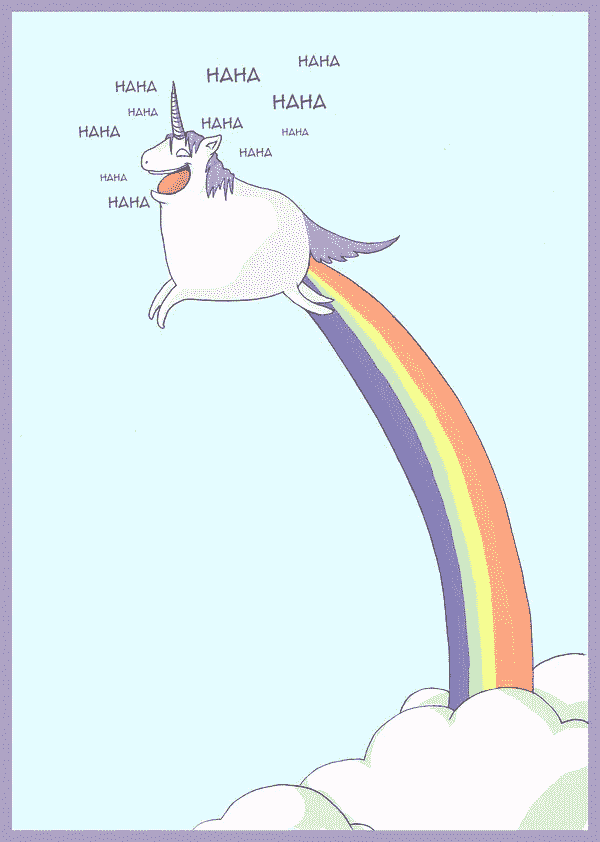

# DoorDash 的独角兽探索的教训

> 原文：<https://medium.com/hackernoon/lessons-from-doordash-s-unicorn-quest-65f8ec5b4a3b>

## 不切实际的估值和回归基本面

几乎可以说，创建一家估值为 1B+美元的公司，是企业家最重要的目标，而不是创建一家盈利和可持续发展的企业。在按需食品/送货领域，有大量的竞争和抢占先机的竞赛。不是通过纯粹的业务增长基本面来实现这一目标，流行的想法似乎表明，更容易的途径是获得[独角兽](https://hackernoon.com/tagged/unicorn)的地位，并将公司的价值作为市场领导者的衡量标准。(当然，[合乎逻辑的风投](http://techcrunch.com/2016/01/15/venture-capital-is-terrible-at-online-shopping/)应该投资那些有实际稳定增长指标的公司，或者至少是一个领导团队，他们绝对不怀疑自己无论如何都会赢。)

巨额融资和高估值为成功/增长铺平了道路，这种观念可能正在改变。最近，一轮新的融资失败，估值被认为是 1B 美元，这突出了这一点。

也许向投资目标冲刺不应该是首要目标。或许企业应该关注核心增长基本面，比如以下策略:

*   在质量和价格上击败竞争对手。例如，类似的服务如 [Caviar](https://www.trycaviar.com/) 只选择高质量的餐馆在当地市场上展示。他们没有像丹尼这样的品牌。选择质量还是数量。
*   先走后跑。钉钉操作。在市场中获得牵引力，成为当地的领导者，并转向另一个领域。
*   向 Wallapop 的领导学习[不要透露融资金额或估值。](http://zingeron.tk/2015/12/08/why-wallapop-ceo-agustin-gomez-does-not-wish-to-discuss-fundraising/)
*   专注于为出色的服务获得良好的公共关系，一个特殊的价值主张，并建立一个有趣和值得信赖的品牌，而不是最近的 Techcrunch 关于结束 b 系列的故事。

我们的目标不应该是筹集巨额资金，因为这会导致人为估值。注意 Gilt Groupe 发生的事情，他们曾经有$1B 的估值，但我们最近被 Hudson Bay (SAKS)以 2 . 5 亿美元收购，比他们被收购前的融资总额还少。

也许现在是创业公司需要回到小企业基本原则的时候了。(你知道，那些流传了几千年的“[买一送二](http://genius.com/3994266)”的原则……)

只是一个想法…

> [黑客中午](http://bit.ly/Hackernoon)是黑客如何开始他们的下午。我们是 [@AMI](http://bit.ly/atAMIatAMI) 家庭的一员。我们现在[接受投稿](http://bit.ly/hackernoonsubmission)并乐意[讨论广告&赞助](mailto:partners@amipublications.com)机会。
> 
> 如果你喜欢这个故事，我们推荐你阅读我们的[最新科技故事](http://bit.ly/hackernoonlatestt)和[趋势科技故事](https://hackernoon.com/trending)。直到下一次，不要把世界的现实想当然！

