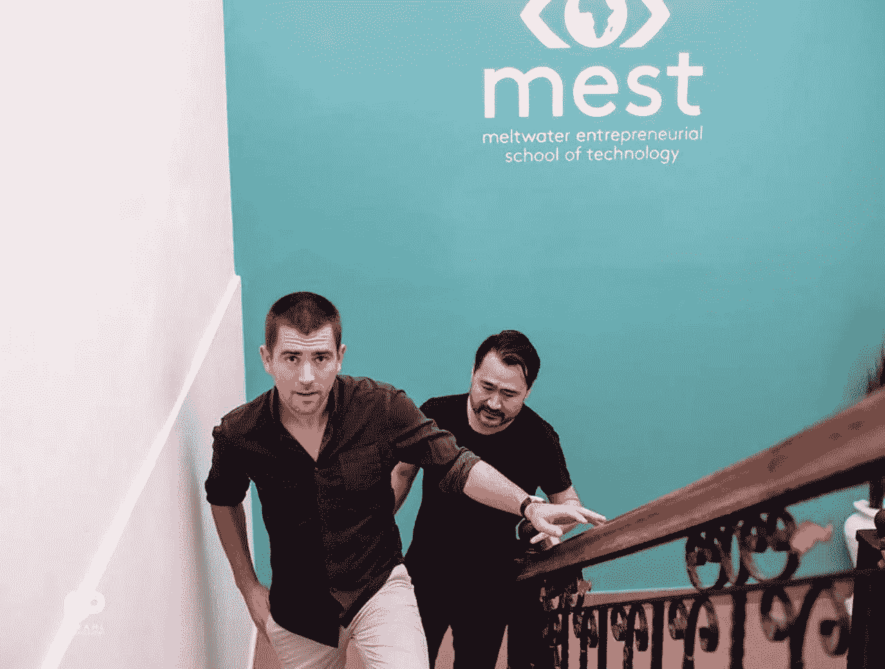
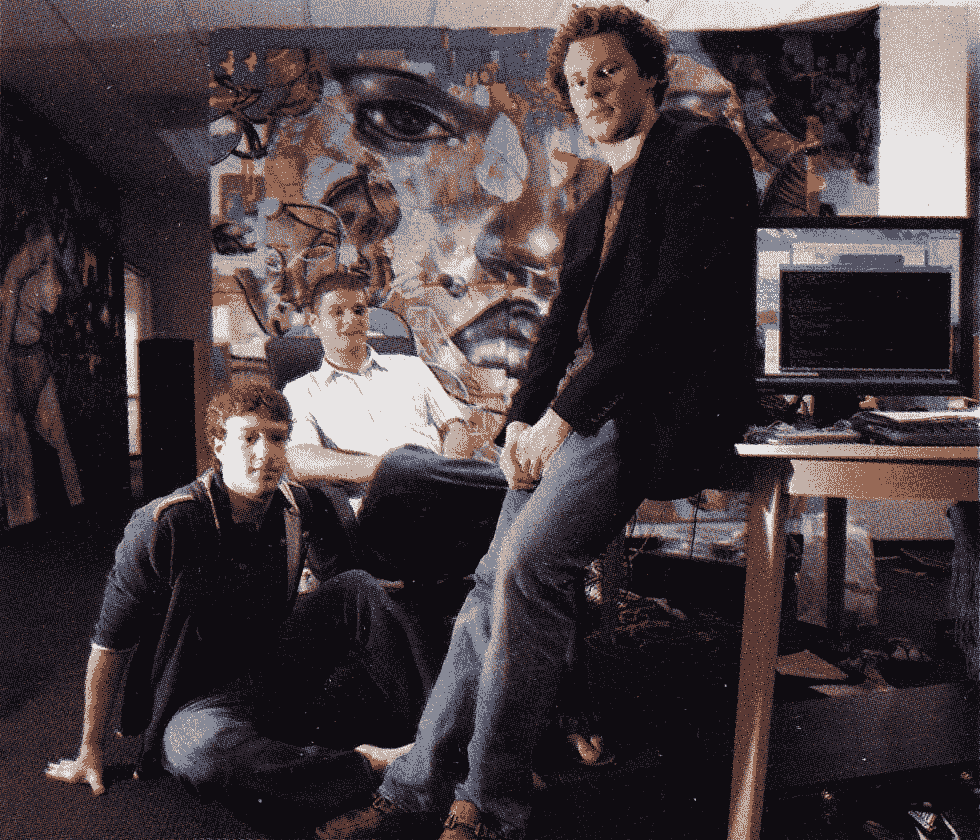
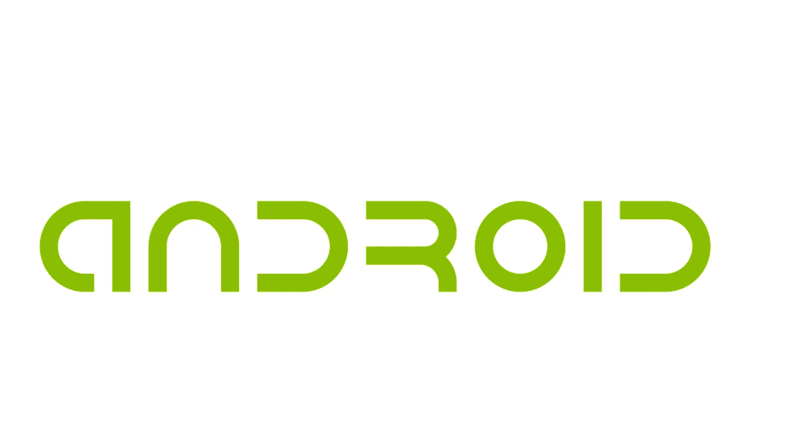
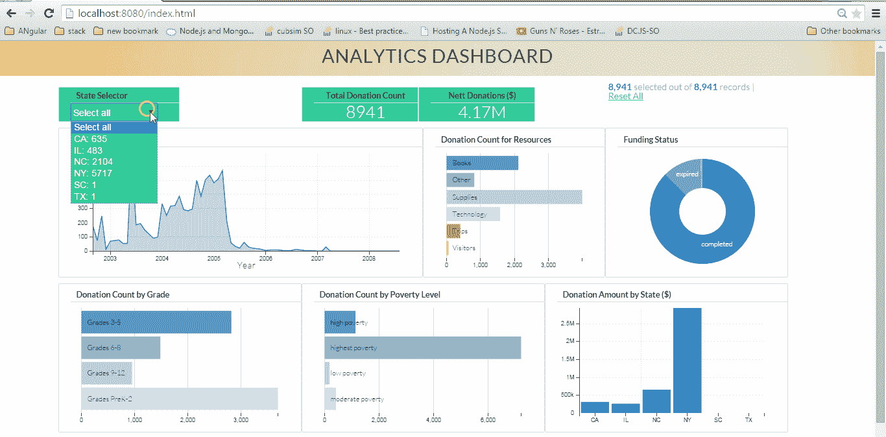
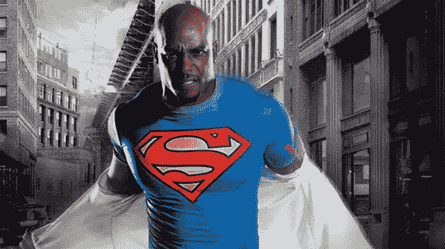
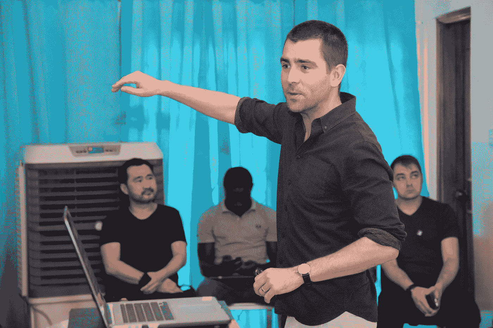

# 我从脸书市警察局局长克里斯·科克斯那里学到的经验

> 原文：<https://medium.com/hackernoon/lessons-i-learnt-from-facebook-cpo-chris-cox-28ef615be643>

Facebook CPO, Chris Cox with MEST Founder, Jorn Lyseggen (Credit: [MESTAfrica](https://www.facebook.com/MESTAfrica/))

3 月 1 日，脸书的首席产品官 Chris Cox 拜访了 MEST，并给我们做了 40 分钟的演讲。

总结——太棒了。

这就是它令人敬畏的原因。在过去的 6 个月里，我们这些在 MEST 受训的企业家一直在学习所有关于创业的知识。从业务方面，一直到技术方面。然而，让一个成功创业的人告诉我们真实的生活经历更令人兴奋。他透露的许多事情与《创业智慧》所说的相悖，但对脸书来说却很管用。

以下是我的最佳建议:

## “从卑微的开始”

Mark Zuckerberg, Dustin Moskovitz and Sean Parker in Facebook office, May 2005

据克里斯说，马克对脸书的想法非常简单。创建一个“面孔目录”，也许有一天(*等着瞧吧*)会超越大学范畴。

克里斯当时在斯坦福，马克说服其他本科生退学加入他的行列。2005 年，公司成立一年后，克里斯接受了邀请，加入了脸书。

## “你的想法看起来很疯狂，人们会说你疯了”

Former Android logo wordmark (2007–2014)

在早期，脸书与一家名为 Android 的初创公司分享其狭小的空间。据克里斯说，另一家初创公司看着他们，认为他们疯了。"既然已经有了 MySpace，为什么还要有另一个社交网络？"他们想知道。另一方面，脸书的人对安卓的人也有同样的想法。“为什么是另一个操作系统？我们已经有黑莓了！”。很多 smh 到处流传。

2005 年 7 月，Android 被谷歌收购，收购金额未披露，同年 5 月，脸书进行了首轮融资。

## “确定用户的新兴行为，并朝着这个方向发展”

This was also the logic behind Facebook reactions

与普遍的看法([甚至连我都坚持](/@steveamaza/a-startup-is-an-experiment-ba719620659d))相反，你不必一开始就想好所有的事情。如前所述，脸书的目标是成为一个面孔目录，这正是它的目标。

TheFacebook.com 只有用户上传照片和填写信息的个人资料。后来，脸书团队注意到，人们一天会更换几次个人资料照片。他们做了一些研究，了解到人们希望展示多张照片。《T4》专辑诞生了。

另一个观察结果是，人们会浏览个人资料并滚动到底部。这是为了检查新的变化。接下来创建了*新闻提要*。诸如此类。

正如 Chris 解释的那样，不是公司决定什么对用户最好，而是让用户决定。这是通过观察新出现的行为和趋势来实现的。

## “实时仪表盘是救星”

克里斯认为，仪表盘是任何初创公司的必备工具之一。它有助于理解数据和用户行为。

在脸书，突如其来的尖峰信号会提醒他们存在一个错误或一些他们一直遗漏的东西。这有助于确定要推出的下一个功能或快速修复问题。

## “你的超级用户比你更了解你的产品。利用它们”

(Credit: [Half Of A Dragon](http://halloftheblackdragon.com/reel/why-muscle-men-love-superman-under-armor/))

克里斯讲述了一个在德国的叙利亚社区领袖的故事，他经常使用脸书组织。他负责的小组为试图移民到德国并开始新生活的叙利亚人提供指导。他一贯利用团队传递信息，因此非常熟悉这一功能。

脸书向他伸出援手，给予他支持和倾听。他现在是拥有社交网络巨头耳朵的特殊用户群体的一员。

## 附加课程

*   快速移动，打破东西。
*   学会接受反馈并采取行动。
*   简化你的目标。
*   价值观很重要。

特别感谢 [Oyinloye Ayodeji](https://medium.com/u/c3add2d123dd?source=post_page-----28ef615be643--------------------------------) 关于这个话题的 Twitter 反馈帮助我刷新了记忆(*我懒得记笔记*)。

 [## oyinloye ayo deji I(@ itzbernoulli)| Twitter

### Oyinloye Ayodeji I 的最新推文(@itzbernoulli)。EIT @mestafrica |博客|工程师|科技企业家…

twitter.com](https://twitter.com/itzbernoulli) 

> [黑客中午](http://bit.ly/Hackernoon)是黑客如何开始他们的下午。我们是 [@AMI](http://bit.ly/atAMIatAMI) 家庭的一员。我们现在[接受投稿](http://bit.ly/hackernoonsubmission)并乐意[讨论广告&赞助](mailto:partners@amipublications.com)机会。
> 
> 如果你喜欢这个故事，我们推荐你阅读我们的[最新科技故事](http://bit.ly/hackernoonlatestt)和[趋势科技故事](https://hackernoon.com/trending)。直到下一次，不要把世界的现实想当然！

