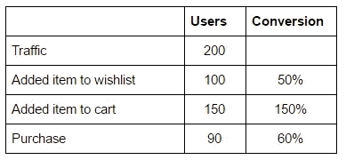
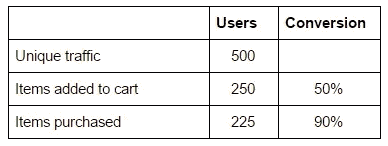
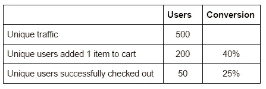
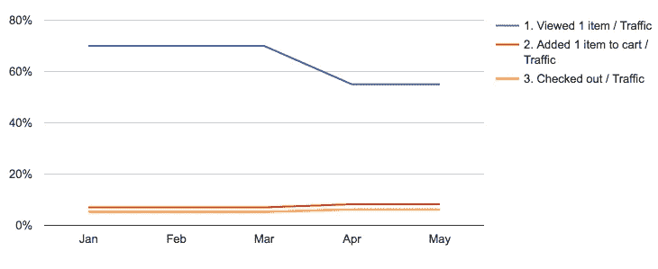
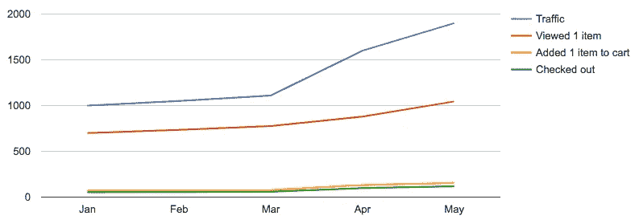
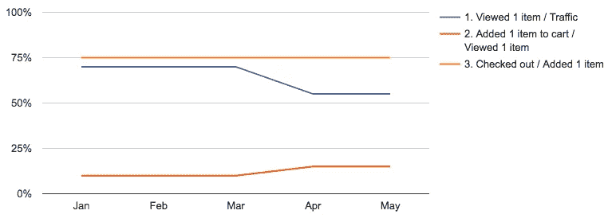

# 如何建立转化漏斗

> 原文：<https://medium.com/hackernoon/lessons-in-building-conversion-funnels-c3378bfa0910>

# 漏斗里有什么？

构建转化漏斗的第一步是定义成功。所有的生意都可以归结为一笔交易——顾客第一次付款。大多数时候这是[漏斗](https://hackernoon.com/tagged/funnel)的底部。

漏斗底部选择的成功衡量标准应基于成功的[业务](https://hackernoon.com/tagged/business)成果。如果你的企业需要一个 100 美元的购物篮结账来获得 20%的必要毛利润，那么在漏斗底部有“完成结账”对你的企业来说不是成功，漏斗也没有帮助。

也有例外，如 SaaS 产品通常依赖于每月定期付款。如果每月定期客户的典型指标是在第 3 个月付款，那么这就是漏斗底部需要的东西。在第 1 个月和第 2 个月付款是漏斗中的步骤。

顶部的步骤应该是顾客第一次以可测量的方式接触产品。中间的步骤是用户从那里到底部所需要做的一切。

# 每一步都应该是必要的

这些步骤是*实现底层目标所必需的*——就像用户到达终点需要通过的关卡一样对待它们。通常，人们会包括与最终目标有关联的步骤，但这并不是必须的。

在将商品添加到购物车之前，将商品添加到愿望清单可能比不添加商品的顾客与成功结账的相关性更高。但这是一个增加转化率的功能，并不是让顾客成功结账的必要条件。

包含不必要的步骤使得分析转换漏斗变得困难。

在计算向购物车中添加商品的客户时，是否只计算向愿望清单中添加商品的客户？漏斗不会计算那些在购物车中添加了商品但没有在愿望清单中添加商品的客户，这可能会排除很大比例的成功转化。

更进一步说，如果下个月较少的用户在他们的愿望清单上添加了一个商品，但是更多的用户在他们的购物车上添加了一个商品，那会怎么样呢？区分*客户需要做什么*和*如何优化*产品以促使用户去做很重要。转换漏斗应该只记录前者。

# 必要的..也很有价值

另一方面，步骤也需要有价值。如果顾客在购买结账时需要填写 3 个不同的地址字段，但从一个步骤到下一个步骤的转化率是 99%，那么它就没有重要到足以包含在你的转化漏斗中。这样做会产生大量的数据点，而多余的信息会分散有价值的信息。

# 你到底做了没有？

进入转换漏斗的下一步应该是一个是/否的答案。当你试图量化成功的*程度*时，转换漏斗变得混乱。

人们很容易认为，一组用户在一个购物车中放 3 件商品要比放 1 件商品好得多，这应该反映在转换漏斗中。但这偏离了漏斗的核心目的:衡量你的产品在吸引顾客结账方面的有效性。

# 客户结果，而不是事件

惰性方法是聚合“事件”，如流量(页面登陆)、向购物车添加商品和成功结账。聚合计数可能看起来像:

转换漏斗的目标是评估你的产品在底部实现客户结果的有效性。这意味着知道在你的漏斗中执行某个步骤的独立用户的数量——不要因为单个用户重复操作而使数据失真。

以客户为中心的转换漏斗看起来像这样:

总计数的转换漏斗看起来很健康，但掩盖了超级用户的影响。添加到购物车中的商品有 90%被结账，但只有 25%的顾客成功结账，这表明结账过程实际上执行得很差。

# 一段时间内绘制图表时上一步的百分比

最常见的错误是用漏斗顶部的百分比来衡量每一步。

Conversion funnel — As a % of traffic

这种方法意味着转化率受之前步骤的影响。如果步骤 2 减少，步骤 3 也会减少。它清楚地表明了有多少客户*到达了漏斗的那一步*，但代价是更有价值的东西——那一步的表现如何。

下一个最常见的方法是计算一段时间内的“步数”,如下所示。

Aggregate event counts

最大的缺点是，当你的业务快速增长时，很难看出每一步随着时间的推移相对于彼此的表现如何。我更喜欢结合下图来看这张图，在下图中，你可以测量从一个步骤到另一个步骤的转换。

Conversion funnel — Stepped over time

值得重复一下——转化漏斗中最有价值的信息是每个步骤是如何执行的。第二张图严重偏向于数量而不是性能。查看第二张图，我们可以看到入站流量有显著增加(可能是由于在新地方做广告)，但我们不知道流量是否充满了可能购买或不购买的相关客户。

第三张图告诉我们:

*   用户不太可能查看商品——预计广告不会完全针对相关客户。
*   但是那些查看过商品的人更有可能把商品添加到他们的购物车中，也更有可能成功结账。

结合这两个图表可以全面了解客户流量的变化。

# 别忘了

*   转换漏斗是用来衡量你的产品在把客户从 A 地带到 b 地的效率的，衡量每个用户的表现，忽略不同客户的相对规模。
*   不要试图同时测量其他东西。
*   一个漏斗不会告诉你你需要知道的关于一个企业业绩的一切。但是一个漏斗应该是一个足够的“温度计”检查。使用二级图来开发更细粒度的理解:比如通过设备分解漏斗来捕捉错误，或者通过迷你漏斗来查看诸如填写表单之类的小部分是否表现不佳。

> [黑客中午](http://bit.ly/Hackernoon)是黑客如何开始他们的下午。我们是 [@AMI](http://bit.ly/atAMIatAMI) 家庭的一员。我们现在[接受投稿](http://bit.ly/hackernoonsubmission)并乐意[讨论广告&赞助](mailto:partners@amipublications.com)机会。
> 
> 如果你喜欢这个故事，我们推荐你阅读我们的[最新科技故事](http://bit.ly/hackernoonlatestt)和[趋势科技故事](https://hackernoon.com/trending)。直到下一次，不要把世界的现实想当然！

