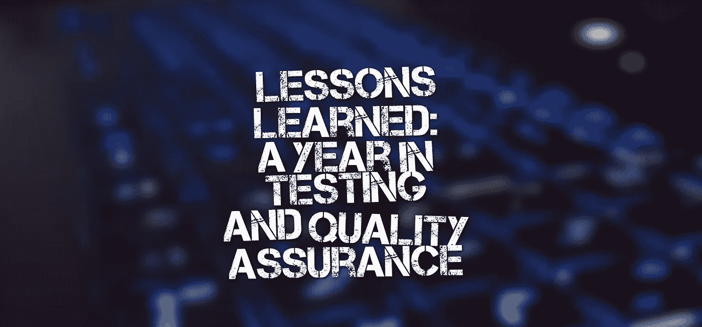
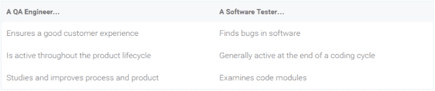
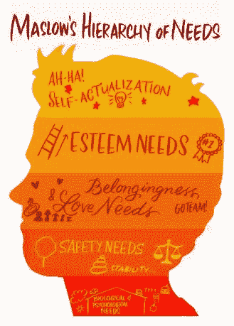

# 经验教训:一年的测试和质量保证

> 原文：<https://medium.com/hackernoon/lessons-learned-a-year-in-testing-and-quality-assurance-86857eb57212>

一年丰富的技术和生活经验！

整整一年前，我开始了我作为软件质量保证工程师的第一份工作。这是美好的一年。在一家大约有 20-25 名员工的科技公司，作为唯一的质量保证工程师，我学到的东西比我预想的要多。下面，我将总结一下我的经验和教训。

# 除非你真的投入进去，否则你永远不知道你是否会喜欢一份工作

我不建议在对一份工作没有任何兴趣或者没有做好关于工作内容的准备的情况下进入这份工作。但是，尽管你做了很多功课，也有很多先验知识，但在你获得第一手经验之前，你不会发现很多东西。新人通常认为测试就是寻找 bug 和破坏东西。虽然那个*是*真的，但它只是事实的一半。测试也是对同一个东西反复测试很多天。它会变得很无聊，你必须付出额外的努力来保持你的注意力。

 [## 深入问答

### 几个月前，一个朋友问我，“你的工作是什么？”。我告诉他我是做质量工作的。保证工程师…

qafrenzy.wordpress.com](https://qafrenzy.wordpress.com/2016/01/14/diving-into-qa/) 

# 工作一年比学习四年(或更久)教会你更多

通常，大学教授的软件测试课程不足以让学生掌握所有需要的知识。尽管我很幸运，我所学的课程涵盖了所有的概念和所有广泛使用的工具。即使在那时，工作教会我的远不止学习。其中一个主要原因是和有经验的人在一起。这些人在这个行业的时间比你长，你总能从他们的经验中获益。另一个原因是工作中的责任感和责任感，这种责任感和责任感确保你尽最大努力，因为你是在为真实的人工作，如果你工作做得不好，真实的企业会受到影响。

# 测试和质量保证被(错误地)当作同义词使用

虽然这两个本质上是不同的概念，但这两个概念经常互换使用，大多数人无法区分它们。“质量保证工程师”是目前测试员工作的热门头衔。[纽提斯](http://www.neotys.com/)完美地描述了这种差异

我见过很多公司把两者混为一谈，把 QA 工程师的头衔用在软件测试人员身上。需要对两者之间的区别有更多的认识。

# 金钱补偿不是一切

好的包装是吸引应届毕业生的第一件事。但是，当你开始在工作场所花些时间时，你会意识到钱不是一切。金钱只满足你的安全需求(马斯洛需求层次理论)。一个好的工作环境，一个好的团队领导，和健康的团队活动满足你的归属需求。当你开始学习新的东西或获得对你表现的奖励时，那就是你的自尊需求得到满足的时候，而这是金钱无法满足的。

# 尝试新事物

您的主要工作可能是手动测试应用程序，您仍然应该继续进行一些自动化工作。尝试不同的工具。留意新工具。挑战你的团队正在遵循的程序，并提出新的建议。不要退缩。关注博客。开始你自己的博客。播客。你永远不知道什么时候你偶然发现了什么东西，它给你正在做的事情带来了新的转折，或者给了你一生的灵感。

# 超越工作描述

不要局限于工作描述。如果你是作为一名测试人员被雇佣来寻找 bug 的，不要止步于此。想办法补救。向开发商建议。提供您对功能的意见。尝试开发。在我工作的地方，有很多围绕数据科学和机器学习领域的工作。我兼职做数据分析已经有一段时间了，它帮助我学到了很多东西，学习一些东西总是能帮助你走很长的路，即使它当时可能与你无关。

# 周末

你开始比以往任何时候都更喜欢周末。会有一些阶段，你会感到格格不入，极度恼怒或沮丧。像那样的日子，周末是一种特殊的享受。即使你足够幸运，从未经历过这种情况，周末仍然是一种幸福，因为从早上 9 点到下午 6 点，周一到周五会耗尽你所有的精力甚至生产力(即使你绝对热爱你的工作)，周末提供了急需的休息时间来再次充电。

工作生活一开始感觉很糟糕。星期一是一场特别的噩梦。但是一旦你开始适应，事情就没那么糟糕了。这需要一些时间来弄清楚你在做什么，你的立场和你的方向。随着时间的推移，你会逐渐喜欢上这种例行公事，喜欢上早晨的咖啡，喜欢上当之无愧的乒乓球休息时间，喜欢上一天辛苦工作后应得的睡眠。富有成效的感觉让这一切都是值得的。

# 有关系的

 [## 6 个月大的 QA 工程师的 6 堂课

### 这是我做质量保证工程师的第七个月，几个月前我开始写这个博客。我的第一个帖子是…

qafrenzy.wordpress.com](https://qafrenzy.wordpress.com/2016/04/05/6-lessons-from-a-6-month-old-qa-engineer/) 

*原载于 2016 年 8 月 31 日*[*【qafrenzy.wordpress.com】*](https://qafrenzy.wordpress.com/2016/08/31/lessons-learned-a-year-in-testing-and-quality-assurance/)*。*