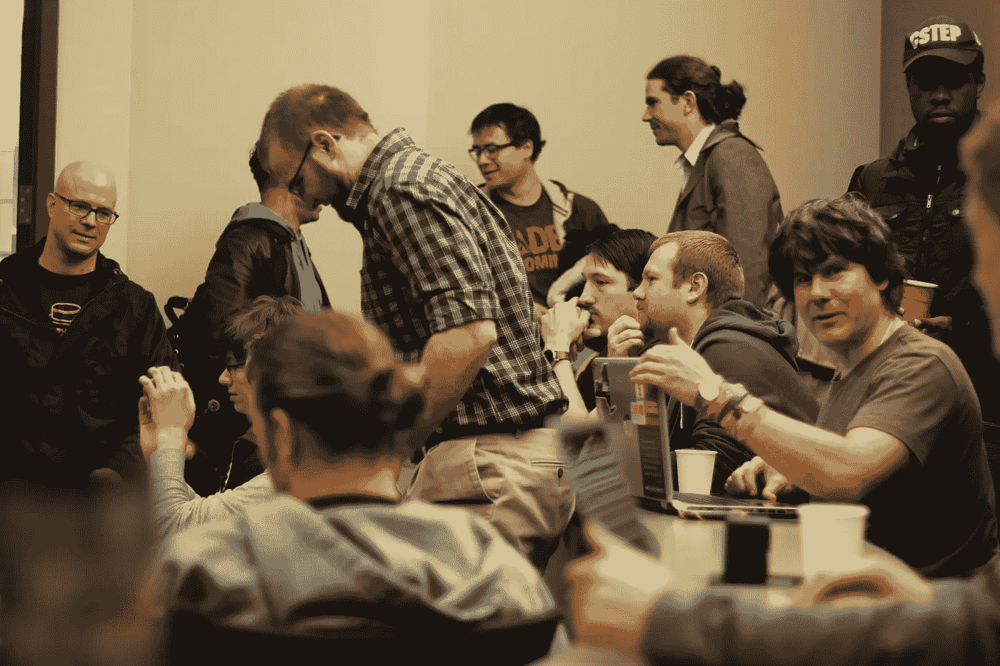
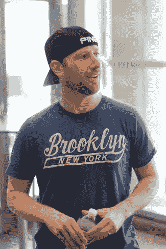
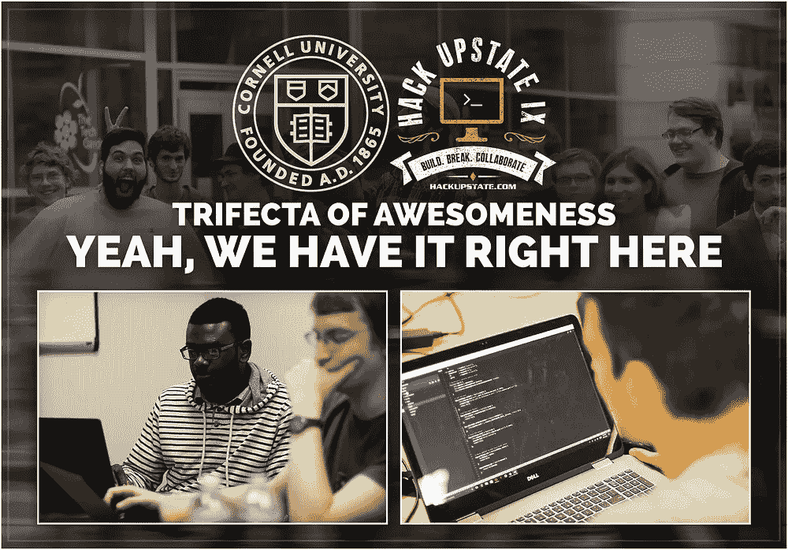
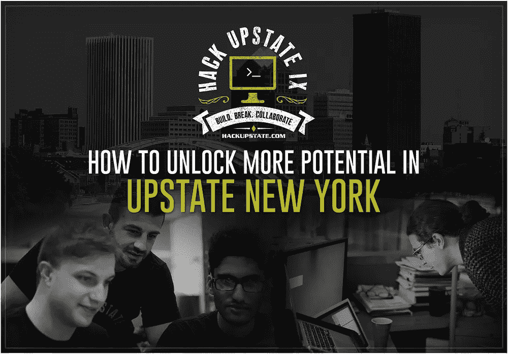

# 在纽约州北部建立技术社区的经验教训

> 原文：<https://medium.com/hackernoon/lessons-learned-from-building-a-tech-community-in-upstate-ny-aac95340beab>

[*报名参加 Hack Upstate XII—10 月 6 日和 7 日—纽约州锡拉丘兹*](http://hackupstate.com/events/xii/index.html)

Photo from [**Daniel Viau**](http://djviau@gmail.com)

当你想到纽约州北部时，你会想到什么？连绵起伏的群山？美丽的风景？

当我想到纽约州北部时，我会想到一个沉睡的 STEM 巨人，他有着尚未实现的巨大潜力。

就培养 STEM 人才而言，纽约州北部拥有一些绝对世界上最好的大学。康奈尔、克拉克森、RIT、RPI、锡拉丘兹等。这个清单还在继续。事实上，在《福布斯》最近的 2016 年 T4 21 所 STEM 大学中，纽约州北部的大学占了 14.28%，这是迄今为止美国任何地区最强的代表。

然而，就 STEM 而言，北部有两个大问题:

1.  我们的人才流失率非常高。我们教育最优秀和最聪明的人，然后他们离开并在其他地方工作。
2.  地区社区之间很少有交叉合作(例如，布法罗、罗切斯特、锡拉丘兹和首都地区)。

这就是为什么我在 4.5 年前决定开始[黑北部](http://hackupstate.com)的原因。

## 什么是北部黑客

Hack Upstate 的使命是团结和促进纽约州北部技术社区之间的合作。在追求过程中，我们组织[黑客马拉松](http://hackupstate.com/x)，提供网络和移动开发课程，促进谈话和讲座，并最终帮助州北部的 STEM 人才找到有希望的就业机会。**迄今为止，我们已经建立了一个由数千名纽约州北部工程师组成的不断发展的网络，并促成了数十个职位安排。**

从这次经历中，我学到了在纽约北部建立一个技术社区。

# 建立明确的使命和愿景

对我们来说，从一开始就有一个明确的使命和愿景是至关重要的。我们的基本使命——推进纽约州北部的技术社区——是我们社区的指南针。它决定了我们前进的方向，并聚焦于我们的未来。归根结底，建立一个技术社区需要时间。这不是临时的战术和短暂的战役。它需要一个策略和必要的时间来成功执行。

# 确定战略合作伙伴

战略合作伙伴在入侵北部地区方面发挥了重要作用。在早期，我们确定了一些组织，如科技园区和 T2 锡拉丘兹大学，它们也投资于我们的使命，并有能力长期支持我们。为了让他们尽早加入，在我们获得任何势头或信誉之前，我们必须找到能够为他们提供额外价值的方式，这与培养纽约州北部的 STEM 社区是一致的。例如，Hack Upstate 是一个小组织。我们敏捷、快速、灵活。与大型组织相比，我们可以更快、更经济地执行某些计划。强调这些额外的价值主张有助于我们在仍有很多需要证明的时候尽早获得认可。

# 不要害怕寻求帮助

建立一个有意义和可持续的技术社区并不容易。在过去的 4.5 年里，我开始依赖许多人的帮助。起初我不愿意寻求帮助。我不想给任何人带来不便。然而，随着时间的推移，越来越明显的是，要让 Hack Upstate 发展成有意义的东西，它需要其他人的支持。我需要找到那些优势互补的人。对我来说幸运的是，考虑到我们的使命和愿景，这么多优秀的人加入了这项工作。在过去的 4.5 年中，无数个人承担了对社区的成功至关重要的角色。他们已经超越了。很高兴看到。

# *永远*把社区放在第一位

有了 Hack Upstate，我们***永远*** 把社区放在第一位。当涉及到决策时，我们会问自己，**“这是否符合社区的最大利益？”使用这种模式产生了深远的影响。首先，它灌输了一个合理的决策过程，使事情变得不那么复杂。其次，它有助于在社区成员之间建立信任，并营造一个欢迎和鼓励反馈的环境。第三，它给了我们做更大更好的事情的杠杆，并产生持久的影响。**

# 授权给社区领导和自发者

这些年来，我们很幸运地拥有一个热情的领导者和自发者组成的核心团队，他们参与了 Hack Upstate，并超越了这个社区。因此，我们尽一切努力赋予他们权力。这又回到了不要害怕寻求帮助的观念。我们为我们最有激情的社区成员提供他们领导和采取行动所需的工具和信息…然后我们会避开他们的方式。我们没有试图去管理他们，而是简单地让底层的黑客任务充当他们的指南针。

# 营造友好、热情和包容的氛围

确保 Hack Upstate 包容和欢迎不同背景、经历和生活方式的人，这一直是我们的首要任务。我们试图减少任何阻碍某人参与的摩擦。例如，我们经常收到类似于*“我需要成为开发者才能参与吗？”*答案当然是“*没有*”。我们欢迎并鼓励任何人，无论背景或技能如何，来加入这一乐趣。我们还有一个由社区管理的开源的[行为准则](https://github.com/hackupstate/code-of-conduct)。我们制定行为准则的目的是确保我们培育一个开放、友好和热情的社区，让纽约州北部的 STEM 社区能够蓬勃发展。

# 组织可重复且易于预测的活动

从一开始，我们就有长远的目标。我们试图建立一个根深蒂固的、可长期持续的 STEM 社区。为了做到这一点，我们很早就有意识地决定组织可重复的活动，并且社区可以很容易地预见和预测。具体来说，我们开始在每年秋季和春季举办[黑客马拉松](http://hackupstate.com/x)，以配合学术日历。通过这样做，我们可预测的黑客马拉松日程一直在人们的雷达上。潜在的参与者总是知道下一次黑客马拉松是什么时候，因此可以相应地计划。

# 通过行动引领

有很多资源讨论领导力以及成为一名成功的领导者需要什么。对我个人来说，我从生活中的优秀领导者身上学到了最多的领导力。无论他们是家人、朋友、老师、教练、顾问等等。，精英中的精英都是通过行动来领导的。通过行动来领导超越年龄、经验和资历的界限。它创造了一个公平的竞争环境，文化和标准是由你的所作所为，而不是你所说的话来塑造的。在北部的 Hack，我也尝试过这样做。无论是倒垃圾，清理工作区，还是跑出去抓食物来适应个人独特的饮食限制，我总是试图通过行动来领导。

过去的 4.5 年收获颇丰。我见过成千上万的人，并有幸与 STEM 领域的一些最优秀和最聪明的人合作。

我迫不及待地想看看十年后我们的社区会是什么样子，但现在我会继续享受这个旅程。

[*道格·克雷辛齐*](https://www.linkedin.com/in/douglascrescenzi/) *是*[*Hack Upstate*](http://hackupstate.com)*的创始人，也是一家将产品开发与数字营销相结合的数字咨询公司*[*Upstate Interactive*](http://upstate.agency/)*的合伙人。*

# 有兴趣资助北部的黑客吗？

# 喜欢这个吗？你可能也会喜欢这些文章！

