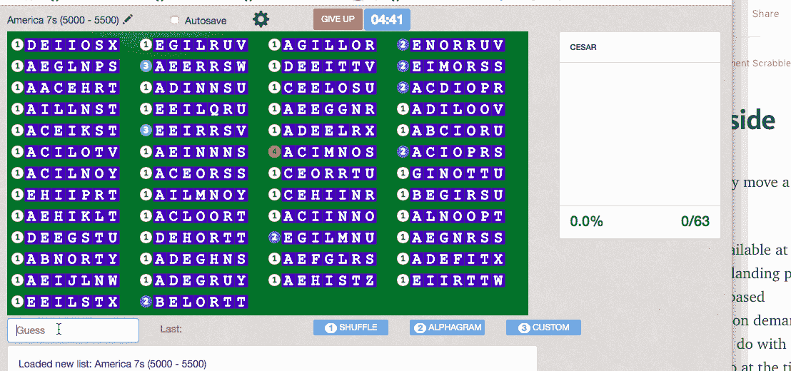
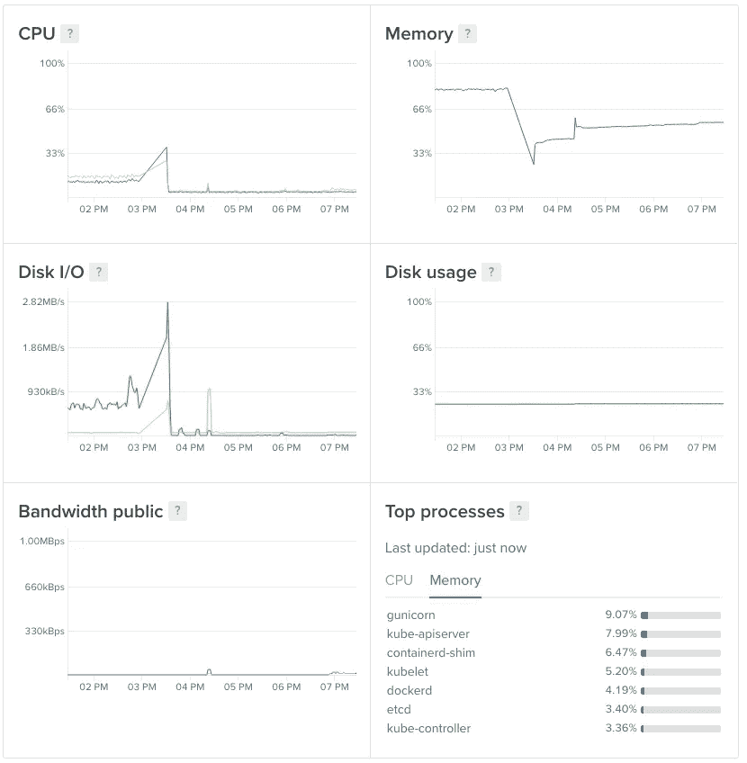

# 将我的副业项目转移到 Kubernetes 的经验教训

> 原文：<https://medium.com/hackernoon/lessons-learned-from-moving-my-side-project-to-kubernetes-c28161a16c69>

这个标题可能已经敲响了一些微弱的警钟；为什么要动用 Kubernetes 的小侧项目？这值得吗？

我在 https://www.aerolith.org 的经营一个小型的拼字游戏玩家学习网站。(请原谅没有一个漂亮的登录页面)。它包括一个 Django 应用程序，带有 PostgreSQL，以及一个基于 go 的小型微服务，可以按需生成一些复杂的单词挑战。service 使用 Go 而不是 Python 的原因主要与性能有关，但部分原因是我当时也在尝试使用 Go。该网站还使用 SQLite 来存储 word databases、Gunicorn、Nginx，即一个标准的 Django 设置。这个网站每天有几百名玩家，所以它不是那么小。我也曾经利用这个平台学习过；Aerolith 的第一个网络版是在 2011 年完成的，是用糟糕的 Javascript 写的。它现在是一个相当现代的应用程序，有 React.js 和 ES6。所以这是一个很好的项目，因为我可以修补我有时会在日常工作中用到的技术(例如，我过去简单地做过一些 Redis/Sock.js 的东西，以及 Django 升级等等)。



Let’s solve some 7-letter words

由于我们在[工作](https://www.appinsights.com)时大量使用 Docker，我前一段时间花时间把我的应用程序转移到使用 Docker。我喜欢 Docker，因为它很容易封装依赖关系；在此之前，部署有点糟糕— `git pull` 在我的虚拟机中，`pip install`每当我更改任何包时，升级都是一个问题，等等。然而，我所做的只是制作一个 docker-compose 文件，过程还是差不多的，包括 git pull，将代码目录装入容器，最糟糕的是，更改任何环境变量或依赖关系都需要停机时间(以重新构建容器)。所以在某种程度上，这比之前基于 virtualenv 的方法更糟糕，尽管在本地开发期间，这是一种相当不错的体验。由于我的空闲时间有限，这已经设置了好几个月了，每当我升级一些包时，我总是忘记和破坏这个应用程序。

无论如何，我在去年的某个时候决定修复它，并开始研究基于 HAProxy 的方法。计划是构建一个容器的两个副本，用 Nginx 反向代理它们，在代码更新期间，与 HAProxy API 交互并更改 IP，等等。由于主要 Aerolith 游戏的实时性，我真的希望有一个零停机部署，这实际上是令人惊讶的困难——稍后会有更多。在开始研究这种 HAProxy 方法时，我意识到我可能需要某种服务发现和数据存储来跟踪活动容器的最新版本，以便在随机重启时存活下来。意识到我正在重新发明轮子，我开始研究 Docker Swarm。

我短暂地玩了一下 Docker Swarm，它不知何故破坏了我的数字海洋虚拟机。我不太记得失败模式，但这也是很早的时候(可能在 2016 年 7 月-8 月)，我放弃了一段时间，并再次专注于我的 React.js 前端。我们在工作中使用 AWS ECS，我不想离开我廉价的 5 美元数字海洋实例，加上我不喜欢 ECS 的一些东西，想学习可能的替代品。

我第一次听说 Kubernetes 是从这篇有趣的 [CircleCI 文章](https://circleci.com/blog/its-the-future/)中。我记得当时我想，我从来没有听说过它，也永远不会使用这样一个神秘的技术，因为它必须是过度杀伤，对不对？但是越来越多的我从《黑客新闻》上听到 Kubernetes 是怎样的未来，尽管[有相反的证据](https://www.youtube.com/watch?v=PivpCKEiQOQ)，集装箱化仍然存在。所以我在本地安装了 Minikube，并开始修补，几个小时后就能得到一个功能齐全的设置。Kubernetes.io 文档非常好。

现在，我学到了一些教训，而设置这一切。

## 1.运行 Minikube 不同于运行集群

实际上，我现在的集群设置一点也不理想。但由于这是一个附带项目，我所做的只是使用了`kubeadm`，它告诉你不要在生产上使用它。另外，我的集群目前只包含一个节点:)

Kubernetes.io 文档解释了如何设置 kubeadm 集群，这实际上非常简单。我也尝试了变戏法和 Juju，不能得到任何功能。YMMV 我可能还不够努力:/

默认情况下，kubeadm 不启用允许 CronJobs 的 batch v2 API。如果有人知道如何做到这一点，我会感谢任何细节。这似乎太难搞清楚了，我有一份日常工作，而是用 crontab 中的`kubectl run`来运行。

## 2.入口有点令人困惑

默认情况下，入口实际上什么都不做。您需要运行一个“入口控制器”,但是默认情况下，入口控制器清单文件中没有选择器。这有点奇怪，因为似乎其他所有东西都使用选择器(服务/部署/复制控制器等)。

找到合适的入口控制器也有点困难。我最终使用了 [nginxinc](https://github.com/nginxinc/kubernetes-ingress) 开发的版本，尽管他们无耻地在所有文档中自我宣传他们的 Plus 版本。Kubernetes 项目本身也有一个更复杂的入口控制器，但是当我在上面运行 ApacheBenchmark 时，偶尔会出现 SSL 错误。有人知道为什么吗？

## **3。零停机部署并不是 Kubernetes** 的默认设置

看这个长帖:[https://github.com/kubernetes/contrib/issues/1140](https://github.com/kubernetes/contrib/issues/1140)

基本上，如果您有一个部署，并且您将容器更新到一个新版本，这是并行发生的事情(转述自该线程上的一个注释):

1.  库伯莱向吊舱发送了一个信号术语
2.  控制器将运输舱从终点移走
3.  kube-proxy 将 Pod 从虚拟 LBs 中移除

因此，默认情况下，一旦收到 SIGTERM，它就会开始拒绝连接，并优雅地包装其余的连接。问题是，在一段时间内，控制器仍然将流量导向这个垂死的 gunicorn，这导致 nginx 返回 502。我不得不想出下面的方法。这可能还可以做得更好，但目前还行:

```
readinessProbe:
  exec:
    command:
    - cat
    - /opt/webolith/djAerolith/test_requirements.txt
  successThreshold: 1
  failureThreshold: 2
  periodSeconds: 5
  initialDelaySeconds: 5lifecycle:
  preStop:
    exec:
      # A hack to try to get 0% downtime during deploys. This should
      # help ensure k8s eventually stops giving this node traffic.
      command: ["sh", "-c", "rm /opt/webolith/djAerolith/test_requirements.txt && sleep 20"]
```

注意，initialDelay 是必需的，因为 gunicorn 需要一点时间做好准备，而`sleep 20`确保 gunicorn 有一些时间脱离端点/虚拟负载平衡器。在某种程度上，发送的 SIGTERM 并不重要。

我基本上用类似`ab -n 1500 -c 15 [https://minikube.aerolith.org/healthz/](https://minikube.aerolith.org/healthz/)`的东西测试了行为，直到我能够在图像更新期间可靠地获得零错误。

另请注意，如果您只有一个副本在运行(我现在只有一个节点)，您还必须设置以下策略:

```
spec:
  replicas: 1
  strategy:
    rollingUpdate:
      maxUnavailable: 0
```

这使得至少有一个副本在运行。在某个时候，我忘记将它添加到 prod 中，我花了一段时间试图弄清楚发生了什么以及它为什么会坏，几乎再次放弃，直到我在做图像更新时仔细查看了`watch kubectl get po`的输出。

## 4.RBAC 搞什么鬼？

因此，当我准备将我的项目部署到生产环境中时，Kubernetes 1.6.0 决定推出，突然我的入口控制器停止工作，我无法降级回 1.5。

基于 Github 的一些问题和对文档的一些阅读，我能够为我的入口控制器添加一些东西。有一段时间，我变得非常沮丧，几乎要重新发明轮子，甚至完全放弃 Docker，回到`git pull && kill -HUP <gunicorn PID>`之前，我记得我很固执，沉没成本谬论是一个真实的事情。无论如何，这是我的改变:

[](https://github.com/domino14/Webolith/blob/master/kubernetes/deploy-configs/nginx-ingress-rc.yaml) [## domino14/Webolith

### web olith-Aerolith 2.0-web 的 aero lith。一个单词学习网站-学习拼字游戏，拼字游戏，单词与弗伦茨等。

github.com](https://github.com/domino14/Webolith/blob/master/kubernetes/deploy-configs/nginx-ingress-rc.yaml) 

注意所有早期的 RBAC(基于角色的访问控制)的东西。希望项目能够更新他们的文档。

再说一次，我不是 Kubernetes 或 ops master，所以可能这些太宽容了，或者我正在以某种方式向世界开放我的集群(我希望不是)。欢迎评论！

## 5.Kubernetes 吃你的资源

我可以发誓，有一些有趣的希特勒使用 Docker 视频，特别指出虚拟机中的大多数资源都被正在使用的编排框架占用了，但我找不到它。无论如何，对于默认的`kubeadm`集群来说,$5 DO 实例的能力太弱了，而且一旦所有的 Kubernetes 容器都在运行(对于 API 服务器、etcd、kubelet、DNS 等等),即使是$10 实例似乎也没有多少内存或 CPU 了。所以我认为我的时间价值超过每月 20 美元，并为此付出了代价。仍然很便宜，捐款应该够了；)



I think it’s doing OK. The weird spikes are from when I resized the instance from 1 -> 2 GB. Note that the memory usage was pretty high before.

## 6.没必要把所有东西都搬过来

我保留了我专用的$5 Postgres 实例。为什么要弄乱它？希望它能长期保持稳定。此外，在本地，我仍然使用 docker-compose 进行本地开发，而不是 minikube。虽然 minikube 已经足够好了，但是 docker-compose 摩擦更少(只需要安装 docker，没有额外的依赖)。

## 7.如何自动化

我使用 CircleCI 构建 docker 容器，推送到 Docker Hub，还从 CircleCI 内部使用 kubectl 运行各种`apply -f`命令。kubeconfig 文件在私人回购中。我也在 CircleCI 中生成 YAML 的文件，从一个小胡子样的模板组合(我称之为卷曲:`CURLIES_RE = r'{{\s*(\w+)\s*}}'`)和仅仅 YAML。许多配置存储在 CircleCI 环境变量中。

让我们加密我的 SSL。现在这是一个伪手动过程。我可能想尽快学会如何使用`kube-lego`,但目前我对 Kubernetes 有点着迷。此外，它只与官方的入口控制器兼容，因为我偶尔看到的 SSL 握手问题，我没有使用它。

请注意，如果您修改了 TLS 密码，这不会自动重新加载入口。您还必须修改一些关于入口的内容。所以我有一个黑客路径，看起来像这样:

```
- path: {{ HACK_PATH }}
  backend:
    serviceName: nginx-static-svc
    servicePort: 80
```

该路径最终类似于`/hackpath-{UUID}`。非常 janky，但我不知道还有其他更好的方法。

## 8.几个附加说明

*   我运行了 Nginx 的两个副本，一个用于入口控制器，一个用于静态文件服务器。也许有可能将它们合二为一，但 Nginx 相当轻便，也许这样就可以了。虽然这看起来有点傻。
*   静态文件就内置在我的 Nginx 静态服务器中。如果我能自动检测任何静态文件是否被修改，以避免构建相同代码的多个副本，那就太好了，尽管…
*   高山图像小，用起来！
*   很容易不小心将各种秘密提交给 Github 和/或 Dockerhub。尤其是后者不像 git 那样尊重忽略规则(即`*.yaml`和`**/*.yaml`在`.dockerignore`文件中是不同的东西)。)
*   所有这些都是用`kubeadm`手动完成的，我有所有东西的 1 个副本。如果该节点出现故障，我必须重建它。只要 DigitalOcean 合作，部署仍然是零停机😊。
*   (事后)我的需求的新版本导致了一些测试没有发现的零星错误。以后还得调查一下。

无论如何，现在我终于有了一个零停机部署的故事，也许我再也不用碰这个设置了，我可以开始加入多人模式了。耶！最终这是值得的；部署新容器现在就像推送到 master 一样简单。

[](http://bit.ly/HackernoonFB)[](https://goo.gl/k7XYbx)[](https://goo.gl/4ofytp)

> [黑客中午](http://bit.ly/Hackernoon)是黑客如何开始他们的下午。我们是 [@AMI](http://bit.ly/atAMIatAMI) 家庭的一员。我们现在[接受投稿](http://bit.ly/hackernoonsubmission)并乐意[讨论广告&赞助](mailto:partners@amipublications.com)机会。
> 
> 如果你喜欢这个故事，我们推荐你阅读我们的[最新科技故事](http://bit.ly/hackernoonlatestt)和[趋势科技故事](https://hackernoon.com/trending)。直到下一次，不要把世界的现实想当然！

