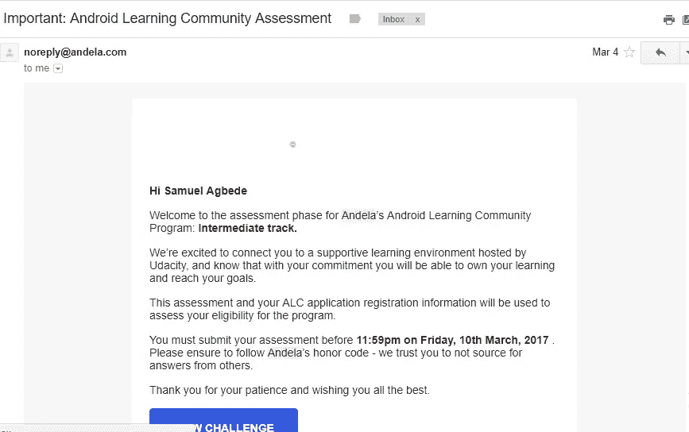
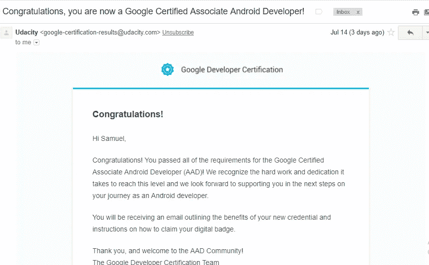

# 从通过 Google 的 Android 开发人员助理(AAD)认证中学到的经验

> 原文：<https://medium.com/hackernoon/lessons-learned-from-passing-the-associate-android-developer-aad-certification-by-google-e192224c6c3b>

一切都像游戏一样开始。

2017 年 3 月 4 日，我在我的 Infinix Note 2 上看到一封邮件通知。是安德拉发来的。想知道它的内容是什么，我把拇指按在屏幕上。

安德拉创建了一个名为[Android](https://hackernoon.com/tagged/android)学习的社区——一个培训 Android 开发人员的项目。我甚至在了解可以获得的特权之前，就已经申请成为这个团体的一员。

我很感激我申请了。我需要它。我于 2015 年 4 月正式开始开发 android 应用程序，当时我在一家名为 [ITVessel](http://itvessel.com) 的令人惊叹的公司实习，并在该公司的程序员托普先生的指导下学习 android 应用程序开发。离开 ITVessel 后，我需要加速我的 android 开发者生活。我开始了项目工作，但没有完成。我阅读和观看了关于不同 android 开发概念的视频，但没有将它们付诸实践。例如，我不理解 UI 测试。我甚至怀疑它的必要性。RxJava 是一个有趣的话题，但我并没有从中获得太多。我甚至在某个时候开始阅读 Kotlin(在它得到 google 官方支持的几个月前)。原谅我的天真，但这是我进入这个项目之前的样子。我非常需要一些结构来完全(以一种平衡的方式)理解我积累的不同概念。我可能是信息肥胖，信息“不完整”。

无论如何，回到邮件。阅读这封邮件的内容让我兴奋不已。我需要申请，这一次我需要制作一个相对简单的应用程序——检索尼日利亚 github 的顶级用户，在列表中显示他们，添加共享功能，并在列表中的项目被点击时显示用户的详细信息。我开始了这个项目，几天后完成并提交。这并不困难。

2017 年 3 月 21 日，我收到一封邮件(标题为“ALC 计划候选人——等待结束了！！！)恭喜我。我将和其他 119 人一起开始这个项目。Andela 与 Udacity 合作，赞助我们关于 uda city Android 开发人员助理考试特别课程准备的培训—[Android 开发人员助理考试快速通道课程。](https://www.udacity.com/course/associate-android-developer-fast-track--nd818)

【Android 开发者助理认证是谷歌的入门级考试。费用为 149 美元，分为两部分——项目部分和离职面谈。在第一阶段，你有一个未完成的项目来添加功能，调试错误和添加 UI 测试。离职面谈试图确认您是否亲自完成了项目，并评估您对 android 应用程序开发基本原则的理解。

安德拉介绍的建筑很漂亮。120 名学者被分成 20 组。每个小组对其所有成员的成功负责，因为每个小组根据每周成功完成视频教程的数量进行评分。我的队友过去和现在都非常棒。我们有一个很好的团队领导，我们不断努力，鞭策自己。没过多久，我们就进入了前三名。安德拉为实现这一“壮举”赠送了免费 t 恤。

当我说“我们不停地射击”时，并不是说我们一直在以惊人的速度前进，我们确实有我们的时代。我们是一个混杂的团队——学生们的组合，一个 [NYSC](https://en.wikipedia.org/wiki/National_Youth_Service_Corps) 的家伙(我)，一个全职工人和一个即将开始 [NYSC](https://en.wikipedia.org/wiki/National_Youth_Service_Corps) 的人。我在尼日利亚马库尔迪的一所大学工作，所以我必须在工作和花时间学习 Udacity 教程之间取得平衡。这些教程内容丰富，效率很高。Udacity 在视频之间打包了三个项目。专业评审人员仔细检查了我的代码，并分享了我如何编写更好的 android 应用程序的见解和建议。过了一会儿，项目开始进来了。第一个(热门电影应用(第一部分))测试了我的知识，动摇了我的 android 生活的基础。我失败了两次。值得庆幸的是，我的评论者很友好地指出了我犯错误的地方，我最终通过了这个阶段。我做了流行电影应用程序的第二部分，也通过了。当我开始做最后一个项目(烘焙应用程序)时，我明白了该做什么的基本知识。我写了要求的项目应用程序，通过了，在这个阶段必须写考试。

与此同时，安德拉做了很多工作来确保我们有很大的机会通过认证。如此伟大的公司值得称赞。他们组织了与专业人士的聚会，甚至组织了一个项目-hon。他们通过自己的行动表明，只有当你故意决定失败时，你才会失败——我们会在这里鼓励你。

当我试图获得 AAD 认证时，我在 ALC 的一位同事奥兹曼迪斯(菲利普·奥康科沃饰)已经通过了考试。我在周六上午 12 点注册了考试，以便在接下来的 48 小时里做这个项目。周末对我来说再好不过了——我不用去上班。到当天早上 5 点，我已经完成了一些功能的添加。到周日晚上，我有两个 bug 没有修复，但是我不能放弃。这时候我紧张起来。感谢上帝，我完成了这个项目，做了我的测试——它们完美地运行着，11 点过几分钟后，我提交了这个项目。现在祈祷吧。该项目测试了我在 android 应用程序调试、使用 Espresso 进行 UI 测试方面的熟练程度(耶！)、在后台线程上处理耗时的操作、在配置改变期间维护用户状态、保存数据等。

几天后，我收到一封邮件，说我通过了项目阶段。呜哇！我需要通过离职面试来确保胜利。我非常感谢上帝让我度过了第一阶段。我安排了面试，然后等待。在面试的那天，我仔细检查了我的项目，注意到了潜在的问题，并确保我练习了很好的回答这些问题。我的面试官在线上，我们进行了一次持续 15 分钟的会谈。他(面试官)确认了我的名字和邮箱。他询问了我参与的项目，还问了一些关于 Android 开发的一般性问题。我结束了面试，等待我的结果。感谢上帝，几天后，我收到一封邮件，告诉我我通过了！！！

在这大约 4 个月的旅程中，我学到了一些教训，我想分享一下。

1.  适当的结构每次都是一大加分(尤其是在准备大型活动的时候)。在我得到这个机会之前，我花了几个月的时间在 Android 开发上四处奔波，研究时尚，编写代码，却没有一个特别好的结构来帮助我在旅程中取得重大进展。安德拉帮助提供了结构，并提供了 Udacity 课程的访问权限——这是一个非常有效的课程，帮助我准备认证。这种结构不仅帮助我做了充分的准备，还让我的代码编写更加平衡。我现在知道为什么有些概念是这样的了。我开始了解编写某些代码片段的更好方法。我通过这个可爱的结构获得的优势是如此之多。
2.  永不放弃。我知道，有数百篇文章强调了这一点，但我的在线课程和认证经验有助于强化这一点。最后，我失败了两次也没关系。失败教会了我很多——我确信我学到的比我没有失败时学到的要多得多。我基本上是失败的前锋。
3.  保持一个良好的、鼓舞人心的社交圈——我的队友教会了我很多。他们梦想远大，我们不断提醒自己，我们必须继续前进。我们为自己加油。有趣的是，我还没有见到这些令人敬畏的人。
4.  回馈人类——安德拉的节目让人印象极其深刻；捐赠一大笔钱来帮助培训“随机”通过申请程序的人。他们帮助我成为了谷歌认证的 Android 助理开发者。他们的服务是一个很好的提醒，有时给人们机会，只是相信他们会充分利用它。毕竟，人才是平均分布在世界各地的，机会不是。生活并不总是为了获得奖学金、机会之类的东西，它也是为了回报。的确，给予比接受更幸福。
5.  聪明学习。我建议任何想写 AAD 的人注册 Udacity 项目。除了让你高效地做好准备，它还能平衡你的 android 开发技能。不管你能做什么，规则很简单——聪明地学习。
6.  继续前进——我最喜欢的一句话来自泰·贝洛的歌曲“我们是未来”。引用的是“他们怎么能说我们已经完成了？我们才刚刚开始”。获得谷歌的认证对我来说是一个巨大的壮举，但它是一个基座——迈向更高境界的垫脚石。继续用力。永远不要对自己的现状感到满意。
7.  做有意义的项目！——如果你不能将你所拥有的知识应用到解决生活中实际问题的项目中，那么这些知识是毫无用处的。不要做那种总是谈论新概念却不运用知识的新闻程序员。知识是潜在的动力，你需要把它转换成动能！

我希望你读得愉快。可以肯定地说，我才刚刚开始我的 android 之旅，但我会在上帝的恩典下继续前进。感谢安德拉(和令人敬畏的主持人)和 Udacity 给我这个伟大的机会。我相信我会充分利用它。

**编辑(18/12/2017) :** 非常感谢大家的阅读以及你们的美好评论和鼓励。在写这篇文章的时候，我正在开发一个现在已经发布在 playstore 上的应用程序。这款应用名为[词典](http://bit.ly/androidlexica)，它解决了我几个月前面临的一个问题。我意识到我无法从我最喜欢的应用程序(Quora、Notes、Web 浏览器、PDF 阅读器)中获得单词定义。我不得不打开字典来检查意思，因此打断了我的阅读过程和体验。我在网上寻找可以解决这个问题的应用程序(因为没有必要重复几次)。我找到了一些，但我不满意，所以我决定做一个，以我想要的方式解决问题。几个月后 Lexica 出生了。Lexica 可以让你从文档和应用程序中获得单词定义——你不需要安装字典。Lexica 拥有越来越多的用户，我很高兴它能为用户提供解决方案。词典是免费的。我非常欢迎对它进行改进的建议和批评，因为目标很简单——让用户的阅读体验更好、更简单。非常感谢了不起的测试人员迄今为止的精彩反馈。请下载、分享、评论并告诉我你的想法。这里又是链接——[Lexica](http://bit.ly/androidlexica)。如果我能增加一个我正在学习的额外的课程，那就是在项目中与人合作——很多时候你不能独自做伟大的事情。我和 Merriam Webster 的 API 以及两个杰出的人一起工作，他们分别负责 UI 模型和 logo 设计。非常感谢上帝，感谢他们，感谢韦氏开发者中心的好人，感谢他们为 Lexica 的成功所做的贡献。