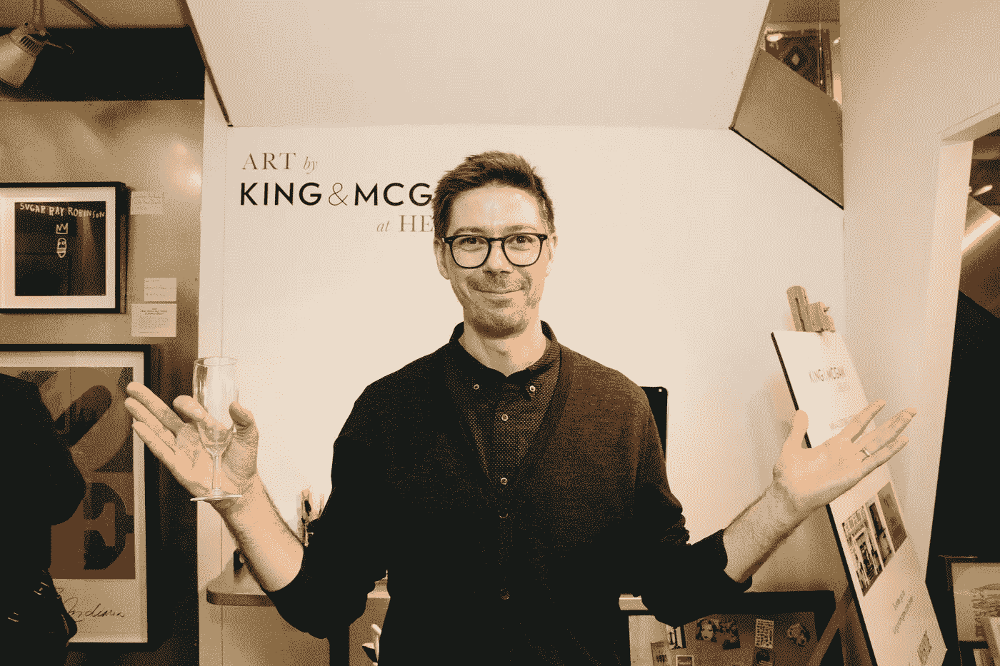

# 开实体店给电子商务上的一课

> 原文：<https://medium.com/hackernoon/lessons-learned-in-opening-a-store-for-an-e-commerce-brand-87c37a913764>

## 今年 2 月，King & McGaw 在伦敦的 Heal's 百货公司开设了一家特许经营店。这是我们到目前为止学到的东西。

Opening night at the King & McGaw shop

在过去的几年里，我们尝试用弹出式商店来吸引人们对我们品牌的关注。我们最终似乎不可避免地会开一家永久性商店，所以当 [Heal's](https://www.heals.com/) 邀请我们在他们的伦敦旗舰店开一家特许店时，我们抓住了这个机会。

在 3 个月内，我们雇佣了员工，建起了商店，并在[开设了我们的第一家商店](https://www.kingandmcgaw.com/heals)。以下是我们目前学到的一些东西。

## 我们可以每周 7 天从真实客户那里收集见解

Daisy, master of clipboards

我们[投入了大量时间和精力](/product-management-and-technical-leadership/data-driven-ux-decisions-e0a4814ccdc2)去了解我们的客户——通过调查、用户测试、市场研究和客户支持洞察。有了商店，我们每周 7 天都有真实顾客的反馈。

在最初的几个月里，电子商务团队轮流培训新的店员，并解决任何问题。我们学到了很多，很明显，商店员工应该写每日报告，这样我们就可以在整个公司分享见解。其中许多直接导致了 kingandmcgaw.com 的变化。

## 有限的空间迫使我们将范围缩小了 99%

Some of the range in our store

我们在 kingandmcgaw.com 上销售的 19，000 种产品中的大部分都是按需生产的，所以我们不受工厂空间的限制。不利的一面是，我们避免了艰难地决定保留或淘汰哪些产品。

当我们开店的时候，我们不得不把产品范围浓缩到 150 种。将产品系列减少 99%以上是困难的，但现在我们有了新产品的试金石——“这个会在商店里卖吗？”。

亲眼目睹商品销售的效果也令人大开眼界。这一点在品类狭窄的门店比在网上要明显和直接得多。

## 线上和线下的差异令人困惑

一些在线上买不到的产品和优惠可以在商店买到(反之亦然)。这让客户感到困惑，也让我们感到尴尬。

> 我能在商店里使用代金券吗？我能把我的东西送到商店吗？你能在商店里接受退货吗？为什么网上没有这个产品？

再多的计划也不能让我们为每一个可能发生的事情做好准备，所以我们必须很快做出决定。我们正在努力确保我们的产品系列和信息在各个渠道保持一致。

## 全渠道归属地难

My best “omni-channel is a guessing game” look

理解和归因于商店带来的间接价值一直很困难。尽管网站为商店带来了流量，一些店内线索也转化到了网上，但整体情况仍然模糊不清。

*你有没有为电商品牌开过店？我很想在评论中听到你的意见！*

> [黑客中午](http://bit.ly/Hackernoon)是黑客如何开始他们的下午。我们是 [@AMI](http://bit.ly/atAMIatAMI) 家庭的一员。我们现在[接受投稿](http://bit.ly/hackernoonsubmission)并乐意[讨论广告&赞助](mailto:partners@amipublications.com)机会。
> 
> 如果你喜欢这个故事，我们推荐你阅读我们的[最新科技故事](http://bit.ly/hackernoonlatestt)和[趋势科技故事](https://hackernoon.com/trending)。直到下一次，不要把世界的现实想当然！

