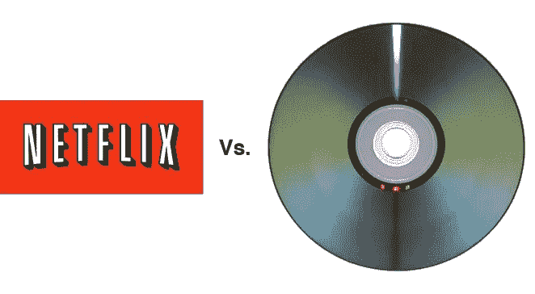

# 自我颠覆的教训——你是在 DVD 行业还是流媒体行业？

> 原文：<https://medium.com/hackernoon/lessons-of-self-disruption-are-you-in-the-dvd-business-or-the-streaming-business-7a34285806f4>

Credit — Netflix & Treehugger

几个月前，我看到了雷德·哈斯汀斯和马克·安德森关于大规模定制时代的精彩对话。在这段对话中，他们谈到了内部分裂，以及[网飞](https://hackernoon.com/tagged/netflix)如何设法在内部分裂，成功过渡到由技术趋势和创始人远见推动的新商业模式。网飞公司的首席执行官雷德·哈斯汀斯甚至描述了他是如何将两个团队分开以实现过渡的。

这让我想到，我们今天看到有多少公司面临着类似的逆风，但未能转型。在这篇文章中，我想说明，对于领导层来说，确定自己所处的行业以及成功所需的战略、组织才能和结构是至关重要的。

请注意，我没有使用贬义词“DVD 业务”。它仅仅意味着意味着一个稳定的赚钱的业务，有希望稍微调整一下就能让它在“流媒体业务”中胜出。在这篇文章中，我提出了一个理由，那就是最好用不同的策略和团队来播种“流媒体业务”，而不是试图将“DVD 业务”转变为流媒体业务。

为什么最好采用全新的方法来过渡到流媒体业务的原因如下

1) **聚焦**——想象一下问经营 DVD 业务的团队——你为什么不试着想想流媒体业务？你认为他们会在这个新想法上投入多少时间和精力？当前业务的多少杂念会让他们不去思考未来。一个想法的成功与团队的专注度成正比。任何不 100%专注于这个想法的事情都很难成功。

2) **团队**——这是另一个被忽略的因素。执行这个想法的团队就是一切。这个团队是否具备在新目标中取得成功的技能。建立和经营流媒体业务所需的技能可能与经营“DVD 业务”所需的技能大相径庭。一个领域的成功不一定会转化为另一个领域的成功。

3) **保护当前的地盘/蚕食威胁** —想象一下让 DVD 团队考虑新的流媒体业务。有多少人会首先想到对他们思维和工作方式的威胁？在所有的精力都花在建立 DVD 业务上之后，这个团队会准备好把它全部拆掉并客观地考虑它吗？说起来容易做起来难。这是人类的自然行为，无可厚非。无助于向新商业模式的过渡

4) **变革所需的精力**——组织变革是一件大事，需要大量的时间、精力和耐心。想象一下，必须改变行为、心态和旧的做事方式。这不是一项微不足道的任务。相反，为什么不花精力雇佣和培养一个新的团队来播种这个想法，然后加速发展呢？这并不意味着需要更少的精力，只是意味着所有的精力都花在想法和发展想法上，而不是陷入公司政治和与人相关的问题中

5) **损失太大**——老牌 DVD 企业通常拥有良好的收入渠道，随着时间的推移不断完善的流程，以及训练有素、能高效运营业务的人员。问题是——失去的太多了。试错和失败是新“流媒体业务”的一部分。有时，当没有什么可失去的时候，仅仅这一点就能刺激创新并赢得长期的胜利。这也是试图保持现状的一个重要原因

因此，我认为，为了在新的“流媒体”业务中获胜，你可能需要投资一个完全不同的团队、策略和方法，同时仍然让 DVD 业务运行并运行自己的进程。这增加了成功的机会，减少了对当前业务的干扰，同时还允许新想法得以实施。

你们觉得怎么样？如果你发现自己身处 DVD 行业，你会有什么反应？你是如何在“流媒体业务”中成功/失败的？你们在自己的行业或公司中看到过类似的趋势吗，或者在其他地方观察到过吗？欢迎思考和评论。

免责声明——本文表达的思想和观点纯粹是我个人的观点，不代表我现在或以前的雇主的观点。

> [黑客中午](http://bit.ly/Hackernoon)是黑客如何开始他们的下午。我们是 [@AMI](http://bit.ly/atAMIatAMI) 家庭的一员。我们现在[接受投稿](http://bit.ly/hackernoonsubmission)，并乐意[讨论广告&赞助](mailto:partners@amipublications.com)机会。
> 
> 如果你喜欢这个故事，我们推荐你阅读我们的[最新科技故事](http://bit.ly/hackernoonlatestt)和[趋势科技故事](https://hackernoon.com/trending)。直到下一次，不要把世界的现实想当然！

