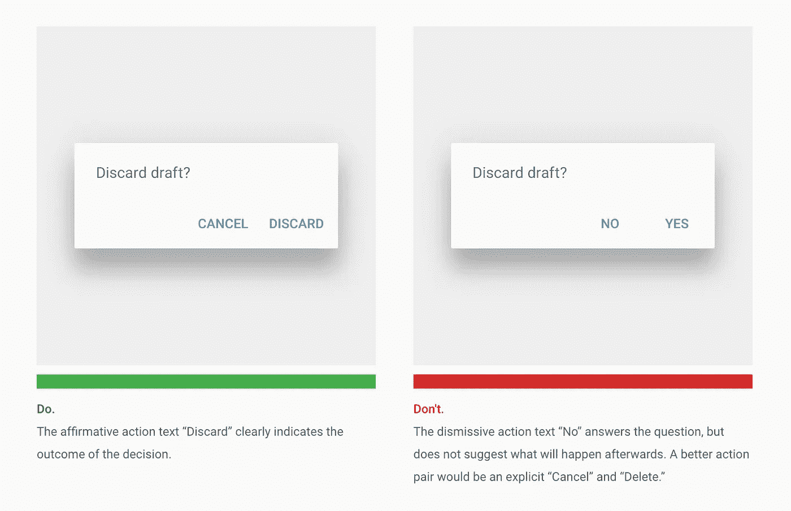
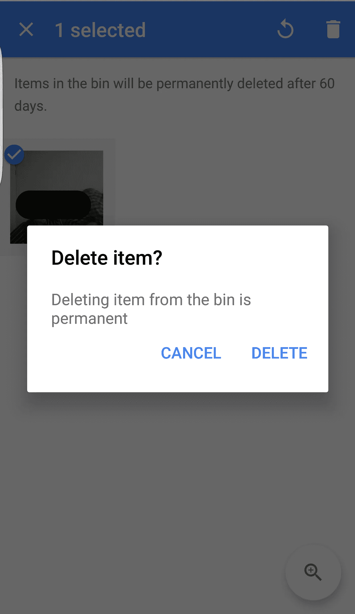
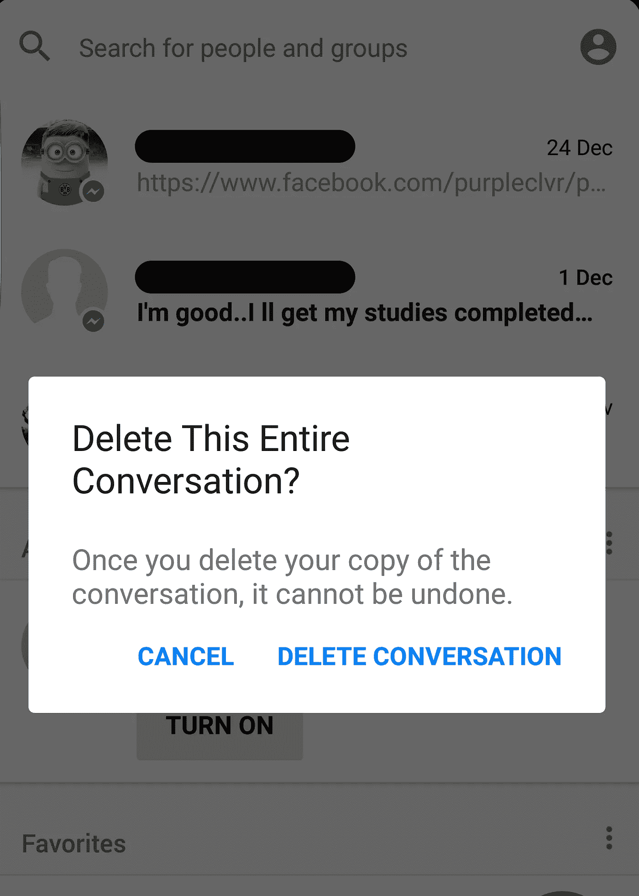
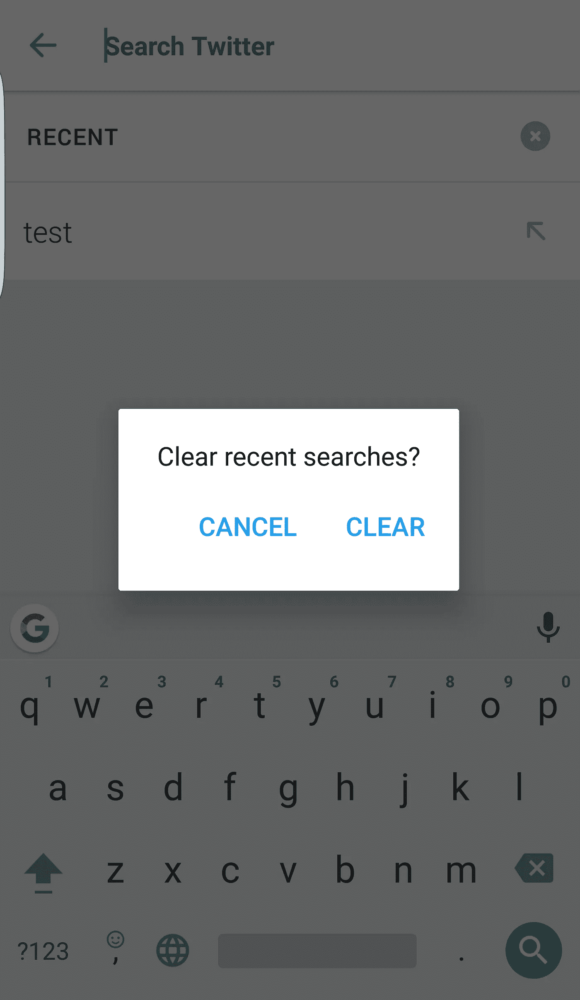
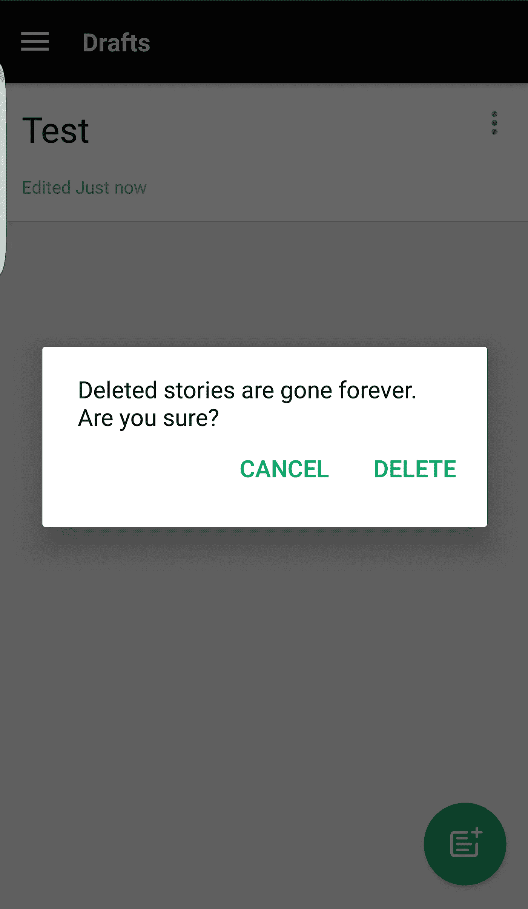
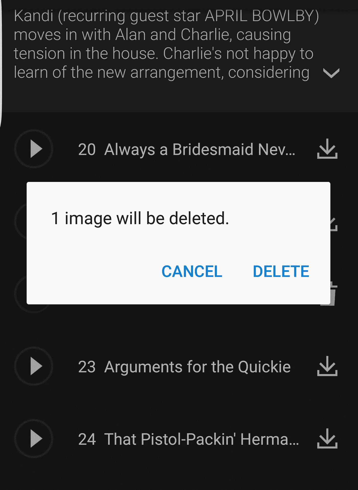
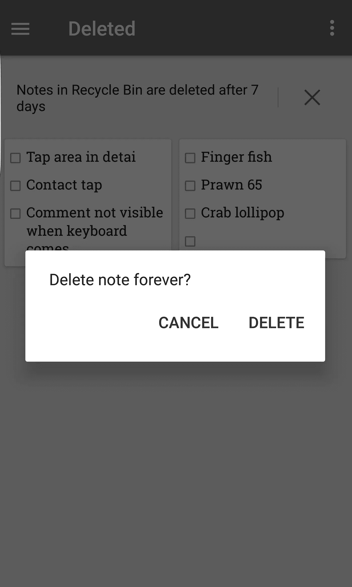
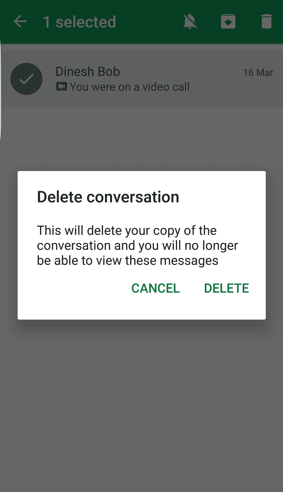
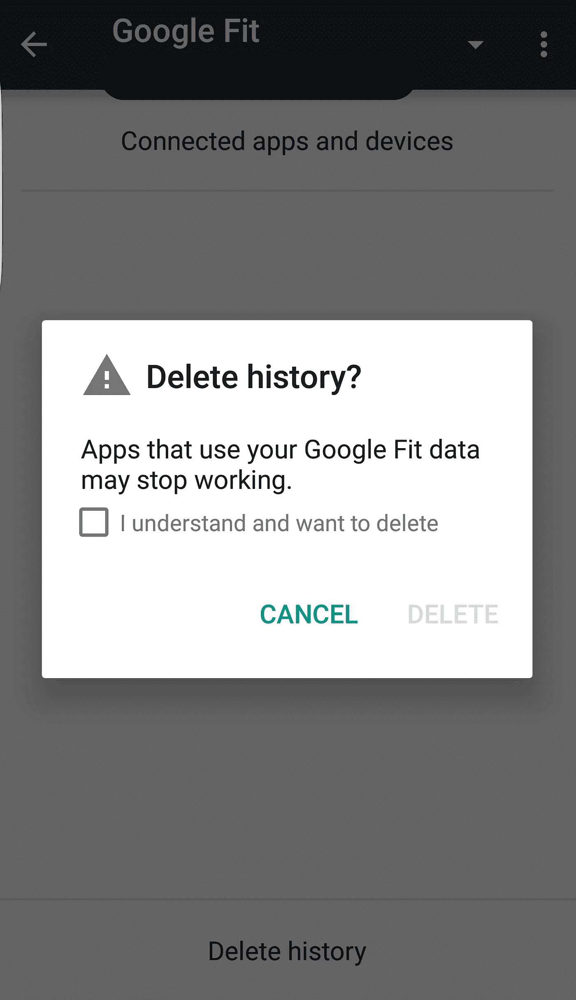

# 让对话框中的动作按钮尖叫它的结果

> 原文：<https://medium.com/hackernoon/let-the-action-buttons-in-the-dialog-box-scream-its-outcome-b319c5efc698>

Image Source: [https://material.io/guidelines/components/dialogs.html#dialogs-alerts](https://material.io/guidelines/components/dialogs.html#dialogs-alerts)

我们在应用程序中使用对话框来通知用户情况，并要求用户确认。在对话框中使用的简单动作按钮对是 **OK/Cancel** 和 **Yes/No** 。但是我们能做得更好吗？

> 让对话框中的动作按钮尖叫它的结果

如果动作按钮清楚地表明结果，比使用普通标签(如“确定/是”)会有更好的用户体验。

从[材料设计指南](https://material.io/guidelines/components/dialogs.html#dialogs-alerts)，

> *肯定性行动文本“放弃”清楚地表明了决定的结果。*
> 
> 不屑一顾的行动文本“不”回答了问题，但没有暗示之后会发生什么。一个更好的动作对应该是显式的“取消”和“删除”

摘自一篇 [UX 星球](https://uxplanet.org/) [文章](https://uxplanet.org/primary-secondary-action-buttons-c16df9b36150#.zhrqw89k0)由著名的[尼克·巴比奇](https://medium.com/u/bcab753a4d4e?source=post_page-----b319c5efc698--------------------------------)

> 一个好的对话框不仅仅是询问用户他们想要执行什么动作。这也是让每个选项尽可能清晰。
> 
> 为一个按钮命名来解释它的作用通常比使用一个通用标签(比如“OK”)要好。
> 
> 尽可能使用动词，而不是“是”或“好”,因为你的按钮会脱离解释文本或标题的上下文而变得有意义。
> 
> 当你可以用动词代替的时候，千万不要用“是”或“好”!

让我们看看一些著名应用程序的对话框中使用的“动词”标签，

Screenshot from Google Photos Android app

Screenshot from Facebook Messenger Android app

Screenshot from Twitter Android app

Screenshot from Medium Android app

Screenshot from Gallery Android app

Screenshot from Google Keep Android app

Screenshot from Hangouts Android app

Screenshot from Google Fit Android app

看起来‘动词’标签几乎用在了所有应用的对话框中，除了少数几个(*cough* Telegram *cough* Amazon)。让我们实现这个对话框 UX 模式，让我们的应用程序更好地为用户服务。

如果你觉得这篇文章有用，请点击💚下面，别忘了在评论里分享你的想法。

在推特上联系我们:[我](https://twitter.com/Dineshbabuhunky) | [黑客正午](https://twitter.com/hackernoon)

> [黑客中午](http://bit.ly/Hackernoon)是黑客如何开始他们的下午。我们是 [@AMI](http://bit.ly/atAMIatAMI) 家庭的一员。我们现在[接受投稿](http://bit.ly/hackernoonsubmission)，并乐意[讨论广告&赞助](mailto:partners@amipublications.com)机会。
> 
> 如果你喜欢这个故事，我们推荐你阅读我们的[最新科技故事](http://bit.ly/hackernoonlatestt)和[趋势科技故事](https://hackernoon.com/trending)。直到下一次，不要把世界的现实想当然！

