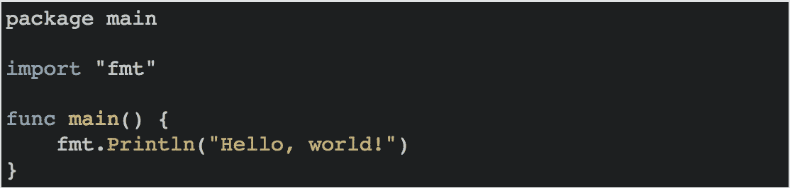
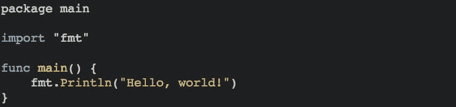
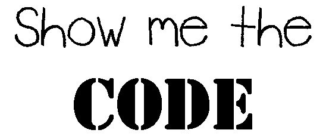

# 让你的代码来说话

> 原文：<https://medium.com/hackernoon/let-your-code-do-the-talking-983906a3a587>

今天，我很兴奋地向大家介绍一个新的 GitPitch 特性，*仅仅使用简单的降价就可以增强*幻灯片中代码的呈现。这个新特性叫做[](https://github.com/gitpitch/gitpitch/wiki/Code-Presenting)****。****

**您将很快看到如何使用*代码呈现*来有效地**单步执行**git repo 中任何文件的静态代码块或完整源代码，或者直接在 GitPitch 呈现中**逐行执行**或**逐节执行**。**

# **代码呈现预览**

**为了快速了解 GitPitch *代码演示*的内容，请看下面 GitPitch 演示中单张幻灯片上代码演示的截屏:**

****

**GitPitch Code Presenting — Step-Thru Code Without An IDE!**

**使用标准幻灯片导航激活，*代码呈现*显示一系列代码片段。当代码片段被揭露时，它会被清晰聚焦，而周围的代码会自动模糊。这意味着您和您的观众现在可以在 GitPitch 中享受**无干扰** *代码演示*。**

# **代码演示直播**

**要观看 GitPitch *代码演示*实况，请花点时间浏览下面的示例演示。我会在这里等你回来:**

**[](https://gitpitch.com/gitpitch/code-presenting) [## [git pitch]git pitch/代码呈现/主

### GitPitch 支持的 Markdown 演示。

gitpitch.com](https://gitpitch.com/gitpitch/code-presenting) 

如果您查看了[示例演示](https://gitpitch.com/gitpitch/code-presenting)，您将会看到来自 git repo 中的静态代码块和源代码的代码被直接呈现在在线演示中。当然，*代码展示*也适用于 GitPitch [离线展示](https://github.com/gitpitch/gitpitch/wiki/Slideshow-Offline)。

# 来自回购源的代码呈现

为了准备*代码展示*的发布，我最近增加了对新的 [**代码滑动分隔符**](https://github.com/gitpitch/gitpitch/wiki/Code-Delimiter-Slides) 的支持。这个新的幻灯片分隔符允许您自动将 repo 中任何文件的代码直接加载到演示文稿中任何幻灯片的代码块中。

新的代码分隔符语法很简单，它只接受 repo 中任何源文件的相对路径:

```
---?code=path/to/source.file
```

任何设置了新代码分隔符的幻灯片都将自动呈现一个 Markdown 代码块。此代码块的内容将是分隔符上指定的文件内容。

例如，假设在您的回购中找到文件`src/main.go`,其内容如下:

```
package mainimport "fmt"func main() {
    fmt.Println("Hello, world!")
}
```

使用新的代码幻灯片分隔符，您可以自动将该文件的内容转换为演示文稿幻灯片中的代码块，只需在您的`PITCHME.md`中标记一行:

```
---?code=src/main.go
```

然后，GitPitch 将此代码块呈现如下:



GitPitch Code Block With Automatic Syntax Highlighting

这个新的分隔符使得将任何文件**加载到 GitPitch 演示文稿的任何幻灯片中变得简单，而不管编程语言**。

这也意味着你不再需要复制和粘贴代码到你的`PITCHME.md`中，如果它已经存在于你的回购协议中。另外，当您在 repo 中更改源文件时，演示文稿中显示的源代码也会自动更新。

# 代码显示降价语法

用于在您的`PITCHME.md`中激活*代码呈现*的 markdown 语法在 GitPitch Wiki [这里](https://github.com/gitpitch/gitpitch/wiki/Code-Presenting)有详细描述。在这篇博文中，我们将通过例子来学习，使用一种简单的语法，称为代码片段标记，或 *CF-marker* 。

让我们首先将前面提到的`src/main.go` 文件的内容粘贴到一个标准的 Markdown 代码块中，该代码块位于一个`PITCHME.md`内的幻灯片上:

```
---```
package mainimport "fmt"func main() {
    fmt.Println("Hello, world!")
}
```@[1]
@[3]
@[5-7]
```

如您所见，代码块本身是一个标准的 Markdown 代码块。 *CF 标记*出现在代码块的正下方。每个 CF 标记采用`@[fragment-range-of-lines].`的形式。在本例中，有三个 *CF 标记*:

1.  第一个 *CF 标记*、`*@[1]*`将导致代码块中的第 1 行(`package`语句)成为高亮显示的代码片段。
2.  第二个 *CF 标记、* `*@[3]*` *、*将导致第 3 行(`import`语句)成为高亮显示的代码段。
3.  第三个 *CF 标记、* `*@[5-7]*` *、*将使第 5 行到第 7 行(整个`main`函数)成为代码块中突出显示的代码片段。

通过结合使用新的代码滑动定界符和 *CF 标记*，我们可以省去将这段代码复制到我们的`PITCHME.md`中的工作，从而获得如下相同的结果:

```
---?code=src/main.go@[1]
@[3]
@[5-7]
```

如果您打开这个演示，*代码演示*将会呈现如下突出显示的代码片段:



GitPitch Code Presenting — Step-Thru Code Without An IDE!

正如你所看到的，*代码展示*是一个简单而强大的工具，它让你在任何 GitPitch 展示中直接关注你所关心的代码。

# 代码演示演讲者代码注释

*CF-marker* 语法也支持带注释的*代码呈现*。你可以把这个特性想象成*演讲者注释代码。*标注为**可选**。注释可以与任何 *CF 标记*相关联。例如:

```
@[1](Go package main for executable command)
```

如果注释与一个 *CF-marker* 相关联，那么当突出显示的代码片段处于焦点时，该注释会自动呈现在幻灯片上，直接位于代码块下方。注释可以用来引起对与突出显示的代码相关的关键点的注意。

# 代码呈现设计简单

通常，作为开发人员，描述代码的最佳方式是让代码自己说话。对于许多办公室、聚会或会议的观众来说，下面这句口头禅是一个常见的重复:



现在，随着 GitPitch *代码演示*的引入，在任何幻灯片演示中直接展示您的代码都享有一流的特性支持。为了与 GitPitch 压倒一切的理念**设计简单**，*代码展示*保持一致，不需要注册，也绝对不需要安装任何东西。**就是管用；)**

感谢您今天的阅读。想了解更多来自 GitPitch 社区的新闻、技巧和酷炫创意，请在 Medium 或 Twitter 上关注我。

[](http://bit.ly/HackernoonFB)[](https://goo.gl/k7XYbx)[](https://goo.gl/4ofytp)

> [黑客中午](http://bit.ly/Hackernoon)是黑客们下午的开始。我们是 [@AMI](http://bit.ly/atAMIatAMI) 家庭的一员。我们现在[接受投稿](http://bit.ly/hackernoonsubmission)并乐意[讨论广告&赞助](mailto:partners@amipublications.com)机会。
> 
> 如果你喜欢这个故事，我们推荐你阅读我们的[最新科技故事](http://bit.ly/hackernoonlatestt)和[趋势科技故事](https://hackernoon.com/trending)。直到下一次，不要把世界的现实想当然！

**