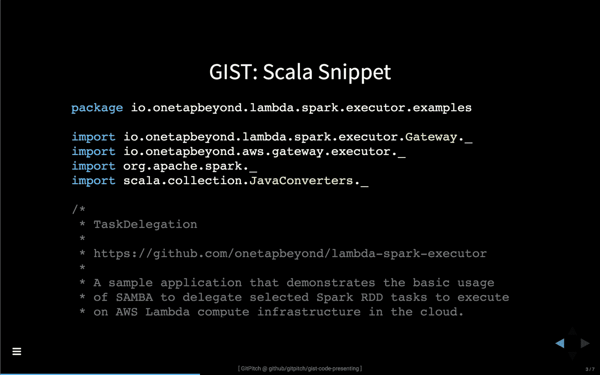

# 让你的 GISTs 来说吧

> 原文：<https://medium.com/hackernoon/let-your-gists-do-the-talking-fe4c2481f31>

> GitHub GIST 的实时代码演示直接在 GitPitch 幻灯片中进行。

几个月前，我为 GitPitch 演示引入了一个新功能，叫做 [**，代码演示**](https://github.com/gitpitch/gitpitch/wiki/Code-Presenting) 。看到这个特性在 GitPitch 社区中如此迅速和广泛地被采用，真是令人惊讶。



简而言之，GitPitch 代码演示可以让你直接在幻灯片演示中一行一行地、一个功能一个功能地、或任意的**一个块一个块地**一步步地执行代码**。**

关于 GitPitch 代码展示的介绍，你可以在 Hackernoon 上找到原始的博客文章:[让你的代码说话](https://hackernoon.com/let-your-code-do-the-talking-983906a3a587)。

# GitHub GIST 刚刚互动了！

今天我很高兴地宣布支持 **GitHub GIST:** 的现场代码演示

[ GitPitch GIST Code Presenting — Sample Presentation ] — Click to Focus

**提示！**当焦点在演示文稿上时，您可以按`F`键打开演示文稿进行全屏查看。

这个演示展示了如何将一个简单的要点变成完全交互式的，同时在 GitPitch 演示中完美呈现。这些演示很容易嵌入任何博客或网站。现在，每个人都可以直接在任何 GitPitch 幻灯片中享受现场代码演示。

# 准备好互动了吗？

再简单不过了。使用一个[要点分隔符](https://github.com/gitpitch/gitpitch/wiki/GIST-Slides)来标识你想要出现在幻灯片上的代码，然后添加标准的[代码表示片段标记](https://github.com/gitpitch/gitpitch/wiki/Code-Presenting)来赋予你的代码生命。

例如，在上面的动画中展示 GIST Scala 片段所需的全部降价如下所示:

```
---?gist=onetapbeyond/494e0fecaf0d6a2aa2acadfb8eb9d6e8&lang=Scala
@[25–29]
@[41–53]
@[57–62]
```

如果你已经准备好动手了，请浏览一下 GitHub 上的`PITCHME.md` markdown 以获得完整的演示样本:

[](https://github.com/gitpitch/gist-code-presenting) [## git pitch/gist-代码演示

### 要点-代码展示-博客帖子- GitHub 要点代码展示

github.com](https://github.com/gitpitch/gist-code-presenting) 

# 离线展示你的要点；-)

GIST 代码演示的另一个令人兴奋的特性是，当你离线演示时，GitPitch 会确保你的 GIST 也离线。这是自动发生的，试一试你就知道了。

当你需要在聚会或会议上发言时，这尤其有用。当你在舞台上直播时，你不能总是依赖网络连接。有了 [GitPitch 离线](https://github.com/gitpitch/gitpitch/wiki/Slideshow-Offline)你就没有这样的担心了。

# 面向所有人的减价演示

GitPitch 还在继续发展。今天的公告是这一迷人旅程的下一步。如果您正在使用 GitPitch，请分享您的喜好、厌恶和建议，以便我们能够将这项服务做得更好。评论区在下面开放，或者你可以随时在[推特](https://twitter.com/gitpitch)上联系我。

GitPitch 让你毫不费力地制作和分享关于你所关心的事物的美丽内容。用它来宣传、推销或展示任何东西；)一如既往，我期待看到 GitPitch 社区接下来会创造出什么。

[](https://twitter.com/gitpitch)

**您可以在**[**Medium**](/@gitpitch)**或**[**Twitter**](https://twitter.com/gitpitch)**上关注我，了解 GitPitch 社区的更多新闻、技巧和独特创意。**