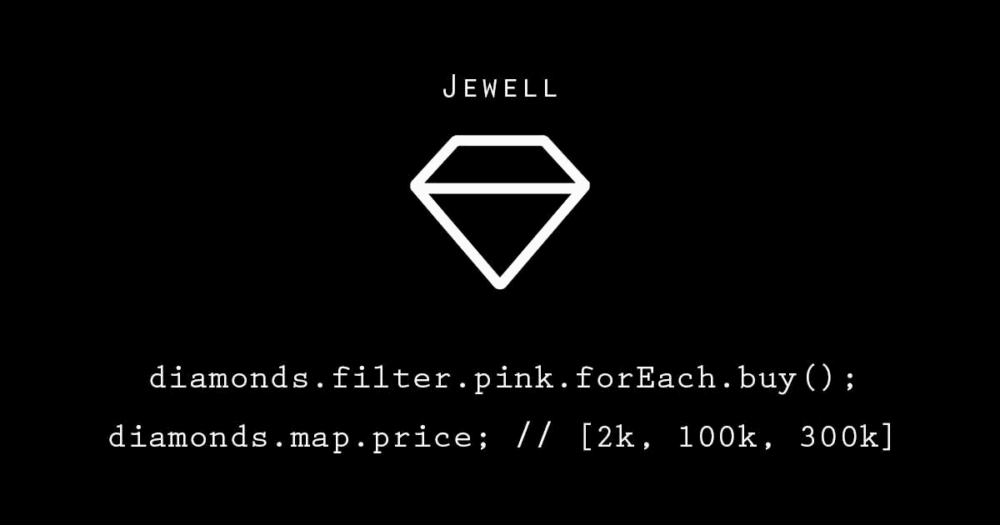

# 让我们用朱厄尔给 Javascript 加点糖

> 原文：<https://medium.com/hackernoon/lets-add-some-sugar-to-javascript-with-jewell-d33d282fdee9>

## 朱厄尔给 Javascript 带来了高阶消息

Jewell — Javascript Syntax Sugar for Higher-Order Messaging

*如果想直接跳转到动作(GitHub repo)，* [*点击这里*](https://github.com/pedsmoreira/jewell) *。*

在我的职业生涯中，我曾使用过许多语言和框架，并从每一种语言和框架中学到了很多东西。

最近我一直在探索 Javascript，有一天，在使用数组时，我想起了 Laravel 框架的一个非常酷的特性，叫做高阶消息传递。它允许你创建非常有表现力的 1 liners，比如: *(PHP 代码)*

`$employees->filter->retired->each->sendPayment();`

通过一些研究，我发现也有一些使用 Ruby 的实现，这是我最喜欢的语言之一。Ruby 的语法非常灵活，所以高阶消息对它来说看起来非常自然。使用 [Nat Pryce 的实现](http://natpryce.com/articles/000535.html)，下面是相同的代码在 Ruby 中的样子。

`employees.where.retired?.do.sendPayment()`

## Javascript 呢？

您可能知道，现在有很多 Javascript 包，所以猜猜当我研究并意识到没有 Javascript 的高阶消息库时，我的反应是什么？

*If you know a library that does that, please leave it on the comments below, I’d love to check it out. I honestly couldn’t find it on NPM/Google* ¯\_(ツ)_/¯

因为我找不到允许我完成同样行为的库，所以我想知道这是否可能。我开始在业余时间编写一个版本，结果发现可以用 ES6 的一个特性 Proxy 来完成。\o/

棘手的部分是让语法变得漂亮，并且在 Javascript 生态系统中有意义，而不产生怪物。几经迭代，终于得到了自己满意的版本！它看起来是这样的:

`employees.filter.retired.forEach.sendPayment();`

和我上面给你看的例子很相似，是吧？！？现在让我们一步一步地看完整的代码示例。

**第 0 步。将朱厄尔加入你的项目**

`npm install jewell --save`

**第一步。**导入`jewellPrototype`并将其应用到`Array`类，这样我们就可以通过原生数组方法使用高阶消息传递。

**第二步。**宣告一个阶级。在我们的情况下，它是钻石

**步骤三。**打造一系列钻石

**步骤四。玩得开心**

注意，在我们的`Get all blue diamonds`例子中，我们调用`#isBlue`，这是因为`#isBlue`是一个函数。如果是这样的话，我们为什么不在这里叫它呢？

`diamonds.filter.isBlue.forEach.buy()`

答案是:可以，但没必要。由于`isBlue`没有参数，朱厄尔认为应该调用它来允许链接。

除了*镶嵌*和`Array`类本身，你也可以将朱厄尔与你自己的库一起使用，这个库有操作数组或单个实例的快捷方式。

**⚠警告:**请记住，Jewell 用一个代理替换了原来的方法，所以在交付生产之前，请确保您没有在您的应用程序中创建一些疯狂的行为或减慢一切。

你可以在回购中查看更多示例[。如果您有任何问题，请在下面留下评论或在回购上提出问题。我们也非常欢迎您提出需求和建议。](https://github.com/pedsmoreira/jewell)

事不宜迟，下面是 GitHub 回购:

 [## 佩德斯莫雷拉/朱厄尔

### 用于高阶消息传递的 jewell - Javascript 语法糖

github.com](https://github.com/pedsmoreira/jewell) 

## **号外**

如果你喜欢用爱制作的软件，我想邀请你参加 [GitShowcase](http://gitshowcase.com/) 。来获得你自己的摇滚明星作品集🤘。 *cc* [*维克托·桑托斯*](https://medium.com/u/f2368f957647?source=post_page-----d33d282fdee9--------------------------------)

 [## GitShowcase

### 开发人员，在即插即用产品组合中展示您的最佳项目。最棒的是，免费的。

www.gitshowcase.com](https://www.gitshowcase.com)