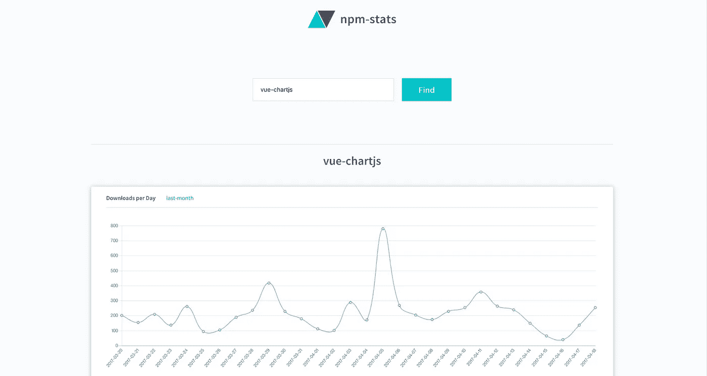
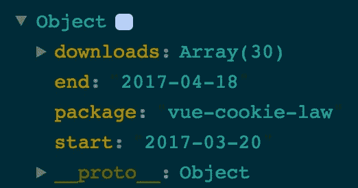

# 让我们用 Vue、Chart.js 和一个 API 来构建一个 Web 应用程序

> 原文：<https://medium.com/hackernoon/lets-build-a-web-app-with-vue-chart-js-and-an-api-544eb81c4b44>



## 构建一个小型 web 应用程序的第一部分，它与 npm API 交互并生成漂亮的图表

数据是美好的。借助现代技术，可视化数据和创造美好体验变得异常容易。在这份快速指南中，我们将介绍如何与国家预防机制互动💘API 来获取一个包的下载统计数据，并用 [Chart.js](http://www.chartjs.org/) 从这些数据中生成一个图表

# ⚡快速入门

我们将构建[npm-stats.org](http://npm-stats.org/)，并将使用以下工具:

*   [Vue.js](https://vuejs.org/) 带`vue-router`
*   [Chart.js](http://www.chartjs.org/)
*   [vue-chartjs](http://vue-chartjs.org/#/)
*   [vue-cli](https://github.com/vuejs/vue-cli)
*   [axios](https://github.com/mzabriskie/axios)

使用 Vue.js，我们将构建应用程序的基本接口，并使用`vue-router`进行路由。我们用 [vue-cli](https://github.com/vuejs/vue-cli) 搭建我们的项目，这创建了我们的基本项目结构。对于图表生成，我们将使用 Chart.js，并将其作为 Vue 的包装器， [vue-chartjs](http://vue-chartjs.org/#/) 。因为我们需要与 API 交互，所以我们使用 [axios](https://github.com/mzabriskie/axios) 来发出 http 请求。然而，你可以随意将这个库与其他库交换。

# 🔧安装和设置

首先，我们需要安装 vue-cli 来支撑我们的项目。我希望您已经安装了 node 和 npm 的最新版本！🙏如果你安装了[纱线](https://yarnpkg.com/lang/en/)就更好了！如果没有，你真的应该！如果你不想要，就用 npm 的等价物替换掉 yarn 命令。

```
$ npm install -g vue-cli
```

然后我们可以用 vue-cli 搭建我们的项目。如果你想可以启用单元和 e2e 测试，但是我们不会覆盖它们。🔥但是你需要检查 vue 路由器！

```
$ vue init webpack npm-stats
```

然后，我们将 cd 放入我们的项目文件夹，并安装带有`cd npm-stats && yarn install`的依赖项。这样，我们的基本项目依赖项就安装好了。现在我们需要为我们的应用程序添加一个。

```
$ yarn add vue-chartjs chart.js axios
```

快速检查一下`yarn run dev`是否一切正常。现在我们应该看到 vue 的样板页面。

我们完事了。👏

# 💪是时候建造了

这里只是一个小小的免责声明，我不会把重点放在造型上。我想你可以自己让网站看起来更好💅所以我们只涉及 javascript 相关的代码。

另一个免责声明，这是一个相当小的 MVP，然后现在超级干净的代码。我将在后面的阶段重构其中的一些。就像在现实世界里一样。

## 成分

让我们想想我们需要什么组件。正如我们在屏幕截图中看到的，我们看到了一个输入您正在寻找的包名的输入框和一个按钮。可能是页眉和页脚以及图表本身。

你完全可以把按钮和输入框做成一个组件，但是我们并没有构建一个复杂的应用程序，为什么要这么麻烦呢？简单点。让它工作！

所以我最后用了以下组件:

*   components/Footer.vue
*   组件/Header.vue
*   components/LineChart.vue
*   页面/Start.vue

我将跳过*页眉*和*页脚*，因为它们只包含徽标和一些链接。这里没什么特别的。*线图*和*开始*页面是重要的页面。

## 折线图

LineChart 组件将是我们呈现图表的 chart.js 实例。我们需要导入 Line 组件并扩展它。我们现在创建两个道具。一个是数据，即下载次数，另一个是标签，例如日、周、年。

```
props: {
 chartData: {
   type: Array,
   required: false
 },
 chartLabels: {
   type: Array,
   required: true
 }
},
```

因为我们希望所有的图表看起来都一样，所以我们在数据模型中定义了一些 Chart.js 样式选项，这些选项作为*选项*传递给 **renderChart()** 方法。

因为我们现在只有一个数据集，所以我们可以构建数据集数组并绑定标签和数据。

# 📺我们的开始页面

因为我们的折线图组件已经启动并开始工作。是时候构建其余部分了。我们需要一个输入字段和按钮来提交包名。然后请求数据并将数据传递给我们的图表组件。

所以，我们先想想我们需要什么数据，什么状态/数据模型。首先，我们需要一个`package`数据模型，我们将在输入字段中使用`v-model`。我们还希望将包的名称显示为标题。所以`packageName`会很好。然后我们的两个数组用于请求的数据`downloads`和`labels`，当我们请求一个时间段时，我们需要设置`period`。但是，也许请求出错了，所以我们需要`errorMessage`和`showError`。最后但同样重要的是`loaded`，因为我们希望仅在请求发出后才显示图表。

## npm API

有各种端点可以下载一个包。一个是例如

```
GET [https://api.npmjs.org/downloads/point/{period}[/{package}]](https://api.npmjs.org/downloads/point/%7Bperiod%7D%5B/%7Bpackage%7D%5D)
```

然而，这个只有一个点的价值。所以总下载量。但是要绘制我们的酷图，我们需要更多的数据。所以我们需要范围端点。

```
GET [https://api.npmjs.org/downloads/range/{period}[/{package}]](https://api.npmjs.org/downloads/range/%7Bperiod%7D%5B/%7Bpackage%7D%5D)
```

周期可以定义为例如`last-day`或`last-month`或特定的日期范围`2017-01-01:2017-04-19`，但是为了简单起见，我们将默认值设置为`last-month`。在第二部分的后面，我们可以添加一些日期输入字段，以便用户可以设置日期范围。

所以我们的数据模型看起来像这样:

```
data () {
 return {
  package: null,
  packageName: ‘’,
  period: ‘last-month’,
  loaded: false,
  downloads: [],
  labels: [],
  showError: false,
  errorMessage: ‘Please enter a package name’
 }
},
```

# 💅模板

现在是时候构建模板了。我们需要 5 样东西:

*   输入栏
*   按钮来触发搜索
*   错误消息输出
*   带有包名的标题
*   我们的图表。

```
<input
 class=”Search__input”
 [@keyup](http://twitter.com/keyup).enter=”requestData”
 placeholder=”npm package name”
 type=”search” name=”search”
 v-model=”package”
 >
<button class=”Search__button” [@click](http://twitter.com/click)=”requestData”>Find</button><div class="error-message" v-if="showError">
  {{ errorMessage }}
</div><h1 class="title" v-if="loaded">{{ packageName }}</h1>
<line-chart v-if="loaded" :chart-data="downloads" :chart-labels="labels"></line-chart>
```

暂时忽略 css 类。我们的输入字段在输入时有一个 keyup 事件。所以如果你按下回车键，你就触发了`requestData()`方法。我们将`v-model`绑定到`package`

对于潜在的错误，我们有一个条件，只有当`showError`为*真*时，我们才显示消息。可能出现两种类型的错误。一种是，有人试图在不输入任何名称的情况下搜索包裹，或者他输入了一个不存在的名称。

对于第一种情况，我们有默认的错误消息，对于第二种情况，我们将获取来自请求的错误消息。

因此，我们的完整模板将如下所示:

# 🤖java 描述语言

现在是编码的时候了。首先我们将做我们的`requestData()`方法。这相当简单。我们需要向端点发出请求，然后映射传入的数据。在我们的 **response.data** 中，我们有一些关于这个包的信息:



response.data

比如开始日期、结束日期、包名和下载数组。然而，下载数组的结构是这样的:

```
downloads: [
 {day: ‘2017–03–20’, downloads: ‘3’},
 {day: ‘2017–03–21’, downloads: ‘2’},
 {day: ‘2017–03–22’, downloads: ‘10’},
]
```

但是我们需要将下载和日期分开，因为对于 chart.js，我们只需要一个包含数据(下载)的数组和一个包含标签(日期)的数组。这是一个简单的工作**地图**

```
requestData () {
 axios.get(`[https://api.npmjs.org/downloads/range/${this.period}/${this.package}`](https://api.npmjs.org/downloads/range/${this.period}/${this.package}`))
 .then(response => {
   this.downloads = response.data.downloads.map(download => download.downloads)
   this.labels = response.data.downloads.map(download => download.day)
   this.packageName = response.data.package
   this.loaded = true
 })
 .catch(err => {
   this.errorMessage = err.response.data.error
   this.showError = true
 })
}
```

现在，如果我们输入一个包名，比如 vue 并按 enter 键，就会发出请求，映射数据并呈现图表！但是等等。你什么也没看见。因为我们需要告诉 vue-router 为我们的起始页设置索引。

在`router/index.js`下，我们导入或寻呼并告诉路由器使用它

```
import Vue from ‘vue’
import Router from ‘vue-router’
import StartPage from ‘@/pages/Start’Vue.use(Router)export default new Router({
 routes: [
   {
     path: ‘/’,
     name: ‘Start’,
     component: StartPage
   },
 ]
})
```

# 💎抛光剂

但是，我们还没有完成。我们有些问题，对吧？首先，如果我们不输入任何名字，我们的应用程序就会崩溃。如果你输入一个新的包并按回车键，我们会有问题。出错后，消息不会消失。

嗯，是时候清理一下了。首先让我们创建一个新的方法来重置我们的状态。

```
resetState () {
 this.loaded = false
 this.showError = false
},
```

我们在 axios api 调用之前在我们的`requestData()`方法中调用它。我们需要检查一下包裹的名称。

```
if (this.package === null 
    || this.package === ‘’ 
    || this.package === ‘undefined’) {
  this.showError = true
  return
}
```

现在，如果我们试图搜索一个空的包名，我们会得到一个默认的错误消息。

我知道，我们覆盖了很多，但让我们添加另一个很酷的小功能。我们有 vue 路由器，但没有真正使用它。在我们的根节点`/`处，我们看到了带有输入字段的起始页。搜索之后，我们停留在我们的根页面。但是如果我们可以分享我们与统计数据的链接，那会很酷，不是吗？

因此，在有效的搜索之后，我们将包名添加到我们的 url 中。

`npm-stats.org/#/vue-chartjs`

如果我们单击该链接，我们需要获取包名并使用它来请求我们的数据。

让我们创建一个新的方法来设置我们的网址

```
setURL () {
 history.pushState({ info: `npm-stats ${this.package}`}, this.package, `/#/${this.package}`)
 }
```

我们需要在我们的响应承诺中调用`this.setURL()`。现在，在发出请求后，我们将包名添加到我们的 URL 中。但是，如果我们打开一个新的浏览器标签并调用它，什么也不会发生。因为我们需要告诉 vue-router，我们的`/`之后的所有内容也将指向起始页，并将字符串定义为查询参数。这非常简单。

在我们的`router/index.js`中，我们只需要在 routes 数组中设置另一条路径。我们称之为 param 包。

```
{
  path: ‘/:package’,
  component: StartPage
 }
```

现在，如果您转到`localhost:8080/#/react-vr`，您将看到起始页。但是没有图表。因为我们需要获取参数并使用它执行我们的请求。

回到我们的 Start.vue，我们在安装的钩子中抓取参数。

```
mounted () {
 if (this.$route.params.package) {
   this.package = this.$route.params.package
   this.requestData()
 }
},
```

就是这样！

你可以在 [GitHub](https://github.com/apertureless/npm-stats) 查看完整的源代码，也可以在📺[http://npm-stats.org/](http://npm-stats.org/)

# 丰富

但是，嘿，仍然有改进的空间。我们可以添加更多的图表。像每月统计，每年统计和添加日期字段来设置期间和许多其他事情。我将在**第二部分**中讲述其中一些！敬请关注！

第二部分:[https://hacker noon . com/lets-build-a-web-app-with-vue-chart-js-and-an-API-part-ii-39781 B1 D5 ACF](https://hackernoon.com/lets-build-a-web-app-with-vue-chart-js-and-an-api-part-ii-39781b1d5acf)

[](http://bit.ly/HackernoonFB)[](https://goo.gl/k7XYbx)[](https://goo.gl/4ofytp)

> [黑客中午](http://bit.ly/Hackernoon)是黑客如何开始他们的下午。我们是 [@AMI](http://bit.ly/atAMIatAMI) 家庭的一员。我们现在[接受投稿](http://bit.ly/hackernoonsubmission)，并乐意[讨论广告&赞助](mailto:partners@amipublications.com)机会。
> 
> 如果你喜欢这个故事，我们推荐你阅读我们的[最新科技故事](http://bit.ly/hackernoonlatestt)和[趋势科技故事](https://hackernoon.com/trending)。直到下一次，不要把世界的现实想当然！

