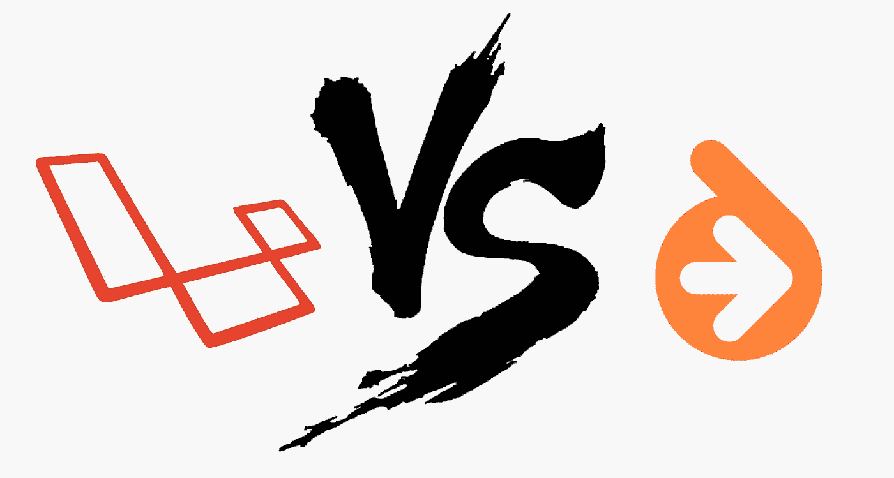

# 让我们比较一下拉勒维尔和教义迁移

> 原文：<https://medium.com/hackernoon/lets-compare-laravel-and-doctrine-migrations-795c0022285f>

这篇文章是针对 Laravel 初学者的。不需要任何技能。这篇文章有点固执己见，所以不要全信。此外，为了简洁起见，省略了细节。

因此，我将进行实际的比较，并给出一些开始的提示。

如果你从未听说过[主义](http://docs.doctrine-project.org/projects/doctrine-orm/en/latest/tutorials/getting-started.html)，那就是数据库抽象层。有点像[雄辩的](https://laravel.com/docs/master/eloquent)，但类型不同:Laravel 是活动记录(AR)，而 Doctrine 是对象关系映射器(ORM)。

# Laravel 迁移([文档](https://laravel.com/docs/master/migrations))

在 Laravel 中，我们有`database/migrations`文件夹存储所有的迁移类。Laravel 还在数据库中保留了一个表来跟踪过去的迁移。该系统非常简单，典型的工作流程如下:

*   `php artisan make:migration create_foo_column_in_bar_table --table=bar` —创建迁移类
*   导航到`[some numbers]_create_foo_column_in_bar_table.php`文件
*   手动填写迁移方法。
*   运行`php artisan migrate`触发`up`方法。运行`php artisan migrate:rollback`触发`down`方法。

**上升**

*   初学者友好。

**不利方面**

*   需要大量代码。在创建表时这并不明显，但对于复杂的更改来说更是如此。
*   迁移类有可读的名称，并且名称应该是唯一的。因此，如果你不够小心，就有可能发生冲突。
*   写下来的方法很痛苦。这是一大堆容易出错的文案。
*   每个迁移都应该被测试，如果没有`down`方法，这是很难做到的。
*   所有的迁移都必须永久保存，因为它们代表了您的模式。这将在您完成数百次迁移后打开庞大的迁移文件夹。

# 教义迁移([文档](http://docs.doctrine-project.org/projects/doctrine-migrations/en/latest/reference/introduction.html))

在理论上，我们将模式定义为实体类上的注释。通过将您的当前模式与预期模式进行比较，自动生成迁移。迁移以原始 SQL 的形式呈现，您可以在需要时修改它们(这种情况相当少见)。以下是典型的工作流程:

*   在实体类中进行更改。
*   从差异中产生迁移:`php artisan doctrine:migrations:diff`。
*   浏览一下迁移，看看一切是否如预期的那样。
*   运行迁移:`php artisan doctrine:migrations:migrate`

**升迁**

*   需要键入的代码更少。在重命名列或移动索引时最明显。改变一行——教义会完成剩下的工作。
*   迁移以时间戳命名。冲突不太可能发生。
*   `down`方法是自动编写的。这意味着你也可以毫不费力地进行`up`和`down`的迁移。您还可以迁移到特定的迁移。
*   迁移是一次性的。因为它们可以从声明中可靠地生成。轻松移动、合并或删除它们。

**缺点**

*   需要一点学习才能掌握。

# 结论

您可能想要使用原则迁移，即使不使用整个原则生态系统。它们非常省时且可扩展。因此，Laravel 迁移只适用于最简单的情况。

# 一些附加信息

*   原则允许从现有数据库创建带有注释[的实体。这些可能需要一些修正，但没有从零开始创造它们那么多。](http://symfony.com/doc/current/doctrine/reverse_engineering.html)
*   当使用 Laravel 迁移时，不要使用口才，只使用查询生成器。或者甚至是原始查询，以获得更多安全可靠的信息。原因是:你可能进行迁移，改变模型，进行另一次迁移。第一次迁移有可能不再与您的模型兼容。这个 bug 很容易在测试或生产环境中发现，并可能导致部分迁移，这是很难处理的。
*   使用教条或 Laravel 迁移只对模式执行更改(如创建表、移动列、附加索引等)。对于数据更改，您可以使用我的[库](https://github.com/asvae/laravel-fixtures)。或者你可以在 Laravel seeders 上为自己建造一些东西。

*原载于*[*gist.github.com*](https://gist.github.com/asvae/f0b8b6f3eae9f72d9fa9e824c470804f)*。*

> 黑客中午是黑客如何开始他们的下午。我们是这个家庭的一员。我们现在[接受投稿](http://bit.ly/hackernoonsubmission)并乐意[讨论广告&赞助](mailto:partners@amipublications.com)机会。
> 
> 如果你喜欢这个故事，我们推荐你阅读我们的[最新科技故事](http://bit.ly/hackernoonlatestt)和[趋势科技故事](https://hackernoon.com/trending)。直到下一次，不要把世界的现实想当然！

