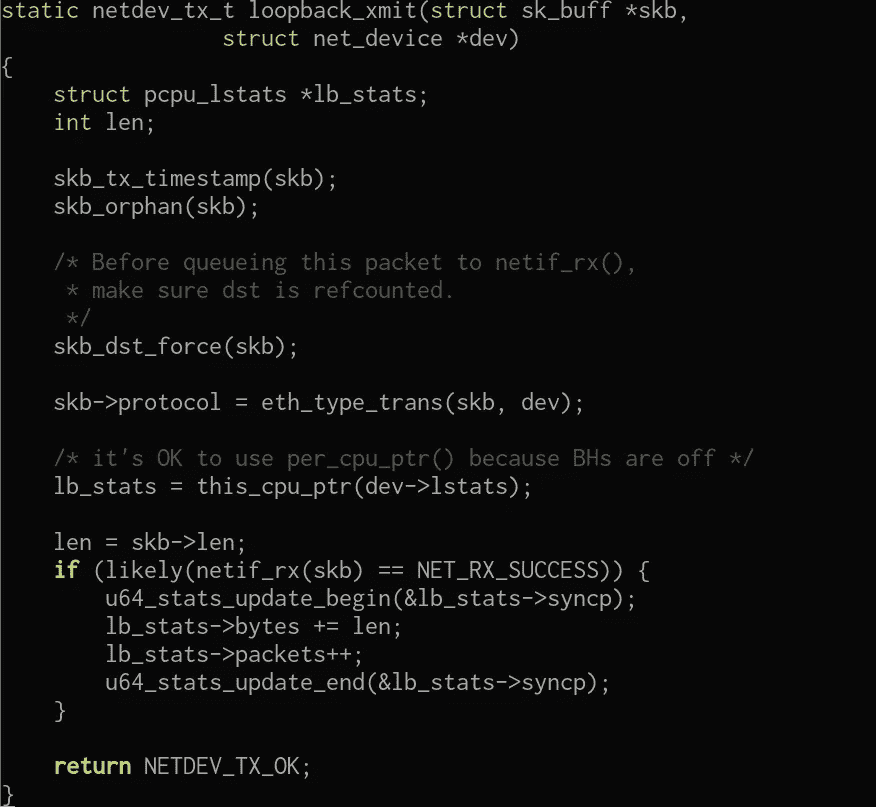

# 让我们看看回环内部

> 原文：<https://medium.com/hackernoon/lets-look-inside-the-loopback-7cd1e7b7803>

嗨，伙计们，我只是想看看 linux 内核中的特殊设备，尤其是**回环**。

这是一个**虚拟设备**，它附带了**网络堆栈**，正如我们在之前的文章中所说([https://medium . com/@ Garcia j . uk/the-network-stack-153 c92 e 35 b 26](/@garciaj.uk/the-network-stack-153c92e35b26))网络堆栈指的是“ **struct net** ”。概括地说，每次我们创建一个新的网络名称空间时，我们都是在实例化一个 struct net。

(include/net/net_namespace.h)

所以这是第一步，第二步是 **loopback** 设备据我所见是作为驱动实现的，所以它的大部分方法都是在[https://github . com/Torvalds/Linux/blob/master/drivers/net/loopback . c](https://github.com/torvalds/linux/blob/master/drivers/net/loopback.c)中实现的。

让我们来看看传输函数:

*   **lb_stats** ，用于保存统计数据，顾名思义就是 RX TX 数据包等
*   **len** 将用于存储 sk_buff ( **skb** )的长度
*   skb_dst_force 它用于“引用计数”，krefs 或 refcounting 是一种内核设计模式，当某个方法引用它时，计数器加 1，当引用被释放时，计数器减 1，然后释放()对象。
*   **eth_type_trans** 用于确定数据包协议 id，并将其插回 skb- >协议中
*   this_cpu_ptr ，这是一个复杂的函数，this_cpu 函数主要用于保证 cpu 级别的原子性，即避免 cpu 切换等的负担(我可能完全错了)
*   **netif_rx** ，接收方法，当 **skb** 在 if 上接收时由驱动调用；将 skb 放入接收队列并更新 stats 等，它返回一个保证接收帧的布尔值( **skb** )。

在下一篇文章中，我将研究包和帧在内核中的样子，我们之前已经讨论过 **sk_buffs** ( **skb** )，所以这是真正的线索。如果你想研究其他部分，请告诉我，但我认为，由于容器等的流行，尽可能多地了解命名空间和内核隔离是很重要的。

你认为呢？

> [黑客中午](http://bit.ly/Hackernoon)是黑客如何开始他们的下午。我们是 [@AMI](http://bit.ly/atAMIatAMI) 家庭的一员。我们现在[接受投稿](http://bit.ly/hackernoonsubmission)，并乐意[讨论广告&赞助](mailto:partners@amipublications.com)机会。
> 
> 如果你喜欢这个故事，我们推荐你阅读我们的[最新科技故事](http://bit.ly/hackernoonlatestt)和[趋势科技故事](https://hackernoon.com/trending)。直到下一次，不要把世界的现实想当然！

