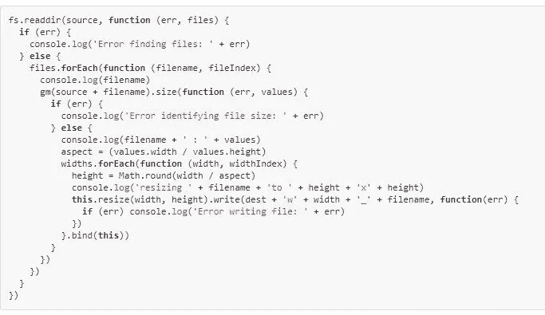

# 让我们制作一个 JavaScript 等待函数

> 原文：<https://medium.com/hackernoon/lets-make-a-javascript-wait-function-fa3a2eb88f11>


Async/await 及其对承诺的底层使用正在席卷 JS 世界。现在，在大多数客户端和服务器 JS 平台 T1 的支持下，回调 T2 编程 T3 已经成为过去。

当然，基于回调的编程是丑陋的。



如果您还没有了解过，那么有必要了解一下 async/await 和 promises。在 async/await 之前，我个人并不热衷于承诺，因为你可以得到这样的代码:


总比回调地狱好，但没有**赏心悦目。**

有很多关于 async/await 的很好的介绍，所以我不会在这里进行全面的讨论，而是 15 秒。教程是，你让你的函数返回一个*承诺*，然后使用 await(在一个异步函数中)来调用这个承诺。

这些例子还将利用 JS 的一个新特性——箭头函数。如果你不熟悉这种风格的写作，基本上是这样的:

**函数(a) { return console.log(a) }**

现在用这个，

**(a)=>console . log(a)**

这样，我们就可以创建我们的等待函数了。

使用等待函数，在某些环境中也称为 *Sleep* ，非常容易理解、读取和写入。这很容易理解。我们希望执行等待一段时间。

只需设置一个解决承诺的超时时间。我们可以提供等待多长时间的 ms。

```
var wait = ms => new Promise((r, j)=>setTimeout(r, ms))
```

wait(2000)返回一个将在 2000 毫秒(2 秒)内解决的承诺。)

```
// Promise syntax
var prom = wait(2000)  // prom, is a promise
var showdone = ()=>console.warn('done')
prom.then(showdone)// same thing, using await syntax
await wait(2000)
console.warn('done')
```

使用 async/await 语法，这比 promise 的好。then()语法。为了简洁起见，让我们将它包装在一个立即调用的函数中。

```
(async () => { await wait(2000); console.warn('done') })()
```

或者在常规代码中

```
var x = 1
var y = 2
await wait(2000)
console.warn(x)
```

如果我们想等待一个事件，而不是仅仅等待 x 毫秒的时间呢？
承诺解决的时候控制就好。

如果事件从未发生，我们甚至可以*超时*调用，这样代码就不会永远等待。

假设我们希望等待一个 DOM 元素在网页中被设置为“Hello World”。我们将每 100 毫秒检查一次，2 秒后超时。

```
<div id=a>s</div>
<script>var e = document.querySelector('#a')

  var waitForHello = timeoutms => new Promise((r, j)=>{
    var check = () => {
      console.warn('checking')
      if(e.innerHTML == 'Hello world') 
        r()
      else if((timeoutms -= 100) < 0)
        j('timed out!')
      else
        setTimeout(check, 100)
    }
    setTimeout(check, 100)
  })//setTimeout(()=>{e.innerHTML='Hello world'}, 1000) (async ()=>{
    a.innerHTML = 'waiting..'
    waitForHello(2000)
  })()

</script>
```

取消对 setTimeout 行的注释将在 1 秒后设置 DIV，否则将超时。

如您所见，async/await 为您的代码开辟了新的可能性。