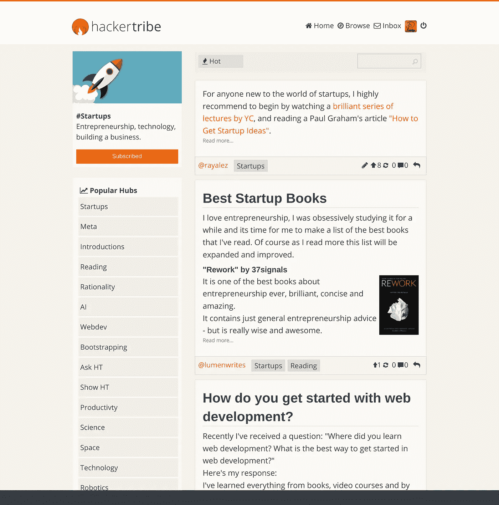

# 让我们用更好的东西取代 Twitter

> 原文：<https://medium.com/hackernoon/lets-replace-twitter-with-something-much-better-19f3ca307060>

## 我对完美社交网络平台的愿景

最近，@ probriancox 写了一篇[帖子](https://cpbotha.net/2016/11/19/lets-replace-twitter-with-something-much-better/)描述他对新社交网络平台的想法。这个帖子已经上了 HN 的头版，很多人都对此感兴趣。因此，我决定是时候分享我对这个平台的愿景了:

 [## 黑客部落

### 黑客和创始人社区。

hackertribe.io](http://hackertribe.io/) 

(仍在进行中，即将推出)

我的目标是从所有已经发展到这一步的社交网络中汲取最好的想法和经验，并创建最终的社交媒体平台，如果现在设计社交网络，它将按照社交网络应该的方式工作——它将是[开源](https://github.com/raymestalez/nexus)，去中心化，优雅，简单，具有高质量的社区，没有任何废话。

事情是这样的:

*   Discovery system 1 是基于 upvotes 的，比如 reddit。
*   探索系统 2 是基于转发的，像 twitter 一样工作。
*   订阅功能的工作方式类似于 RSS。您可以关注他人，并在首页上以相反的时间顺序查看他们的帖子。
*   发布工具的工作方式类似于媒体——漂亮的编辑器、标签、出版物。
*   这个平台是开源的、去中心化的。任何人都可以很容易地导出他们的数据，并建立他们自己的实例，这些实例将自动接入网络(其功能类似于 GNU Social)。
*   它有一个 API，开发者可以用 twitter API 做任何他们想做的事情。
*   我将推出的社区实例将有严格的审核，如黑客新闻，这将优化讨论的质量。但任何人都可以推出自己的实例，这将实现绝对的言论自由。
*   我打算像 Discourse 那样，通过提供简单、轻松的托管服务来赚钱。这将负责开发和服务器成本，同时保持平台无广告。

我认为这种系统将是完美的，建立它唯一需要的是正确的去中心化协议，这是最近出现的——activity pub。

目前，除了最具挑战性的部分——使用 AvtivityPub 的去中心化，我已经实现了所有的功能，这一点我还在琢磨。

如果你对测试这个平台感兴趣，并想给我一些反馈和帮助我开发这个平台，请给我发邮件(raymestalez@gmail.com ),我会邀请你加入测试版。

如果你想为它的发展做出贡献，你可以在这里找到代码:

[https://github.com/raymestalez/nexus](https://github.com/raymestalez/nexus)

(我目前正在清理后端代码，并在 React 中重写前端)。

> [黑客中午](http://bit.ly/Hackernoon)是黑客如何开始他们的下午。我们是 [@AMI](http://bit.ly/atAMIatAMI) 家庭的一员。我们现在[接受投稿](http://bit.ly/hackernoonsubmission)并乐意[讨论广告&赞助](mailto:partners@amipublications.com)机会。
> 
> 如果你喜欢这个故事，我们推荐你阅读我们的[最新科技故事](http://bit.ly/hackernoonlatestt)和[趋势科技故事](https://hackernoon.com/trending)。直到下一次，不要把世界的现实想当然！

