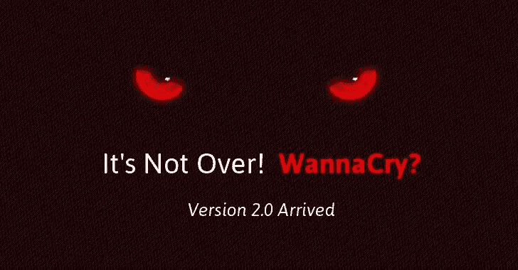
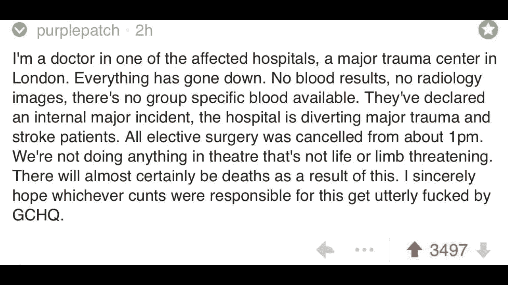

# 我们去告国安局吧！…?网络安全的双重标准

> 原文：<https://medium.com/hackernoon/lets-sue-the-nsa-double-standards-in-cyber-security-97d48315212b>

“我能起诉国安局吗？”一个同事问。这让我开始思考我们如何对待和要求网络安全责任，而不是生物武器。

我想探讨这个问题的两个非法律方面:

*   如果这是一个政府机构丢失的生物武器呢？还是医院因为卫生问题没能控制住感染？
*   我们是受害者吗？

## 背景

上周，一种新的蠕虫病毒(WannaCrypt)在互联网上传播。作为勒索软件，它加密了全球成千上万台计算机，据报道，包括导致英国近 20 家 NHS 医院停止运营。

这是当我的同事阿米泰·丹在[脸书](https://hackernoon.com/tagged/facebook)上问:“我能起诉国家安全局吗？”

我被这个问题迷住了。我标记了一些我的专业网络[安全](https://hackernoon.com/tagged/security)律师朋友。你可以在这里找到马克·拉什[写下的这些法律答案之一。然而，在这篇文章中，我想走一个不同的方向。](http://www.securitycurrent.com/en/news/ac_news/massive-ransomware-attack-can-i-sue)

## 网络安全中的双重标准

当美国国家安全局在由影子经纪人公布的泄密事件中丢失网络武器时，它可能被视为一个关键事件，但人们是否遭受了个人后果？机构的头儿有没有？

当 Flame APT 被发现时，发现它是一个 20 兆字节的完整工具集，很少考虑 OPSEC 及其自身的安全性，我确信这对于其背后的情报机构来说是一个关键事件，但该机构的负责人被解雇了吗？

如果这是一种从生物研究机构逃逸的病毒，反应会是一样的吗？

网络安全是一个新的领域，我们刚刚开始探索它的含义。我们现在承认“网络武器”应该被如此对待，甚至正在探索瓦森纳的出口限制。但是我们还没有到这样一个地步，我们明白我们不是在玩电脑游戏。

我不一定要为所发生的事情责怪美国国家安全局，但我确实看到了一种会计和责任模式被引入到等式中。这是对未来事物的迷人看法。

我的观点是，我们或许应该感谢美国国家安全局的辛勤工作，并理解他们在微软的行动中是负责任的，但这个问题本身是合理的，应该提出来。

## 网络安全中的受害者指责

其他一些朋友，如戴夫·马库斯和艾利森·尼克松提出了我们是受害者的观点。也许即使国家安全局，微软，甚至国民保健服务被起诉——不管他们应该还是不应该——我们事实上是受害者指责。

下面是一个医生讲述事情经过的截图(我无法核实截图是否真实)——仔细看这个，它有些亵渎:

罪魁祸首是发布这个蠕虫的人。我们应该记住这一点。也许我们需要通过法律强制网络安全，也许这是一个公司治理问题。

或许，NHS 应该为没有在网络安全上投入资金负责。甚至，他们应该为忽视威胁负责。在安全方面，人们很难不说“你为什么不打补丁？这是你自找的。”

指责受害者不一定是这种情况，因为一方不一定会原谅另一方。

不管怎样，他们是网络攻击的受害者，事实上我们在网络安全方面急于指责受害者。这不是我们在其他情况下的常规和即时默认，我们应该花一些时间来思考这个问题。

加迪·埃夫隆。
(推特: [@gadievron](http://twitter.com/gadievron) )

#法律# NSA # NHS #受害者指责#双重标准# wannacry #火焰#瓦塞纳尔

> [黑客中午](http://bit.ly/Hackernoon)是黑客如何开始他们的下午。我们是 [@AMI](http://bit.ly/atAMIatAMI) 家庭的一员。我们现在[接受投稿](http://bit.ly/hackernoonsubmission)并乐意[讨论广告&赞助](mailto:partners@amipublications.com)机会。
> 
> 如果你喜欢这个故事，我们推荐你阅读我们的[最新科技故事](http://bit.ly/hackernoonlatestt)和[趋势科技故事](https://hackernoon.com/trending)。直到下一次，不要把世界的现实想当然！

