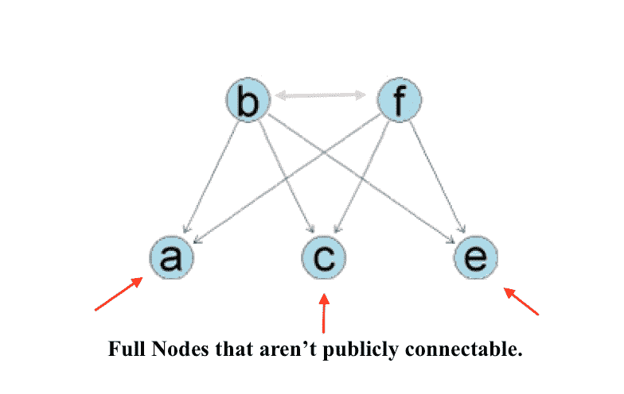
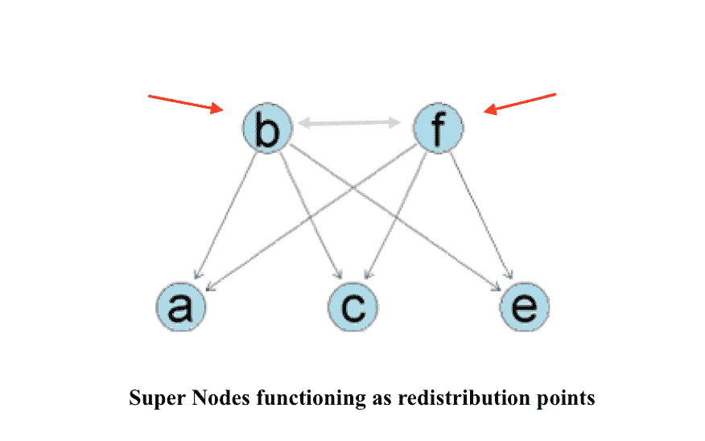

# 先说比特币节点

> 原文：<https://medium.com/hackernoon/lets-talk-about-bitcoin-nodes-e9502193198c>

由于比特币的分散性质，有时关键术语或定义可能会被社区成员无意中误解。这对于想要了解比特币的新手来说尤其成问题，因为他们可能会被变体词汇弄糊涂。例如，一个完整的比特币节点对一个人来说可能意味着另一个人略有不同。有鉴于此，我提出以下术语列表，以帮助社区统一关于比特币节点的语言。

# **一个节点**

在我们谈论比特币节点之前，让我们在分布式网络的背景下广泛地谈论节点。在分布式网络中，定义一个节点最简单的方法就是说它是网络的连接点。它既可以充当重新分发点，也可以充当通信端点。这个宽松的定义有助于我们更好地理解比特币网络中比特币节点的不同功能。以下建议的定义应全部统称为比特币节点。

# **一个完整的节点**

完整的比特币节点是比特币网络不可或缺的组成部分，因为它可以验证区块链。它通过下载它的副本来做到这一点。它还能够中继事务和最近的数据块，但这不需要被视为完整节点。现在当你第一次打开像比特币核心这样的全节点客户端时，大多数人都坐在防火墙后面。在这种情况下，您的完整节点可以连接的连接数有限(大约 8 个),并且只查找超级节点(也称为监听节点)。这是因为您的完整节点还不能公开连接。

# **超级节点又名监听节点**

在分布式网络中，超级节点充当高度连接的再分发点以及中继站。因此，这将是描述可公开连接的完整比特币节点的合适术语。这意味着许多节点可以连接到它，以获得中继的事务数据和区块链历史。这可能比一个完整的节点需要更多的带宽和 CPU，因为它要做所有额外的工作。这些超级节点通常 24/7 全天候工作，是其他节点连接的可靠焦点。为了在作为节点的比特币客户端中激活该功能，您必须使其可公开连接。一种方法是绕过任何潜在的防火墙和/或设置端口转发。一些手册建议在后台运行 bitcoind(比特币守护进程)而不是 Bitcoin-Qt，但这不是必要的。

# **矿工的节点**

如今，矿工利用独立于比特币核心的挖掘程序来挖掘比特币区块。一些矿工选择单干，因此通过 bitcoind 使用他们自己的完整节点来维护区块链的完整副本。还有的选择池矿，一起解块。在这种情况下，池的管理员维护一个完整的节点，而池矿工贡献他们的 hashpower。第三种方法，尽管非常不鼓励并且对网络有害，是在完全验证它们之前，通过在块的顶部挖掘来进行 SPV 挖掘。这些 SPV 池挖掘者通常信任另一个挖掘池的完整节点作为构建的参考。鉴于此，挖掘器节点可以进一步细分为单独挖掘器的完整节点或池挖掘器的完整节点。

# **一种简化的支付验证(SPV)客户端，也称为轻型钱包**

像 Breadwallet(智能手机的比特币应用程序)这样的 SPV 客户端不是完全节点，因为它们不下载区块链。SPV 客户通过确保您的交易放在一个块中，然后确认其他块正在被添加到该块中来做到这一点。因此，在最宽松的意义上，SPV 客户可能符合节点的标准。然而，他们并没有做太多的事情来支持和验证比特币的分布式不可信账本。相反，它们只存储从其他超级节点获取的区块链中所有块的所有头的副本。因此，SPV 客户无法验证交易链中的任何交易，因为他们没有访问权。这样，它们就充当了通信端点，因为它们不能中继事务或区块链数据。此外，重要的是将您自己的完整节点放在它们后面，以便安全地将 SPV 客户端用作钱包。

# 结论

上面，我简要描述了比特币节点的各种角色。我还暗示了用户为了扮演这些角色需要采取的必要步骤。希望通过利用这个术语列表，比特币用户将能够理解他们在比特币网络上扮演的确切角色，并被告知如果他们想执行不同的任务，他们可以采取的步骤。

**特别感谢小卢克审阅本文。*

# 记得给我左边的掌声，下面的捐款，和你的朋友分享！直到下一次，向前和向上。😁