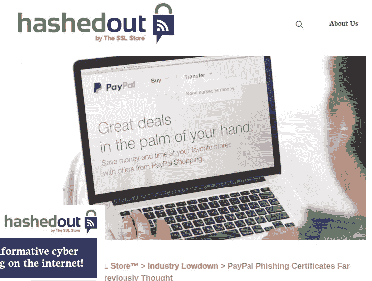
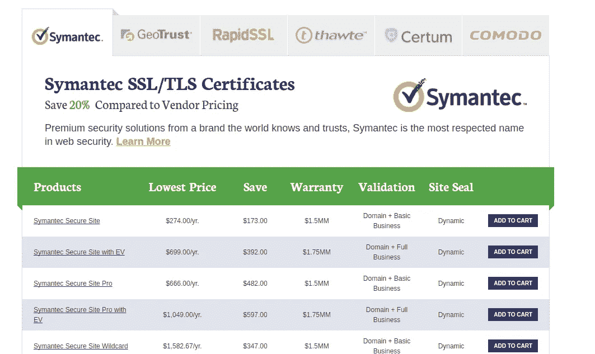

# LetsEncrypt，Paypal 和销售恐惧

> 原文：<https://medium.com/hackernoon/letsencrypt-paypal-and-selling-fear-21940474d387>

## 人们不理解 SSL/TLS

有一份新的[报告将 Let's Encrypt 与网络钓鱼](https://www.thesslstore.com/blog/lets-encrypt-phishing/)联系起来。所以推特中的许多[人开始尖叫，因为他们在同一个句子中读到了钓鱼和](https://twitter.com/search?q=paypal%20letsencrypt&src=typd) [Paypal](https://hackernoon.com/tagged/paypal) 。

让我们[加密](https://hackernoon.com/tagged/encrypt)是一个免费赠送证书的基金会。不仅如此。让我们加密是试图使安装和更新证书毫不费力。

我决定读这篇报告，它更像是一篇博客文章。

显然，该报告的论点是，Let's Encrypt 在给出证书之前没有进行适当的验证。如此多的网站使用类似 Paypal 钓鱼网站的服务。

但是这份报告并没有说域名卖家在出售钓鱼域名之前没有进行适当的验证。

但是转折来了。这篇博文出现在一个名为 [hashedout](https://www.thesslstore.com/blog) 的网站上。

在 hashedout 的图标下，你可以看到小写字母“在 SSL 商店旁边”。原来博客来自一家[卖证](https://www.thesslstore.com/)的公司。

> 一家出售证书的公司撰写了一份报告，批评一家免费赠送证书的基金会。

是的。我知道它们是不同种类的证书。

事实上，他们的论点是，他们出售的证书只有经过适当的验证后才能颁发。

不管怎样，他们卖什么样的证书？

Cheap!!!

是的，很多赛门铁克、Thawte 和 GeoTrust。

同样的赛门铁克、Thawte 和 GeoTrust 在没有正确验证的情况下[不正确地发出证书](https://security.googleblog.com/2015/10/sustaining-digital-certificate-security.html)(包括扩展验证证书，那些名称也为绿色的证书)。

同样的赛门铁克、Thawte 和 GeoTrust[将会被至少一个主流浏览器](https://groups.google.com/a/chromium.org/forum/#!topic/blink-dev/eUAKwjihhBs%5B1-25%5D)所不信任。

PKI 有一个严重的问题。

但是伙计们，**你们有胆量**。

> [黑客中午](http://bit.ly/Hackernoon)是黑客如何开始他们的下午。我们是 [@AMI](http://bit.ly/atAMIatAMI) 家庭的一员。我们现在[接受投稿](http://bit.ly/hackernoonsubmission)，并乐意[讨论广告&赞助](mailto:partners@amipublications.com)机会。
> 
> 如果你喜欢这个故事，我们推荐你阅读我们的[最新科技故事](http://bit.ly/hackernoonlatestt)和[趋势科技故事](https://hackernoon.com/trending)。直到下一次，不要把世界的现实想当然！

