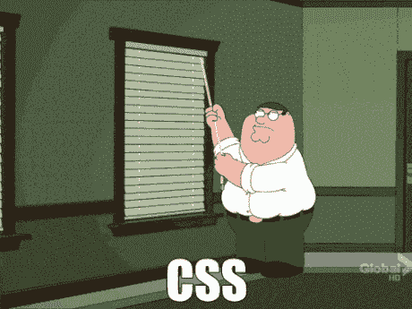
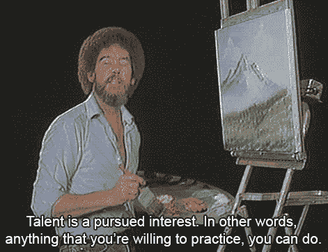

# CSS 的专业水平——你准备好学习教程了吗？

> 原文：<https://medium.com/hackernoon/levels-of-expertise-in-css-are-you-ready-for-the-tutorial-bed0b3a697ff>

如果你喜欢这个，来看看我的网站[*www.brian-best.com*](http://www.brian-best.com)*看更多的博客吧！*

以下是帮助理解级联样式表(CSS)教程的指南。为了帮助那些正在创建教程的人，以及我未来的教程，我想量化 CSS 的专业水平。我正计划为 HTML 和 JavaScript 制作一个公会！我发现有时候这些技能水平并没有很好的定义。因此，作为学生衡量教程是否适合他们的资源，我提出了以下几点。对于这个等级，我将使用初级、初级、中级和高级来表示学生在开始学习教程之前应该知道的先验知识。对于每个级别，学生应该知道或具备:

# 初学 CSS

*   之前没有 CSS 知识

# 基本 CSS

*   需要 HTML 的基础或中级知识。
*   如何制定风格规则？
*   理解标签、ID 和类规则声明之间的区别。
*   了解样式如何[‘级联’向下](https://developer.mozilla.org/en-US/docs/Learn/CSS/Introduction_to_CSS/How_CSS_works)。
*   一些基本的风格规则，像`color`、`font-family`、`background-color`。
*   如何将 CSS 文件插入 HTML 文档？
*   什么是伪类，以及如何将规则指向它们。
*   什么是 web 字体和系统字体。

# 中级 CSS

*   规则`!important`的作用以及为什么在大多数情况下不使用它。
*   什么是浏览器定义的样式，为什么需要重置文件。
*   大多数的[风格规则](https://developer.mozilla.org/en-US/docs/Web/CSS/Reference)。
*   如何基于 HTML 属性来定位规则？
*   了解各种定位方式以及何时使用它们。
*   了解[盒子型号](https://css-tricks.com/the-css-box-model/)，何时使用位置、边距、边框、填充、高度和宽度。
*   如何在样式中嵌套样式。

# 高级 CSS

*   需要 HTML 的[高级知识。](https://brian-best.com/2017/10/23/levels-of-expertise-in-html/)
*   所有样式规则以及它们应用于特定标签的时间。
*   兄弟选择器，比如`>`和`+`。
*   如何解决浏览器兼容带来的风格问题？
*   如何使用媒体查询来建立响应站点和元素？
*   如何用关键帧创建动画？
*   如何使用`:before` & `:after`在 DOM 中制作样式驱动元素？
*   了解什么是 CSS 预处理器，以及如何使用至少一个。

这个博客只是一个指南，当然，有很多情况下需要一些重叠的知识。示例是需要一些中级知识的基础教程。对于学生来说，只要记住鼓励你搜索你不完全理解的术语。对于教育者来说，深入了解你认为必要的知识并不是一件坏事。