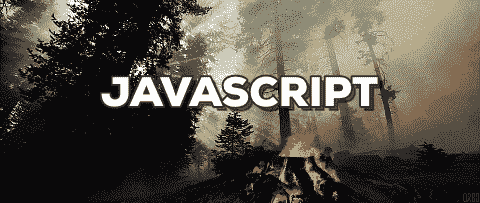
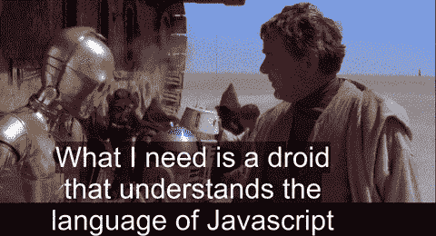

# JavaScript 的专业水平——你准备好学习教程了吗？

> 原文：<https://medium.com/hackernoon/levels-of-expertise-in-javascript-are-you-ready-for-the-tutorial-4ad7a42a21d4>

*如果你喜欢这个，来看看我的网站*[*【www.brian-best.com】*](http://www.brian-best.com)*获取更多博客吧！*

下面的博客是我不断增加的网络技术在线教程的教师和学生指南的一部分。帮助判断教程期望读者在阅读之前了解什么。这次我们讨论的是 JavaScript，但是看看我的其他关于 HTML 和 CSS 的指南。

JS 是一个大公司，在过去的十年里，它的增长呈爆炸式增长。过去是一个向页面添加少量逻辑的系统，现在可以运行整个网站、硬件和 3D 游戏。对于本指南，我只介绍普通的 JS，因为它存在于浏览器的前端。稍后，我会让其他博客包含更多高级功能，包括各种框架，如 [React](https://reactjs.org/) 、 [Vue](https://vuejs.org/) ，以及带有 Node.js 的 JavaScript 后端。

对于这个等级，我将使用初级、初级、中级和高级来表示学生在开始学习教程之前应该知道的先验知识。对于每个级别，学生应该知道或具备:

# 新手

*   之前没有 JavaScript 知识

# 基本 JavaScript

*   HTML 和 CSS[的中级知识](https://brian-best.com/2017/10/28/levels-expertise-css/)
*   变量，以及如何声明它们
*   运算符，如`+`、`-`等。
*   功能
*   什么是 API
*   如何访问和查询 DOM

# 中间 JavaScript

*   环
*   在 DOM 上创建和呈现新元素。
*   JS 如何以及何时在网页上呈现
*   事件。如何监听事件并创建自己的事件。
*   函数和变量作用域，你应该知道什么是`this`
*   匿名函数和立即调用函数表达式(IIFE)
*   浏览器对新 JS 功能的支持，以及如何在需要时使用聚合填充来填充支持

# 高级 JavaScript

*   如何发出 AJAX 请求
*   如何利用承诺，知道什么时候得到数据。
*   var、let 和 const 声明变量的区别。
*   什么是闭包以及如何利用它们
*   什么是面向对象编程，或者 OOP，以及它如何在 Javascript 中发生
*   速度的逻辑优化

这个博客只是一个指南，当然，有很多情况下需要一些重叠的知识。示例是需要一些中级知识的基础教程。对于学生来说，请记住，鼓励他们用谷歌搜索你不完全理解的术语。对于教育者来说，深入了解你认为必要的知识并不是一件坏事。