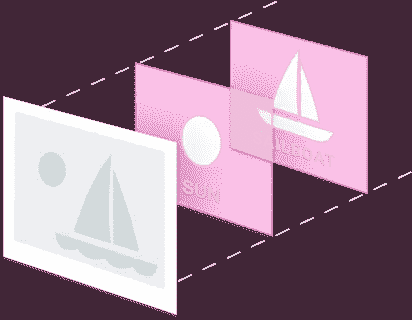
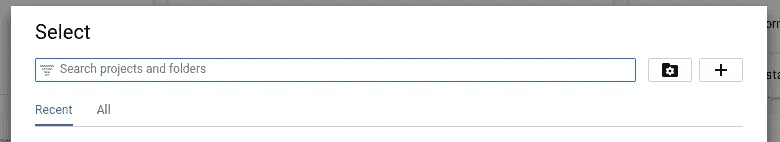
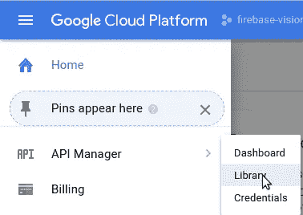
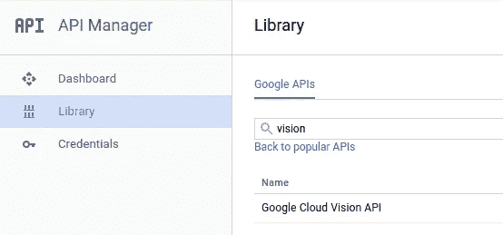
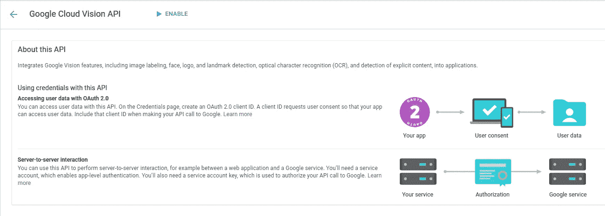
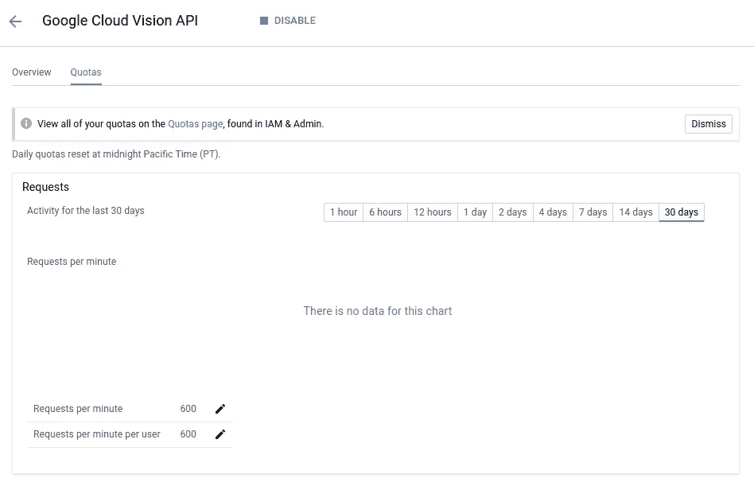
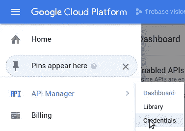
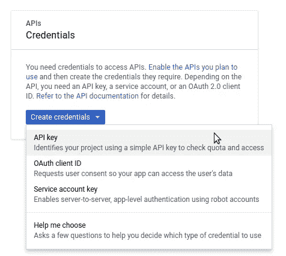
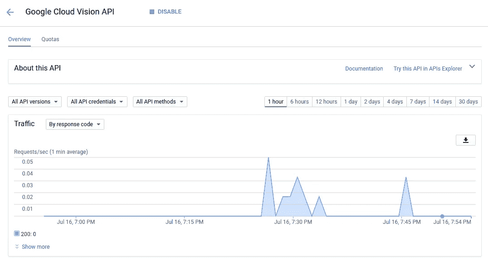

# 利用 Google Cloud 构建无服务器的图像标签服务——第 1 部分——Google Cloud Vision API

> 原文：<https://medium.com/hackernoon/leveraging-google-cloud-for-building-a-serverless-image-tagging-service-part-1-7ec8171ac075>

场景是这样的。你在一家初创公司工作，该公司开发了一个平台，允许摄影师(专业和业余)上传并与其他摄影爱好者分享他们可爱的照片。

该平台现已上线 2 年多，非常成功。用户已经上传了超过 500 万张图片。

你的产品负责人来找你要求一个杀手级的功能，允许用户搜索照片，甚至是那些还没有被标记或者没有收到任何描述的照片。

要求你想出一个既便宜又快捷的解决问题的办法。现在怎么办？

**谷歌云拯救世界！**

在这一系列文章中，我们将看到如何构建一个利用 Android、Firebase 和 Google Cloud Vision API 的解决方案，通过**无服务器结构**简化云中的图像标记。

在第一部分中，我们将重点关注配置一个启用了 Google Cloud Vision API 的 Google Cloud 项目。在接下来的部分中，我们将看到如何配置 Firebase 服务，以及如何创建一个基本的 Android 应用程序来上传照片。

让我们开始吧！

# 谷歌云视觉 API

Google Cloud Vision API showcase

谷歌对这项服务的描述如下:

> 谷歌云视觉 API 通过将**强大的机器学习模型**封装在一个易于使用的 REST API 中，使开发者能够**理解图像的内容**。它快速地将图像**分类成数千种类别(例如，“帆船”、“狮子”、“埃菲尔铁塔”)，**检测图像**中的单个物体和人脸，并找到和读取图像中包含的印刷文字。您可以在您的图像目录上构建元数据，缓和攻击性内容，或者通过图像情感分析实现新的营销场景。**分析请求中上传的图像**或在 Google 云存储上整合您的图像存储。**

对于我们的用例，我们将关注**图像分类**。我们将使用它来标记我们的图像，以便我们的平台用户可以搜索它们。

为了使用 API，我们需要做的第一件事是创建一个 Google Cloud 项目。为此，请按照下列步骤操作:

*   访问[谷歌云控制台](https://console.cloud.google.com)并使用你的谷歌账户登录；
*   单击控制台徽标右侧的菜单:

Project selection menu

*   在打开的对话框中，点击 **+** 按钮创建新项目:

Project selection dialog

*   为您的新项目命名，然后等待它的创建。
*   项目创建完成后，再次点击控制台图标右侧的菜单，选择新建的项目作为活动项目；

酷！您刚刚创建了 Google Cloud 项目，该项目将用于管理本系列中使用的 API。

是时候为项目启用 **Google Cloud Vision API** 了。为此，请按照以下步骤操作:

*   打开左上方菜单，选择 **API 管理器** > **库**:

Opening API Manager Library

*   接下来，搜索并选择 Google Cloud Vision API:

Searching for the Google Cloud Vision API

Google Cloud Vision API page (for this tutorial, we are going to use Server-to-server interaction)

*   点击 **ENABLE** 后，页面变为显示 API 的仪表板:

Google Cloud Vision API dashboard

使用 API 的下一步也是最后一步是创建一个 API 密钥，用于认证我们对服务的调用。让我们完成它:

*   再次点击左上方菜单，选择 **API 管理器** > **凭证**:

Opening API Manager Credentials

*   点击**创建凭证**，然后选择 **API key** :

Creating our API Key

*   一个新的对话框显示您的密钥。您以后可以随时通过访问 **API 管理器** > **凭证**来访问和复制该密钥。

## 测试我们所做的

考验我们宝贵工作的时间到了！为此，我们将对 API 执行一个 HTTP 请求。为此，我们将使用以下 JSON 模板:

Our request payload template

注意，我们使用 **__IMAGE_URI__** 作为 **imageUri** 字段的值。当我们调用 API 时，这个占位符将被替换为 **sed** :

Performing a POST request to the API

这里发生了什么事？

*   首先，我们使用 **sed** 将 **__IMAGE_URI__** 替换为我们正在分析的图像的 URL
*   然后，我们将 **sed 输出**传送到我们的 **curl** 命令。这将把我们的 JSON 由 sed 更改为[https://vision.googleapis.com/v1/images:annotate?key=__API_KEY__](https://vision.googleapis.com/v1/images:annotate?key=__API_KEY__) (确保使用您在这里生成的 API 密钥)。

结果如下:

curl command output

成功了！从结果中，我们可以看到 API 超过 **97%确定它是一个马克杯**，超过 **94%确定它是橙色**。下面是我们分析的图像。如您所见，API 产生了相当好的结果:

Our not so beauty analyzed orange mug

最后，如果您再次检查 Google Cloud Vision API 仪表板，您应该会看到它现在显示更新的数据:

Google Cloud Vision API dashboard now displays some data

## 结论

在第一部分中，我们已经了解了 Google Cloud Vision API 是什么，创建 Google Cloud 项目并为其启用 Vision API 是多么容易，使用 API 是多么容易，当然，API 的准确性令人印象深刻。

请继续关注下一部分，因为我们将看到如何配置 Firebase 并将其与 API 集成，以及如何创建一个基本的 Android。

希望你喜欢它！

*感谢阅读！如果你觉得这有帮助或有趣，请❤它。另外，欢迎在下面的评论中分享你的想法。*