# 词汇分析

> 原文：<https://medium.com/hackernoon/lexical-analysis-861b8bfe4cb0>

[Cypress Trees](https://en.wikipedia.org/wiki/Cypress_Trees), [Kanō Eitoku](https://en.wikipedia.org/wiki/Kan%C5%8D_Eitoku)

欢迎来到 [*让我们构建一个编程语言(LBPL)* 系列](https://hackernoon.com/lets-build-a-programming-language-2612349105c6)的第三篇文章。如果这是你正在阅读的这个系列的第一篇文章，那么《LBPL》是带领读者从 0 到 1 实现编程语言的系列文章。你可以在这里查看第二篇关于编译器和解释器的文章[，在这里](https://hackernoon.com/compilers-and-interpreters-3e354a2e41cf)查看一般介绍[。](https://hackernoon.com/lets-build-a-programming-language-2612349105c6)

本文将描述如何构建编译器的第一阶段，**lexer**。在文章的最后，你会用一个[挑战](https://github.com/ftchirou/blink-lexer)弄脏你的手:为 [Blink](https://hackernoon.com/lets-build-a-programming-language-2612349105c6#1d67) 构建一个 lexer。

# 入门指南

**词法分析器**，也称为**词法分析器**或**分词器**，是一个将输入源代码分解成一系列词法序列的程序。它逐字符读取输入源代码，识别词位，并输出描述词位的标记序列。

## 什么是词位？

一个**词位**是一个可识别的字符序列，例如，关键字(如`class`、`func`、`var`和`while`)、文字(如数字和字符串)、标识符、运算符或标点符号(如`{`、`(`和`.`)。

## 什么是代币？

**标记**是描述*词位*的对象。一个令牌有一个**类型**(例如关键字、标识符、数字或运算符)和一个**值**(所描述的词位 *)* 。一个标记还可以包含其他信息，比如在源代码中遇到词位的行号和列号。

An implementation of a token in JavaScript (ES6). Using this class, the lexeme “Hello, Blink!”, for example, could be represented by the token **Token**(TokenType.**String**, “Hello, Blink!”).

## 代码中的词法分析器

一个**词法分析器**可以被实现为一个类，它的构造函数在参数中接受一个输入字符串(代表要执行词法分析的源代码)。它公开了一个方法来识别并返回输入中的下一个标记。

Skeleton of the Lexer class

## 如何识别令牌

所有可能出现在用编程语言编写的代码中的词汇，都在该编程语言的规范中被描述为一组称为**词汇语法**的规则。词法语法中的规则经常被转换成称为**有限状态机** ( *FSM* )的自动机。然后，lexer 模拟有限状态机来识别令牌。

在本文的下一节中，我们将研究组成编程语言词法语法的规则、有限状态机、如何将词法语法中的规则转换成有限状态机，以及如何在`Lexer`类的`nextToken()`方法中实现和使用有限状态机来识别下一个令牌。

在后面的部分中，我们将为一种迷你语言构建一个词法分析器，你将被介绍到一个挑战中，你将不得不为眨眼编写你自己的词法分析器。

# 词汇语法

一种编程语言的词汇语法是一组形式规则，控制着该编程语言中有效的词汇是如何构造的。例如，规则可以规定字符串是任何用双引号括起来的字符序列，或者标识符不能以数字开头。词汇语法中的规则通常用一组**常规定义**来表达。

正则定义的形式是`<element_name> = <production_rule>`，其中`<element_name>`是在编程语言中遇到的符号或词位的名称，`<production_rule>`是描述该符号或词位的 [**正则表达式**](#1b6b) 。

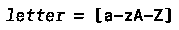

例如，上面的常规定义将*字母*定义为任何小写或大写字母字符。

正则定义可以在其正则表达式中使用在同一词法语法中定义的任何元素名。

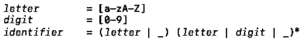

作为一个例子，在上面的常规定义中，定义*标识符*重用定义*字母*和*数字*，在其产生规则中好像*字母*和*数字*是符号一样，以将标识符定义为以字母或下划线开头的任意字符串*，*后跟字母、数字或下划线的零个或多个出现。

# 有限状态机

有限状态机或 FSM 是一种抽象机器，在任何时间点都处于*且只有一个*状态。作为事件的结果，FSM 可以从一种状态改变到另一种状态。从一种状态改变到另一种状态被称为**转换**。为了更好地理解这一点，让我们考虑下面的例子。

灯泡可以被认为是 FSM。在任何时间点，灯泡只能处于两种状态之一，即`ON`或`OFF`。按下开关，灯泡从状态`ON`转换到状态`OFF`，按下同一开关，灯泡从状态`OFF`转换到`ON`。

FSM 通常用[状态图](https://en.wikipedia.org/wiki/State_diagram)表示。

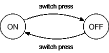

A FSM simulating a light bulb. States are represented with circles and transitions with labeled arrows.

## 词汇语法和有限状态机

为了识别由正则定义描述的记号，定义中的正则表达式通常被转换成 FSM。得到的 FSM 具有有限数量的状态**包括初始状态**和接受状态**的集合**。

FSM 通过使用正则表达式中的一个字符 *或元素*从一种状态转移到另一种状态。从初始状态到接受状态之一的转换产生了由正则表达式描述的有效字符串。

例如，正则表达式 *a | b* 可以转换成下面的 FSM。

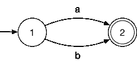

上述 FSM 有两种状态，标记为 **1** 和 **2** 。指向 **1** 不知从哪里冒出来的箭头表示 **1** 是*初始状态*， **2** 上的内圈表示 **2** 是该 FSM 的*接受状态*。

从 **1** 到 **2** ，我们可以通过消耗角色`a`产生字符串 *a* 来跟随顶部过渡，或者通过消耗角色`b`产生字符串 *b* 来跟随底部过渡。 *a* 和 *b* 实际上是由正则表达式 *a | b* 描述的两个可能的字符串。

再比如。

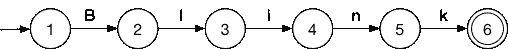

在上述 FSM 从初始状态 **1** 转换到接受状态 **6** 后，只能产生一个字符串，*闪烁*。

## 从正则表达式到有限状态机

通过建立以下三个基本规则，我们可以将任何正则表达式转换成 FSM。

**甲|乙**

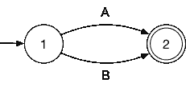

正则表达式 *A | B* 由具有两种状态的 FSM 表示。从状态 **1** 开始，我们可以消费 A 并移动到接受状态 **2** 或者消费 B 并移动到接受状态 **2** 。

**AB**

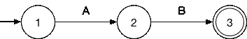

级联 *AB* 由具有三个状态的 FSM 表示。从 **1** 开始，我们首先通过消费 A 移动到 **2** ，然后通过消费 b 移动到接受状态 **3** 。

**答***

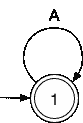

***由一个 FSM 表示，其中只有一个状态既是初始状态又是接受状态，并转换到自身，形成一个循环。从 **1** 开始，我们可以不去任何地方，因为 **1** 也是接受状态，从而产生*空字符串*，或者我们可以通过消耗 A 来跟随转换，这将导致回到**1**；同样，我们可以不去任何地方，也可以跟随转变。这将生成字符串`A`、`AA`、`AAA`、`AA...AAA`和空字符串*。*

通过重用上述基本规则中的一个或任意组合，任何其他正则表达式都可以转换成一个 *FSM* 。

让我们来看一些例子。

**R = (a|b)c**

*R* 是 *a|b* 后跟 *c* 。首先， *a|b* 的 FSM 为

然后，到 *c* 的连接由从状态 **2** 到新的接受状态的转变来表示。

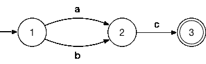

通过模拟该 FSM 可以产生的两个可能的字符串是`ac`和`bc`。

**R = (a|b)*c**

首先， *(a|b)** 的 FSM 是一个循环，在每次迭代中有两个选项 *a* 和 *b* 。

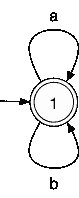

然后我们添加一个新的过渡来连接 *c.*

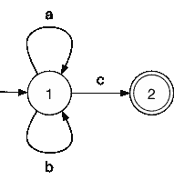

模拟或运行上述有限状态机可以产生`c`、`ac`、`abc`、`bac`、`bc`、`bbabaabbc`、`aaaaac`或`abbbaabbbaabbc`等字符串。

**R = a(bc)***

*a(bc)** 是字符 *a* 后跟零个或多个重复的串联 *bc* 。用于 *a* 的 FSM 很简单。

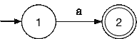

*(bc)** 的 FSM 将由 *bc* 上的循环表示。

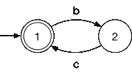

将上述两个 FSM 连接起来，我们将得到 *a(bc)** 的 FSM。

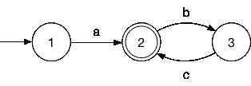

运行这个 *FSM* ，我们必须消耗`a`才能从状态 **1** 移动到接受状态 **2** 。在 **2** 处，我们可以停止并让出字符串`a`或消耗`b`以移动到状态 **3** 。从 **3** 开始，我们别无选择，只能消耗`c`回到接受状态**2**；再次在 **2** 处，我们可以停止或者通过消耗`b`进入 **3** ，循环继续。该 FSM 可能产生的字符串有`a`、`abc`、`abcbc`、`abcbc`、`abc...bc`。

作为最后一个例子，让我们看看对应于一个规则定义的 FSM，它可以描述编程语言中的标识符。

首先，*字母| _* 的 FSM 是一个基本的 *A | B* FSM。

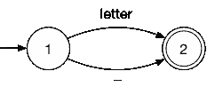

那么*(字母|数字| _)** 的 FSM 将是一个循环，每次迭代有 3 个不同的选项。

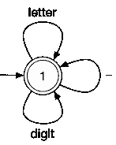

我们通过连接上面的 2 个*FSM*得到了*标识符*的最终 FSM。

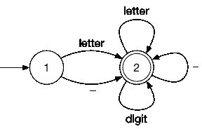

## 代码中的有限状态机

FSM 是以下各项的组合

*   FSM 可以处于的所有可能状态的集合
*   FSM 所处的**初始状态**
*   一组**接受状态**
*   以及所有**转换的集合**。

我们可以从将 FSM 实现为一个类开始，该类具有状态、初始状态和接受状态的属性。

FSM 的转换可以用一个函数来建模，该函数在参数中取一个状态`currentState`和一个字符或符号`input`，并返回 FSM 在状态`currentState`中消耗`input`之后将处于的状态。我们可以将该函数称为**转换函数**，并将其命名为`nextState()`。

最常见的情况是，转换函数是参数`currentState`上的 switch 语句，每种情况都根据参数`input`返回下一个状态。

Skeleton for a transition function

为了帮助实现转换功能，可以首先将 FSM 转换成[转换表](https://en.wikipedia.org/wiki/State_transition_table)。转换表将每个状态 S 和输入 I 映射到状态 S’，其中 S’是当输入 I 从状态 S 消耗时 FSM 将处于的状态

作为一个例子，让我们考虑下面的 FSM。

(a|b)c

相应的转换表是

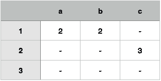

Transition table for (a|b)c

转换表的行标有 FSM 的状态，列标有可能被消耗的所有字符或元素。如果相应列的字符被消耗，而 FSM 处于相应行的状态，则表格的每个单元包含 FSM 将处于的状态。包含`—`的单元意味着对应的状态和字符在 FSM 中没有转换。

编写转换函数时，转换表提供了一个快速的可视化参考。上述 FSM 的转换函数为:

现在，为了完成我们的 FSM 类的构造函数，让我们给它添加一个类型为`Function`的参数`nextState`，表示转换函数。

实现我们的 FSM 的下一步是添加一个函数，允许**运行**、**模拟**或**对输入字符串执行**FSM。该函数将返回一个布尔值，指定输入字符串(或输入字符串的子集)是否与对应于 FSM 的正则表达式相匹配。

`run`功能的实现非常简单。该函数将逐字符读取输入，同时跟踪 FSM 的当前状态。对于每个读取的字符，它通过调用转换函数`nextState()`，用 FSM 将处于的下一个状态更新当前状态。在循环执行结束时，如果当前状态是 FSM 的接受状态之一，则输入字符串(或输入字符串的子集)匹配对应于 FSM 的正则表达式。

## 有限状态机的使用

为了结束关于 FSM 的这一部分，让我们看看如何使用我们新实现的`FSM`类来识别标识符。

让我们重复使用下面的常规定义。

下面是对应的 FSM。

和相应的转换表。

现在我们可以创建我们的`FSM`类的一个新实例，并配置它来识别标识符。

然后，我们的`FSM`实例可以用来识别标识符。

注意，调用`fsm.**run**("lisp-case-identifier")`将返回`true`，即使`lisp-case-identifier`不是有效的标识符，因为`—`不在正则表达式中。它返回`true`，因为`lisp-case-identifier`中的子集`lisp`是有效的闪烁标识符。在本文的最后一部分，当使用您自己的 lexer 时，您必须更新我们的`FSM`实现，以便`run`方法除了返回一个布尔值之外，还返回匹配正则表达式的输入子集。

# 把所有的放在一起

配备所有必要的工具(词汇语法、正则表达式、有限状态机、转换表等)。)，我们现在可以看看它们是如何在 lexer 的实现中结合在一起的。

让我们考虑一种执行数学运算的简单语言。该语言支持四种基本算术运算符(+、-、*和/)、比较运算符(>、≥、

Below are examples of valid instructions in our mini language.

The valid lexemes for this language, **标识符**、**数字**、**括号**和**运算符**用以下常规定义描述。

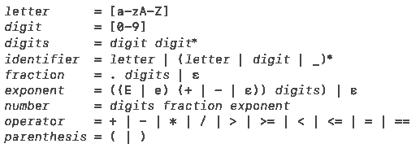

让我们通过完成我们在文章开头介绍的 `[Lexer](#d21e)` [类](#d21e)的[骨架来为这种语言构建一个 lexer。](#d21e)

## 令牌类型

实现词法分析器的第一步是为每个有效的词法分析器添加一个标记类型。

因为运算符和括号的数量有限，所以我们将通过为每种类型的运算符和括号添加一个特定的标记来提高清晰度和粒度。添加一个特殊的令牌`EndOfInput`也很有帮助，当输入中的所有字符都被读取后，将返回这个令牌。

下一步是完成`Lexer`类的实现。

## Lexer 类

让我们从向`Lexer`类添加属性开始，以跟踪输入中的当前位置，只要当前行和列。

现在，让我们实现`nextToken()`方法。

我们可以对`nextToken()`使用的策略是读取当前位置的字符。如果字符与一个词位的产生式规则中的起始字符相匹配，我们就将词位的识别委托给对应于该产生式规则的 helper 方法。

让我们从最简单到最复杂来看看帮助器方法。

**识别括号**

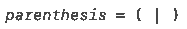

识别括号很简单。我们只需检查当前角色是`(`还是`)`并返回适当的令牌。我们还增加输入中的当前位置，以及当前列。

**识别操作员**

在对`operator`词位的定义中，我们可以注意到我们基本上有两种类型的操作符，*算术*和*比较*操作符(技术上我们有第三种，赋值操作符`=`，但是为了简化实现，我们将它添加到这里的比较操作符组中)。

为了可读性，我们可以将每种类型的操作符的识别委托给一个特定的助手函数。

**前瞻**。`recognizeComparisonOperator()`的实现使用了一个名为`lookahead`的变量。因为一个操作符可以是`>`或`>=`，一旦我们阅读了字符`>`，我们需要知道下一个字符是什么，然后才能决定我们使用哪种操作符。如果下一个字符是`=`，则识别的操作符是`>=`；如果下一个字符是任何其他字符，识别的操作符是`>`。这就是`lookahead`变量的目的，在输入中进行实际的预测。

**识别标识符**

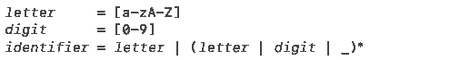

我们可以为此构建一个 FSM，并用它来识别标识符，但是这些规则非常简单，可以用一个循环来实现。我们只需不断读取输入中的字符，直到我们遇到一个不是字母、数字或下划线的字符。

**识别数字**

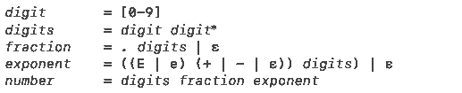

Note: With these regular definitions, strings such as 00, 00.42 or 00e-00 are considered numbers.

根据上面的常规定义，一个数是一个或多个数字的连续。数字后面可以跟一个小数部分(由`fraction`产生规则描述)或一个指数部分(由`exponent`产生规则描述)，或者两者都跟。分数和指数部分都是可选的，如正则表达式中的 *| ε* 所示。

有效数字的例子有`42`、`3.14`或`6.6262e-34`。描述数字的正则表达式非常复杂，足以阻止我们像对待标识符一样尝试手动识别数字。FSM 将大大简化这里的实现。

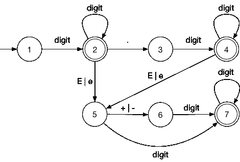

一个数的正则表达式可以转换成上面的有限状态机，下面是相应的转换表。

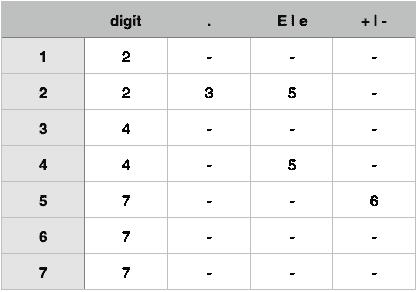

有了转换表，我们可以构建一个 *FSM* 并在我们的`recognizeNumber()`方法中使用它。

随着`recognizeNumber()`的完成，我们用来执行数学运算的小语种 lexer 也差不多完成了。

为了使我们的 lexer 完全完整，我们需要更新我们的`nextToken()`方法来忽略空白(例如，`1+2`、`1 + 2`或`1+ 2`)并处理错误。

Lexer class with complete nextToken() method

这就完成了我们的`Lexer`实现。通过重复调用`nextToken()`直到返回一个`EndOfInput`标记，我们可以很容易地得到一个输入中的所有标记。

# 测试你的力量！

祝贺你在文章中走到这一步。如果你准备好了，是时候通过为 Blink 编写一个 lexer 来完成你的第一个挑战了。

点击[此链接](https://github.com/ftchirou/blink-lexer)了解如何获得挑战以及如何完成挑战的说明。

如果你在阅读这篇文章或完成挑战时有任何问题、建议或需要澄清(或只是打个招呼)，请随时在 Twitter 上给我发短信。:)

感谢阅读。

# 正则表达式

*这是一个正则表达式的快速介绍，介绍了掌握本文中* [*这里*](#82e1) *讨论的词汇语法所必需的概念。*

一个**正则表达式**，简单来说就是描述所有可以由一组基本字符/符号构建的字符串的规则。

最简单的正则表达式就是所描述的字符串。比如设 *R* 为正则表达式 *lang* ， *R = lang* 。 *R* 描述第一个字符是`l`，后面是`a`，后面是`n`，再后面是`g`的字符串。只有一根这样的弦，那根弦就是**郎**。

为了描述更复杂的字符串，我们使用了**正则表达式操作符**。

## 经营者

**工会**。`|`操作符用于指定联合或替代。比如对于 *R = a | b* ，`a`是 *R* 描述的有效字符串，`b`也是。`|`可称为*或*操作员。

**串联**。当字符/符号之间缺少运算符时，意味着串联。例如 *R = ab* 描述了唯一字符串`ab`。

**零次或多次出现**。后缀*用于指定它所应用的元素可以重复*零次或多次*。比如 *R = a** 描述的是`a`、`aa`、`aaa`、`aaaa`、`aaaaa...`、*等字符串和空字符串*。 ***** 更正式的名称是*克莱尼闭包*，以帮助形式化正则表达式概念的[斯蒂芬·科尔·克莱尼](https://en.wikipedia.org/wiki/Stephen_Cole_Kleene)命名。

**分组**。就像数学表达式一样，括号`()`用于分组。比如 *R = (a|b)*c* 串联 *(a|b)** 到 *c* ，描述`c`、`ac`、`aac`、`bc`、`bbc`、`abbc`、`abbbabababc`等字符串。

**人物类别**。字符类可以用来缩短长的*或*正则表达式。比如正则表达式 *a | b | c | d* 可以用字符类*【ABCD】*代替。如果一个字符类中的所有字符形成一个逻辑序列，该字符类可以使用范围符号*【–aⁿ】*进一步缩写，其中 *a* 是该序列的第一个元素， *aⁿ* 是最后一个元素。例如 *0 | 1 | 2 | 3 | 4 | 5 | 6 | 7 | 8 | 9* 可以转换为字符类*【0123456789】*，可以进一步缩写为*【0–9】*。

**空弦**。空字符串由*ε*(ε)描述。比如 *R = a | ε* 描述字符串`a`或者*空字符串*。

## 运算符优先级

克莱尼闭包(*)的优先级最高，其次是串联运算符。union 运算符(|)的优先级最低。

例如，在正则表达式 *ab*|c* 中，首先对 *b** 求值，然后是 *ab** ，最后是用括号重写的 *c.* 的并集，该正则表达式将等效于*((a(b *)| c)*。

对于本文来说，这就是我们需要知道的关于正则表达式的全部内容。现在回到 [*词汇语法*](#82e1) *。*

你已经到达终点了。🎉