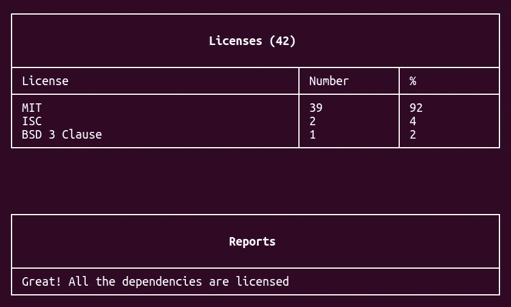
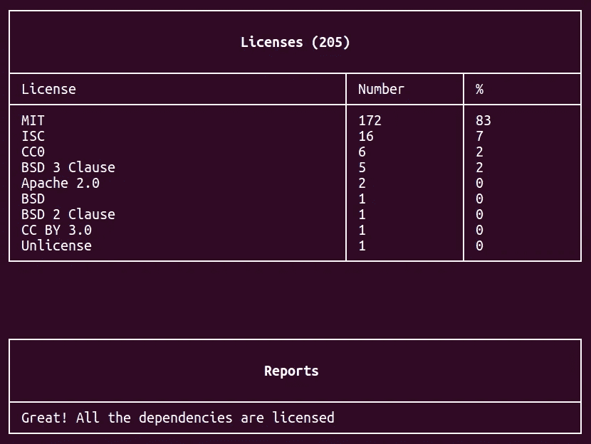
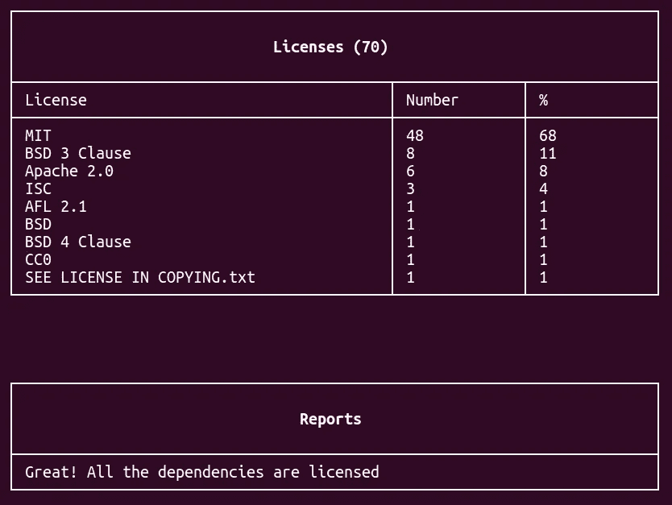
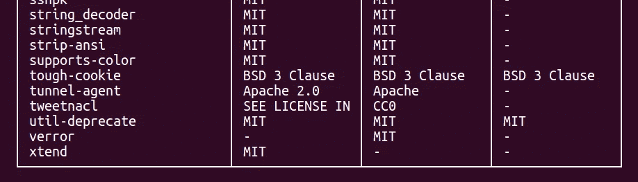
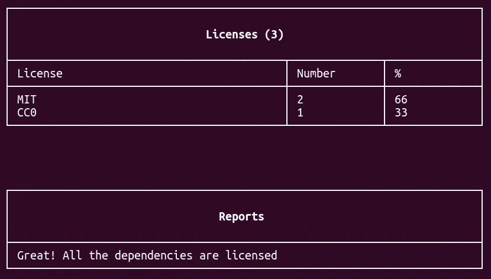
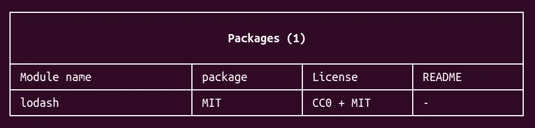
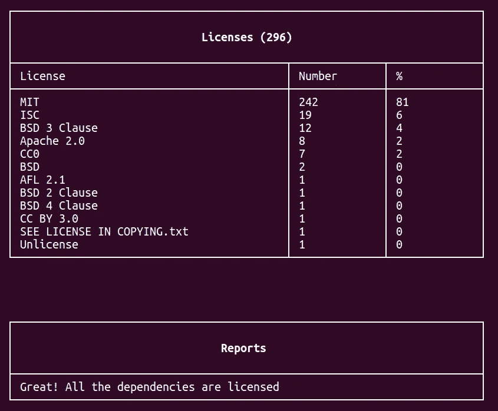

# 轻松获得 NPM 软件包的许可

> 原文：<https://medium.com/hackernoon/licenses-for-npm-packages-b2036b4bb6a>

> 免责声明:我不是律师，这不是法律意见

下面我们来探究一下明星们在 NPM[前 5 名的包使用的是什么许可证，看看](https://www.npmjs.com/browse/star) [*合法*，我做的一个分析你项目库的工具](http://github.com/franciscop/legally)。

## #0 快递

正如这个被广泛使用的项目所预期的，没有什么令人惊讶的，因为在 *express* 上工作的人们做了他们的工作。令人惊讶的是，这种规模的项目总共有 42 个许可证，包括间接许可证。胡乱猜测:这是因为他们将许多部分，如 *body-parser* 分成了独立的库。

```
legally express -lr
```



[MIT license](https://tldrlegal.com/license/mit-license), [ISC License](https://tldrlegal.com/license/-isc-license), [BSD3 Clause](https://tldrlegal.com/license/bsd-3-clause-license-%28revised%29)

## #1 大口

自从最近的补丁以来，事情已经很清楚了:

```
legally gulp -lr
```



[MIT License](https://tldrlegal.com/license/mit-license), [ISC License](https://tldrlegal.com/license/-isc-license), [CC0](https://tldrlegal.com/license/creative-commons-cc0-1.0-universal), [BSD 3 Clause](https://tldrlegal.com/license/bsd-3-clause-license-%28revised%29), [Apache 2.0](https://tldrlegal.com/license/apache-license-2.0-%28apache-2.0%29), [CC BY 3.0](https://tldrlegal.com/license/creative-commons-attribution-%28cc%29), [Unlicense](https://tldrlegal.com/license/unlicense)

## #2 请求

我们看到，并非一切都是顺利的，有一个“许可证”带有文本“参见 COPYING.txt 中的许可证”:

```
legally request -lr
```



[MIT license](https://tldrlegal.com/license/mit-license), [BSD3 Clause](https://tldrlegal.com/license/bsd-3-clause-license-%28revised%29), [Apache 2.0](https://tldrlegal.com/license/apache-license-2.0-%28apache-2.0%29), [ISC License](https://tldrlegal.com/license/-isc-license), [AFL 2.1](https://spdx.org/licenses/AFL-2.1.html), [BSD 4 Clause](https://tldrlegal.com/license/4-clause-bsd), [CC0](https://tldrlegal.com/license/creative-commons-cc0-1.0-universal)

让我们检查它的哪个包包含这个警告:

```
legally request -p
```



[CC0](https://tldrlegal.com/license/creative-commons-cc0-1.0-universal) in disguise

## #3 异步

异步仅取决于 lodash:

```
legally async -lr
```



[MIT license](https://tldrlegal.com/license/mit-license), [CC0](https://tldrlegal.com/license/creative-commons-cc0-1.0-universal)

## #4 洛达什

它不依赖于任何其他包，所以这个很简单，让我们只显示包:

```
legally loadsh -p
```



Sure enough [lodash’s LICENSE](https://github.com/lodash/lodash/blob/master/LICENSE) has both licenses

> 这个列表是 0 索引的，所以不要寻找库# 5(；

## 他们全部

让我们切入正题，一起看看他们。不过这需要一段时间。

```
legally express gulp request async lodash -lr
```



似乎前 5 名的库没有坏的许可证，所以我们可以安全地使用它们。你的图书馆和那些一样安全吗？查看它们:

```
legally ANY_OR_YOUR_LIBRARY
```

或者直接进入您的项目并检查您正在使用的许可证:

```
cd ./MY_PROJECT
legally
```

如果您希望这个或类似的功能默认包含在 npm 中 [:+1:我在 NPM 库中的特性请求](https://github.com/npm/npm/issues/14270)(在反应中，不是作为注释)。

**谢谢。**如有问题或建议[请发邮件给我](https://francisco.io/)或[在 Github 中提出问题](http://github.com/franciscop/legally)。