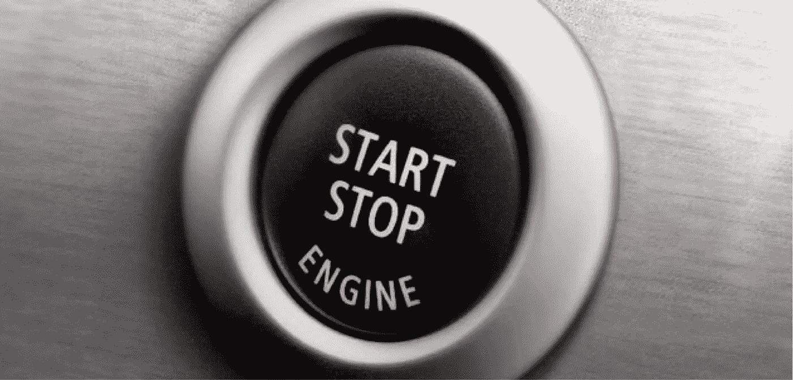
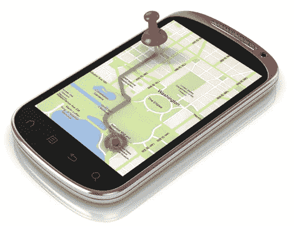
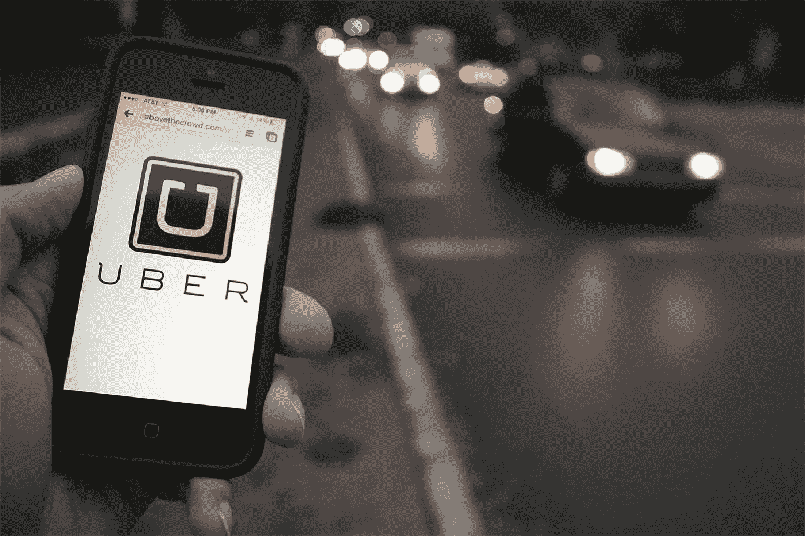

# 生活 4.0

> 原文：<https://medium.com/hackernoon/life-4-0-e8a84e4a8d4f>

我的智能手机在早上 5:30 叫醒了我。那天我在米兰有一个工作面试，为此我必须赶上早上 7:01 离开乌迪内的火车。这看起来是最好的选择，几天前我在 [Trenitalia](https://hackernoon.com/tagged/trenitalia) 的应用程序上订票，通过与我的 VISA 信用卡关联的 PayPal 账户支付。在我脑海中简单回顾了一下每天的日程安排后，我停顿了几秒钟，静静地凝视着我妻子和我们的孩子几乎看不见的无意识的脸，微笑着，他们都非常漂亮，在我身边熟睡。我打开 iPhone 的探照灯功能，面朝下寻找走出漆黑卧室的路。

当我打开我的车时，黄昏传感器迅速打开了前灯。我按下了仪表板上的媒体按钮，突然，通过车载娱乐系统和智能手机之间自动配对的蓝牙连接，我的音乐库开始播放一首歌曲。我开得很慢——ECO 模式打开了——穿过沉睡的郊区，dualogic 变速器给了我安慰。每当我需要在几个还没有转换成更有效的环形路的闪电处停下来时，只要我把脚从刹车踏板上抬起来，发动机就会立即停下来重新启动。

一个停车场被方便地安置在离火车站一百米远的地方。没有入口酒吧，没有服务员。我把车停在几乎空无一人的地方，走到售票机前，投了几枚硬币，加到预计晚上返程的时间，走回车旁，把票放在前窗后面一个非常显眼的地方，关上门，悄悄地走到车站，盯着显示器辨认我的火车，走到我的车厢前，坐下。

在火车上，我在网上冲浪，收集有关过渡管理公司的信息，几个小时后我就会在那里赴约。然后检票员来了，他用平板电脑扫描了我视网膜显示屏上显示的二维码，验证了我的电子机票。上午的其余时间，我放松地听一些我最喜欢的广播节目的播客，偶尔连接到我的网络银行平台，查看我的股票，并为我的大孩子的学费安排汇款。

当我到达米兰时，我插上耳机，一个合成的声音指引着我穿过这座城市走向我的目的地。我路过主教堂，拍了张照片，然后贴在了脸书上:几分钟后，我收到了一个住在曼谷的朋友的赞。当我到达办公室时，我的智能手机找到了一个附近的地方吃午饭，消磨等待的时间。

约会结束后，我登录优步，想找辆车把我送回火车站。我提前在智能手机上查看了将我的火车换成更早的火车的可能性，但来自 Trenitialia 的应用程序通知我——因为我买了打折票——不允许换车。我坐在附近的一家酒吧喝开胃酒，但当我准备点餐时，我的手机上出现了天气警报:15 分钟内有超过 80%的几率会有阵雨。我及时回到了车站，避免了预报的大雨倾盆而下。

在回乌迪内的火车上，我打开我的 Macbook，欣赏通过 BitTorrent 下载的《非理性的人》。在那之后，我切换到 Kindle 应用程序，继续阅读我在亚马逊网上购买的*投资假人*。我在 22:05 到达乌迪内的前几分钟完成了这本书。我走到停车场，坐在车里，慢慢驶过寂静的郊区，回到了家。屋子里很安静，我打开了 iPhone 的探照灯功能，面朝下照亮了我穿过漆黑的卧室的路，脱了衣服，进了床。我停顿了几秒钟，静静地凝视着我妻子和我们的孩子几乎看不见的无意识的脸，微笑着，他们都非常漂亮，在我身边熟睡着。然后我切换到飞行模式，闭上眼睛。

> [黑客中午](http://bit.ly/Hackernoon)是黑客如何开始他们的下午。我们是 [@AMI](http://bit.ly/atAMIatAMI) 家庭的一员。我们现在[接受投稿](http://bit.ly/hackernoonsubmission)并乐意[讨论广告&赞助](mailto:partners@amipublications.com)机会。
> 
> 如果你喜欢这个故事，我们推荐你阅读我们的[最新科技故事](http://bit.ly/hackernoonlatestt)和[趋势科技故事](https://hackernoon.com/trending)。直到下一次，不要把世界的现实想当然！

