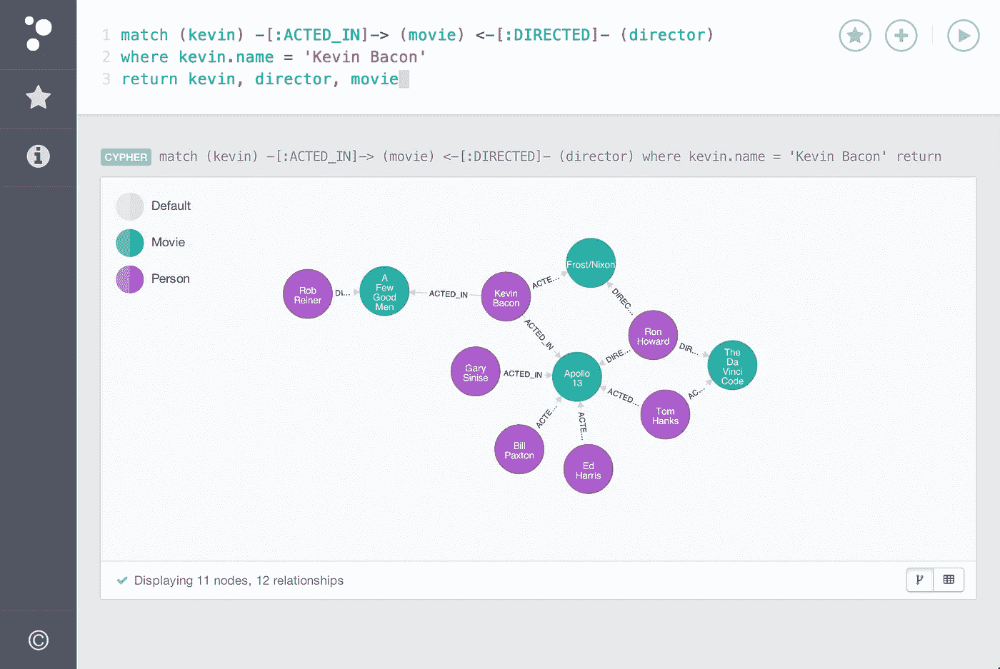

# 使用 Neo4J 一年后的寿命

> 原文：<https://medium.com/hackernoon/life-after-1-year-of-using-neo4j-4eca5ce95bf5>

一年前，在我的一个项目中，我们有了一个想法，迁移到 Neo4j 会很棒，因为我们有非常适合 graph 的数据。从那以后，我们的生活永远改变了。

我认为 Neo4j 就像《英雄》,一开始你认为这是你能想象到的最棒的东西，但几个月后 eyforiya 倒下了，你开始明白这可能不是你一生中最好的选择。在 Neo4j 网站上，你可以看到许多大客户，如 Ebay、LinkedIn，但实际上我不知道他们如何以及在哪里使用这个数据库，所以如果他们的一些开发人员可以在评论中分享一些信息，那就太好了。但是现在我只告诉你我个人使用 Neo4j 的经验。

## 查询语言

Neo4j 的查询语言叫做 Cypher。这非常简单，在阅读文档几分钟后，你就可以进行一些重要的查询。像大多数数据库一样，它也有 ***解释*** 和 ***配置文件*** 命令，这些命令使您有可能理解查询的背后发生了什么。
但是当你开始进行越来越复杂的查询时，你开始发现你无法理解 query 是如何工作的，并且每次更改后你都需要使用 ***Profile*** 。例如，在 SQL 中使用 Join 指令时，您已经知道这会增加查询量，但是在 Neo4j 中，您可以更改少数几行的顺序，这在逻辑上不会导致任何更改，但是在运行时，它会导致查询时间从 0.05 毫秒增加到 30 秒。所以进行困难的查询是一种魔法。我认为 Neo4j 推荐将所有查询拆分为小查询的原因之一。

## 查询执行

**查询观察器**
因此，您创建了第一个查询，并在服务器上运行它，但不幸的是，您犯了一个小错误，返回的不是 5 个节点而是 5M 个节点。在大多数数据库中，都有一个监视器，它寻找长时间运行的查询或使用大量内存的查询，并可以杀死它们以防止数据库关闭。Neo4j by docs 也有一个，但我没有看到它真的工作。在最好的情况下，你会得到类似“未定义-未定义”的错误，在最坏的情况下，你的数据库将关闭，也许你的服务器也将关闭。

**先读取所有数据** 记住，在 Neo4j 中不管你在做什么它都会先进行读取查询。例如，在关系数据库中，您想要删除所有记录——数据库将遍历每条记录并删除它们，不管您有多少条记录。在 Neo4j 中，它首先会尝试从这些记录中获取所有信息，然后运行 delete。例如，在现实生活中，这意味着您不能从数据库中删除所有 100 万条记录，因为您没有足够的内存来完成这项工作。要删除所有记录，您需要编写脚本来运行有限制的查询，直到所有记录都被删除。这样做的问题是，你无法知道节点中有多少数据，以及如何设置限制，以便它不会溢出 RAM。

**锁定** 这是另一个有趣的部分。锁定在这里的工作方式与在许多关系数据库中不同。例如，在某些相关数据库中，当您进行更新查询时，查询执行器会理解这一点，并根据锁定策略为字段、记录等设置写锁定。在 Neo4j 中，只有写锁，它不是在查询开始执行之前设置的，而是在部分查询试图更新某些内容时设置的。因此，例如查询**MATCH(n:Test { id:1 })SET n . param = 2**将仅在发出匹配请求后向节点添加写锁。这意味着在并发更新时会出现问题。在 Neo4j 博客上有一个如何处理这类问题的大话题，但对我来说，它似乎是一个热修复的集合。就是这里:[https://neo4j . com/blog/advanced-neo4j-fifty three-read-writing-scaling/](https://neo4j.com/blog/advanced-neo4j-fiftythree-reading-writing-scaling/)

## 连接

上线时的另一个问题是——没有像 Pg 中那样的连接代理平衡器，也没有办法限制 DB 可以处理的连接数，并关闭其他连接。这导致使用 HAproxy 和奇怪的手写脚本来实现这一点，并使 DB 在现场使用时更加稳定。

## 高可用性

Neo4j 只有一种方法，基本上是主从复制，甚至没有主从复制。也没有办法为实例设置主优先级(当你安装了插件时，这是一件好事。我将进一步讲述它们)。

例如，您不能进行 DC-DC 复制，您不能使用蓝绿部署技术，或者创建两个群集。所有这些你都需要自己为 Neo4J 编写脚本、服务和内核插件。Neo4j 的开发者也在他们的博客中写道，你应该经常检查主机和从机之间的同步，因为有时它会失败。

## 扩展ˌ扩张

因此，Neo4j 有 3 种类型的扩展——非托管扩展、服务器插件和内核扩展。我只和第三个人一起工作。当您需要为 Neo4j 的内部工作方式添加一些额外的功能时，可以使用内核扩展。在我的例子中，我使用的是 [TransactionEventHandler](http://neo4j.com/docs/2.2.0/javadocs/org/neo4j/graphdb/event/TransactionEventHandler.html) ,它以前处理事务事件，比如 beforeCommit、afterCommit、afterRollback。

在我看来，这是一个添加一些 Neo4j 没有的功能的好方法。

首先，我知道几乎没有这方面的文档，我需要查看几个创建的插件、StackOverflow 和其他网站，以便将事情整合在一起并进行首次尝试(如果我是 Java 开发人员，可能会快得多，但我主要使用 python，有时使用 Android)。

我发现的第二件事是，不是所有的事件都像它们应该的那样工作。例如，在 beforeCommit(应该在数据库未更改时运行)中，您无法访问已删除的节点参数、标签和关系，因为它们已经被删除。是..奇怪。然后在事务仍然打开时执行 afterCommit(应该在事务提交和关闭之后运行),这将导致死锁(没有任何信息和异常),如果您试图更新本地数据库(在某些情况下)。

第三，每一个扩展都是在全局环境下运行的，这导致了依赖冲突，如果你有不止一个插件，你就需要手动修复插件。

我写了一些内核扩展的例子，可以帮助开始制作新的酷插件:[https://github.com/creotiv/neo4j-kernel-plugin-example](https://github.com/creotiv/neo4j-kernel-plugin-example)

## 我的结论

所以我并不是说 Neo4j 不工作，因为我知道它是最好的图形数据库之一，你可以免费使用，但它仍然非常原始。你应该明白，如果你的任务不是很琐碎，那么你会因为使用 Neo4j 而得到一些开销。也不是很符合 HL+HA 的要求。

如果你们能在评论中分享你们使用 Neo4j 的经验，我会很高兴。

阅读我的新故事

 [## 如何把自己锻造成一个男人？我的人生故事。

### 今天我想和你们分享一些帮助我成为一个更好的人的事情。这不是什么快速超级…

medium.com](/@a.nikishaev/how-to-forge-a-man-out-of-yourself-story-of-my-life-d9121e01c05c) 

> [黑客中午](http://bit.ly/Hackernoon)是黑客如何开始他们的下午。我们是 [@AMI](http://bit.ly/atAMIatAMI) 家庭的一员。我们现在[接受投稿](http://bit.ly/hackernoonsubmission)，并乐意[讨论广告&赞助](mailto:partners@amipublications.com)机会。
> 
> 如果你喜欢这个故事，我们推荐你阅读我们的[最新科技故事](http://bit.ly/hackernoonlatestt)和[趋势科技故事](https://hackernoon.com/trending)。直到下一次，不要把世界的现实想当然！

