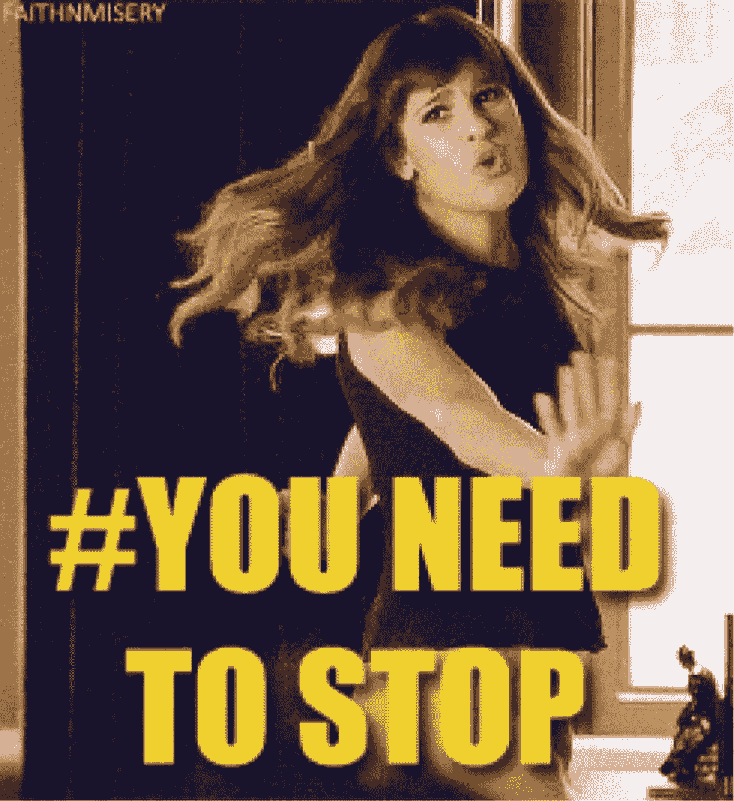

# 生命黑客/反生命黑客

> 原文：<https://medium.com/hackernoon/life-hacks-anti-life-hacks-cf5657ac9212>

所以现在我们有 10 倍的帖子告诉生活帮作家/创业失败/成功的故事，不要再写那种生活了。

但现在我想，你们都需要停下来，停止重复彼此的节拍，因为鼓会停止演奏。希望人们会接受你的点击诱饵，不再点击。

> [黑客中午](http://bit.ly/Hackernoon)是黑客如何开始他们的下午。我们是 [@AMI](http://bit.ly/atAMIatAMI) 家庭的一员。我们现在[接受投稿](http://bit.ly/hackernoonsubmission)，并乐意[讨论广告&赞助](mailto:partners@amipublications.com)机会。
> 
> 如果你喜欢这个故事，我们推荐你阅读我们的[最新科技故事](http://bit.ly/hackernoonlatestt)和[趋势科技故事](https://hackernoon.com/trending)。直到下一次，不要把世界的现实想当然！

