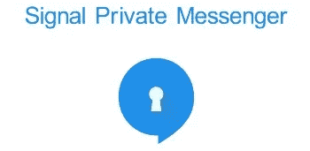
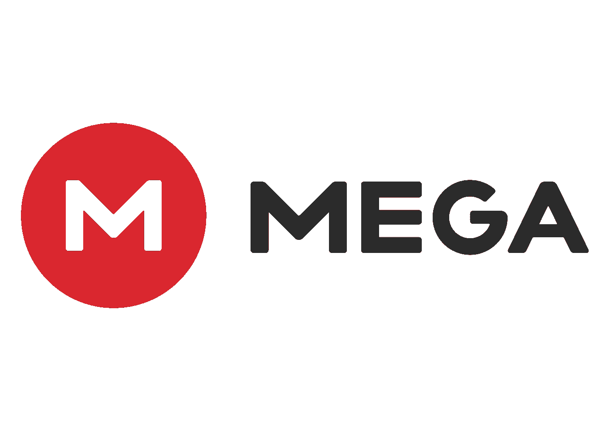
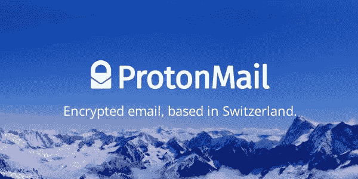
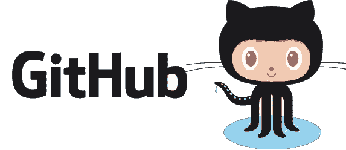

# 防止黑客攻击的生活黑客

> 原文：<https://medium.com/hackernoon/life-hacks-to-prevent-hacks-f3ba1d8e118f>

## 17 年安全指南

What if hacking actually looked like this?

网络攻击变得越来越强大和普遍。[政府](https://hackernoon.com/tagged/governments)正在竭尽全力武装和防御新时代的数字武器。随着时间的推移，勒索软件、网络钓鱼、零日和其他几种攻击方法变得越来越复杂。随着我们的生活变得越来越数字化，我们的身份转移到互联网上，保护自己和他人免受伤害的责任大大增加。普通公民(或开发者)并不安全。

那么，**你如何保护自己？**你可能不是安全研究人员(如果你是，那就祝福你)，考虑到你所拥有的时间，设置 VPN、代理和 Tor 可能会非常痛苦。但是，随着技术的最新进步和对数字威胁认识的提高，拥有一个安全的在线状态从未如此容易。我将向您介绍的安全解决方案是免费的、开源的，并且易于安装和使用。而且，我们都喜欢有很棒的用户界面/UX 的服务，所以请放心，这些应用程序就是这样的！

*免责声明:下载和/或使用这些应用程序不会授予您完全的在线隐私。然而，它们将在减轻针对你的迫在眉睫的网络威胁方面做得很好。还有，这个帖子不是赞助的；我是以我自己的方式提到这些服务的。*

# 信息发送

Signal

还记得当每个人都为最近的政府监控丑闻而抓狂，所有这些消息应用都试图添加端到端加密吗？如果你知道，你可能听说过 [Signal](https://whispersystems.org/) ，这是一个私人和安全的消息应用程序，自最初推出以来一直提供端到端加密。它是由 [Open Whisper Systems](https://whispersystems.org/#team) 的优秀人员开发的，提供了你在消息应用中需要的一切:点对点消息、群组消息、语音通话，甚至涂鸦/图片消息。Signal 是 iMessage、Groupme 和 Telegram 等应用程序的最佳安全替代方案，因为它使用了前向保密和高级端到端加密方案。它可以让你安全地与任何拥有该应用的人进行交流，并提供了一种通过扫描二维码来验证你的交流对象的方法。要了解更多关于 Signal 的信息，请点击[此处](https://whispersystems.org/)。

[iOS 下载](https://www.google.com/url?sa=t&rct=j&q=&esrc=s&source=web&cd=1&cad=rja&uact=8&sqi=2&ved=0ahUKEwjb8qKXvqnRAhXC6YMKHal3CQgQFggaMAA&url=https%3A%2F%2Fitunes.apple.com%2Fus%2Fapp%2Fsignal-private-messenger%2Fid874139669%3Fmt%3D8&usg=AFQjCNEzBa_idEJXpV1iuo3I-MTvoeyP3w&sig2=j9XSmnj7ZQ2mijKfchE5TQ&bvm=bv.142059868,d.amc) | [安卓下载](https://www.google.com/url?sa=t&rct=j&q=&esrc=s&source=web&cd=2&cad=rja&uact=8&ved=0ahUKEwiNpc7WvanRAhUI_IMKHXcdDWMQFggxMAE&url=https%3A%2F%2Fplay.google.com%2Fstore%2Fapps%2Fdetails%3Fid%3Dorg.thoughtcrime.securesms%26hl%3Den&usg=AFQjCNENTFzyBHIGShZQCnLr9A0FmRzCew&sig2=h2LCuoGbkUQS-uqmP154jQ) | [Github](https://github.com/WhisperSystems)

# 储存；储备

mega.nz

Mega 是一个没有多少人知道的产品。他们免费提供 50GB 的加密存储空间！请记住，Box 提供 10GB 的免费空间，Dropbox 只提供 2GB 的免费空间，而谷歌只允许所有谷歌应用提供 15GB 的免费空间，当你使用 Gmail *和* Drive 时，这几乎等于零。Mega 还允许你从桌面和移动设备上传和下载你的内容，并且创建一个账户是免费的。没有太多其他可谈的，所以如果你想检查他们，去[这里](https://mega.nz/)。

[iOS 下载](https://itunes.apple.com/us/app/mega/id706857885?mt=8) | [Android 下载](https://www.google.com/url?sa=t&rct=j&q=&esrc=s&source=web&cd=1&cad=rja&uact=8&ved=0ahUKEwirk7LnwKnRAhUCVyYKHfDfBK0QFggcMAA&url=https%3A%2F%2Fplay.google.com%2Fstore%2Fapps%2Fdetails%3Fid%3Dmega.privacy.android.app%26hl%3Den&usg=AFQjCNHa_hXaA58CHEp3ZO98-p-8cOlq_g&sig2=J5sa9DuiU9iaMrxV1Mb1qQ) | [Github](https://github.com/meganz)

# 电子邮件

Protonmail

电子邮件是网络攻击者中最古老也是最常见的攻击载体。PGP 加密增加了一层安全性，但它从未被普通人采用。这意味着有数以百万计的电子邮件在传播，面临着被恶意外部方拦截的风险。易受攻击的电子邮件的解决方案是 [Protonmail](https://protonmail.com/) 。对于那些不知道的人来说，Protonmail 是一种加密邮件服务，具有免费存储、自动 PGP 加密、密码保护的电子邮件和自毁消息。此外，他们的服务器位于瑞士，所以政府不能合法扣押机器。要了解更多关于 Protonmail 的信息，请点击[这里](https://protonmail.com/about)。

[iOS 下载](https://www.google.com/url?sa=t&rct=j&q=&esrc=s&source=web&cd=1&cad=rja&uact=8&ved=0ahUKEwjozY3biarRAhXBbiYKHYkaBPMQFggaMAA&url=https%3A%2F%2Fitunes.apple.com%2Fus%2Fapp%2Fprotonmail-encrypted-email%2Fid979659905%3Fmt%3D8&usg=AFQjCNE_PJyRqLop1H_oD-OPv9oEsrwRuw&sig2=wJTFJ-WFLThLiTW1-xTa4g&bvm=bv.142059868,d.eWE) | [安卓下载](https://www.google.com/url?sa=t&rct=j&q=&esrc=s&source=web&cd=1&cad=rja&uact=8&ved=0ahUKEwiz6aPjiarRAhWBbCYKHTilDlUQFggaMAA&url=https%3A%2F%2Fplay.google.com%2Fstore%2Fapps%2Fdetails%3Fid%3Dch.protonmail.android%26hl%3Den&usg=AFQjCNGOm2Wd2X9Epz9HtfzgWK70TtgVCw&sig2=HlJbh_sJR2gD1g6V7nxNRQ&bvm=bv.142059868,d.eWE) | [Github](https://www.google.com/url?sa=t&rct=j&q=&esrc=s&source=web&cd=3&cad=rja&uact=8&ved=0ahUKEwj1zL-iiarRAhWESSYKHaS8CAQQFggnMAI&url=https%3A%2F%2Fgithub.com%2FProtonMail&usg=AFQjCNEHXuVrU1DpsUCokxYXplBDdErKxA&sig2=VwFHrjNI_IjCg0FzckSG3Q&bvm=bv.142059868,d.eWE)

# 发展

Github

你可能会问为什么 Github 会在这里。嗯，Git 存储库(开源的也是)构成了今天的技术基础设施的一大部分，来自恶意方的一次恶意提交可以摧毁任何重要的存储库。为了保护您的项目，您可以用您自己的 GPG 签名来签署您的提交，以防止任何人假冒您和您的提交。您也可以禁用强制推送您的回购，这基本上可以确保您的项目不会被试图抹掉它们的人破坏。要了解更多关于提交签名的信息，[请看这里](https://help.github.com/articles/signing-commits-using-gpg/)。[要了解如何保护树枝免受外力推动，请点击这里](https://github.com/blog/2051-protected-branches-and-required-status-checks)。

# 你们

上面提到的所有应用和服务都将有助于让你在网上更加安全，但抵御网络攻击的最佳保护是你自己。只要你让自己了解最新的在线威胁，并知道如何减轻这些威胁，几乎没有什么可以伤害你。

我希望这个列表是有帮助的！如果你认为是，一定要**喜欢、推荐、分享**。谢谢！

As always, you’re awesome!

> [黑客中午](http://bit.ly/Hackernoon)是黑客如何开始他们的下午。我们是阿妹家庭的一员。我们现在[接受投稿](http://bit.ly/hackernoonsubmission)并乐意[讨论广告&赞助](mailto:partners@amipublications.com)机会。
> 
> 如果你喜欢这个故事，我们推荐你阅读我们的[最新科技故事](http://bit.ly/hackernoonlatestt)和[趋势科技故事](https://hackernoon.com/trending)。直到下一次，不要把世界的现实想当然！

