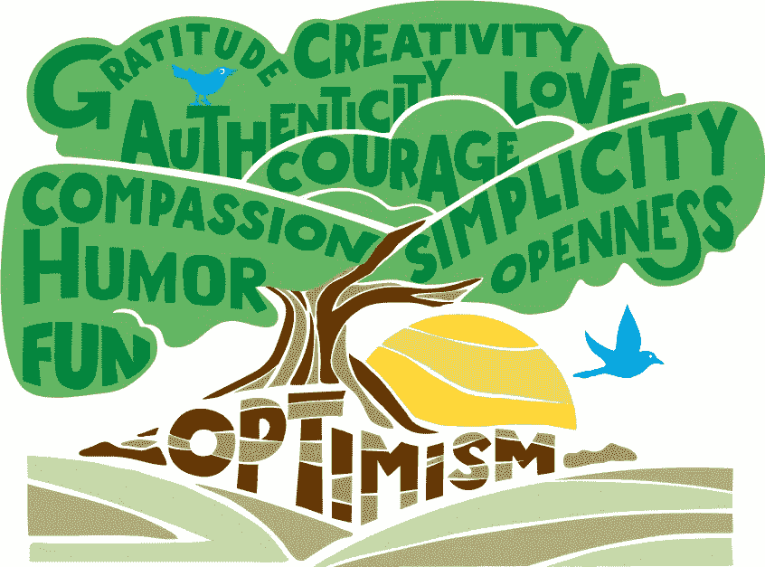
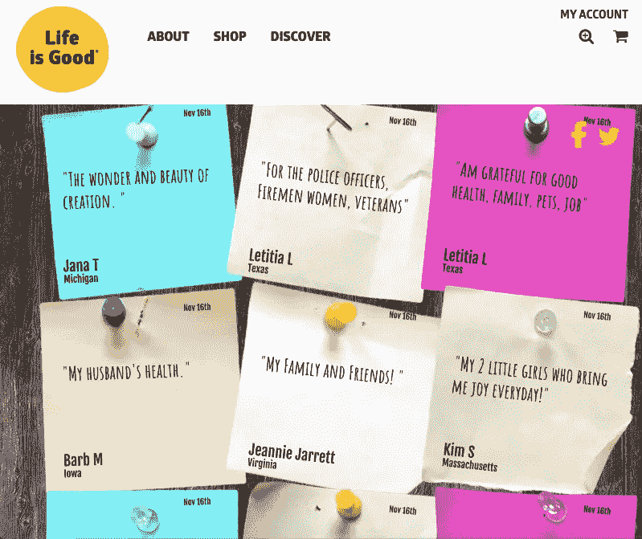
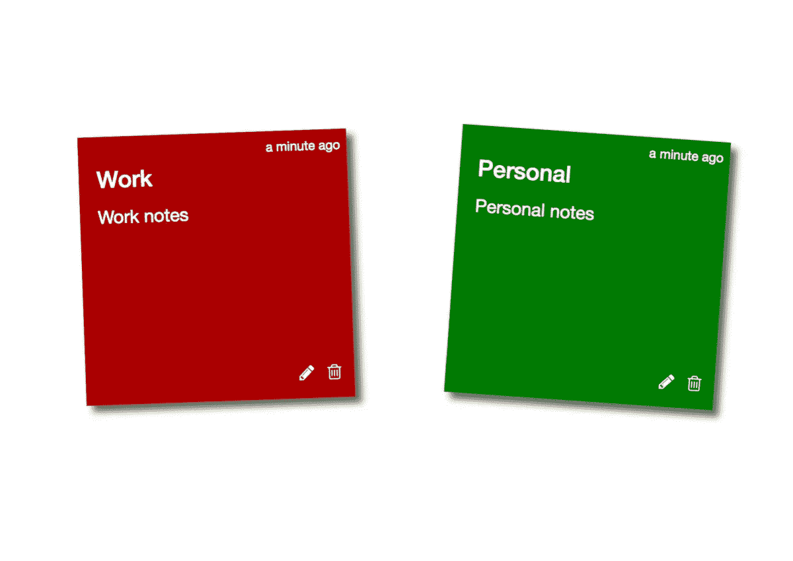

# 生活是美好的在宇宙 js 上建立一个 React / Node.js 感恩墙

> 原文：<https://medium.com/hackernoon/life-is-good-builds-a-react-node-js-gratitude-wall-on-cosmic-js-56e236e1746>

[Read the Case Study on Cosmic JS.](https://cosmicjs.com/case-studies/life-is-good-shares-gratitude)

生活美好社区有一个简单而统一的使命:传播乐观的力量。本着这种精神，Life is Good tech 团队为一些用户生成的感恩节建立了一面[感恩墙](http://content.lifeisgood.com/gratitude-wall/?utm_source=cosmicjs.com&utm_medium=referral&utm_campaign=gratitudewall)。这个小部件将允许用户在感谢板上添加“便笺”,上面有他们的名字和他们感谢的事情。

感恩墙改编自宇宙 JS [便利贴 App](https://cosmicjs.com/apps/sticky-notes) ，构建于 [React](https://cosmicjs.com/knowledge-base/react-cms) ，Redux 和 [Node.js](https://cosmicjs.com/knowledge-base/nodejs-cms) 。这堵墙目前正在 Heroku 上运行，并且在其登陆页面上被 i-framed 到 WordPress 中。Life is Good 团队还构建了一个简单的审核应用程序，以便他们的团队可以轻松地批准或删除用户生成的内容。他们还在内容输入过程中建立了客户端审核功能，可以根据禁止的单词列表进行检查，并阻止提交。

> " [Cosmic JS](https://cosmicjs.com) 为我们提供了一个强大的脚手架来接受、存储和调节用户生成的内容，并在定制的 web 应用程序中实时显示这些内容。有了 [Cosmic](https://cosmicjs.com) ，我们能够在几个小时内开发出一个 MVP，并将我们的资源集中在 UX 和设计上，而不是内容管理上。宇宙支持团队在整个过程中给予了极大的帮助。我们很高兴在未来的项目中再次利用这些工具。”
> 
> — Chris Schwab，前端工程师

# 灵感应用

生活是美好的[感恩墙](http://content.lifeisgood.com/gratitude-wall/)由我们的一个社区成员 [Jazib Sawar](https://cosmicjs.com/jazibsawar) 改编自便利贴应用。在这里可以下载并安装[。](https://cosmicjs.com/apps/sticky-notes)

 [## 化妆品/便利贴

### 一个用 React，Redux 构建的，由 Cosmic JS 支持的便签应用。

github.com](https://github.com/cosmicjs/sticky-notes) 

准备好试试宇宙 JS 了吗？[报名](https://cosmicjs.com/)，加入[宇宙 JS 社区](https://cosmicjs.com/community)更快搭建 app。通过 [Twitter](https://twitter.com/cosmic_js) 或 [Slack](https://cosmicjs.com/community) 联系我们。

## 附加阅读