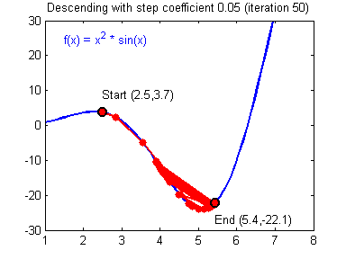

# 生活是梯度下降

> 原文：<https://medium.com/hackernoon/life-is-gradient-descent-880c60ac1be8>

机器学习和优化理论如何改变你的视角

A grassy continuous non-convex function. Credit to [C Rand](https://www.flickr.com/photos/20722238@N00/5545260044)

最近，我一直在[学习](https://hackernoon.com/tagged/learning)关于[梯度下降](https://en.wikipedia.org/wiki/Gradient_descent)。这是一个非常漂亮的算法，有助于找到函数的最优解，并形成了我们今天如何训练智能系统的基础。它基于一个非常简单的想法——它不是立即找出问题的最佳解决方案，而是猜测一个初始解决方案，并朝着更好的解决方案的方向前进。算法是重复这个过程，直到解决方案足够好。

我的理论是，这是我们人类的工作方式。在生活中，我们都被动或主动地遵循某种形式的梯度下降。明确理解这个梯度下降的框架有助于改善你的目标设置，加快实现这些目标的进度，理解他人，并看到更广阔的前景。这篇文章的目的有两个:1)通过梯度下降的镜头来看生活，2)通过生活的镜头来看梯度下降。在整篇文章中，我将提供精确使用这个术语的例子。让我们从理解梯度下降开始。

## 对数学感兴趣的人来说

如果你想最小化方程 x(它的导数是 2x)，你对解的猜测是 3，那么你可以在 x=3 的梯度的相反方向上迈出一小步(. 1)，也就是-6。所以下一个猜测可能是 2.4，下一个 1.8，下一个 1.5…直到最后我们达到零。这极大地简化了梯度下降的使用，因为在这种情况下，我们可以直接求解，但现在请耐心等待。

## 对于视力有问题的人

[Gradient Descent](https://www.cs.toronto.edu/~frossard/post/linear_regression/sgd.gif)

想象一个大碗边上有一颗弹珠。这是对解决方案的第一个猜测。它从远离碗的底部中心开始，但它最终通过滚动到达那里，一点一点。它不是瞬间从边缘传送到底部，而是沿着阻力最小的路径逐渐移动。

## 标准监督机器学习如何工作

在[机器学习](https://hackernoon.com/tagged/machine-learning)中，这种方法用于使用标记数据迭代一个成本最小的解决方案。例如，如果我们想让分类器预测一幅图像是否有猫，我们可以为它提供一组有猫和没有猫的标记图像。为了执行梯度下降的一次迭代，分类器在其当前状态下将用于对所有图像进行分类，使用预测和标签来计算成本，然后计算梯度以找出如何移动分类器权重来正确预测更多图像。您可以将此过程视为找出分类器在山坡上的位置，并向正确的方向滚动一点。

在生活的梯度下降中，我们是众多不同山丘中的这些弹珠。这些山丘在不同的情感和尺度上有所不同，比如幸福、财富、爱情、地位、手艺等等。让我们调用这些函数。在每个函数中，我们坐在山坡上的某个地方，试图到达山谷或山顶(让我们称之为 optima)。只要我们有一个可测量的成本/回报函数，以及一些我们可以监督的相关数据，我们就有了练习梯度下降的良好基础。

## 利奥想成为一名更好的足球前锋。

利奥的奖励函数取决于他的进球数、上场时间、对阵的球队以及赢得的奖杯。目前，他一个赛季能进 10 到 15 个球，但是他认为他可以通过稳定的进步达到 25 到 30 个。他每天比队里的其他人多训练两个小时，每周日罚一个小时的点球。这使得他第二年的进球数达到了 18 个。在看了他的进球数后，他发现他的进球几乎没有一个是来自传中的头球。这为他的进步确定了方向。他做各种各样的小腿抬高和跳箱训练。他在禁区的攻击性增加了。所有这些变化最终形成了一个 22 球的赛季。

与此同时，Leo 也有一个他试图最小化的成本函数——伤害。任何受伤都将是对他任何奖励功能的巨大挫折。每天和他的教练一起，他分析自己身体的任何疼痛、压力、僵硬，并缓解它们。在任何时间点，Leo 都在评估一组不同的适应度函数，同时评估适应度函数本身。也许他的目标是成为一名更好的前锋，应该转变为进攻型中场。这样他就可以为他的团队实现最大化的目标。

Leo 的梯度下降算法的关键成分是可以测量的函数(一个赛季的进球数或受伤天数)，对函数有贡献或有损函数的数据(头球、关键传球、拉伤、骨折等)，以及分析数据后他日常工作中的小步。

## 批量与随机梯度下降

让我们暂时回到机器学习。在我的图像分类示例中，我们计算了对*的所有*图像的预测，并使用所有这些图像的结果来迭代我们的解决方案。这实际上是梯度下降的一个具体变体，称为批量梯度下降。我们也可以只取一张*单个*图像(随机选取)，预测，计算成本，并在正确的方向上迭代我们的分类器。这被称为随机梯度下降；它基本上是说，我们可能偶尔会走错方向，但一般来说，我们会朝着正确的方向前进。随机梯度下降计算起来很便宜，但是可能有噪声。这如何转化为生活？

将每一天视为一个样本，将我们的行动视为每个样本的特征。通过根据我们的目标来审视我们的行为，我们可以看到我们犯了什么错误，并调整我们的行为。这实际上以新年决心的形式根植于我们的文化中。但是，人类[在这个](https://en.wikipedia.org/wiki/New_Year's_resolution#Success_rate)上很烂。我们没有记录我们的目标。众所周知，我们的记忆很糟糕——我们不是电脑。我们对最近的样品进行了大量的超重处理。我们对最情绪化的样本进行了大量的加码。Kahneman 和 Frederickson 在数十项研究中证明了这一点，并将此称为[峰端法则](https://en.wikipedia.org/wiki/Peak%E2%80%93end_rule)。

好吧，你说，批量梯度下降不行。为什么不用随机梯度下降？我们可以每天观察我们的行为，并朝着我们的目标调整。我们人类忙*懒*。如果我们有足够的意志力来监控和改变我们每天的行为，那么我们可能会找到实现所有目标的最佳方案。这让我想起了托德·巴里讲的一个笑话。他描述了一个关于衣柜组织策略的电视特别节目，其中涉及根据你穿的衣服精心安排衣架的方向——他认为，任何成功保持这一习惯的人都已经是世界上最有条理的人了。

幸运的是，机器学习研究人员和实践者已经找到了解决这个问题的方法。我们可以使用小批量梯度下降结合两者的优点。每周或每两周分析一次你的错误，是人类心理学和改变局部最优方向之间的一个很好的平衡。另外，我们有电脑帮助统一记录每个样本。大多数成功的举重运动员都会记日记，记录他们的每一次举重和饮食。如今，数据驱动型公司无处不在。Fitbits、智能手机、智能秤都是帮助计算梯度的有用工具。

## 梯度下降正在戴上眼罩

Bob chillin at a local optima

追求目标会在两方面蒙蔽我们的双眼。首先，当向“正确”的方向迈出小步时，我们可能看不到向“错误”的方向前进一点或从其他地方开始可以帮助我们找到更好的解决方案。在左边的图中，我们可以看到，如果简笔画 Bob 向左移动，他将到达一个更理想的山谷。

## 警惕梯度下降是局部优化器

在我们的生活中，我们有许多不同的健身功能或山峰。穿越这些山中的任何一座都会让我们看不到其他的山！想象一下足球运动员利奥，在他当地 12 岁的联赛中用机关枪快速扫射得分。只要他在那里不断磨练自己的技能，他就不会在更具挑战性和多样化的足球环境中提高自己的技能，比如欧洲。利奥需要搬到一座山谷更深的山上。

此外，我们正在寻找的函数甚至可能不是正确的。这些功能通过被动或主动的方式改变。这种情况在成长过程中时有发生。还记得你用你有多少张口袋妖怪卡或者你的鞋子有多贵来衡量自己吗？这些可能不是衡量自己的正确标准。

## 这可以帮助你了解人们

住在同一个屋檐下，工作在同一个岗位上，或者看起来一模一样的两个人，可以从事完全不同的工作。Bob 和 Alice 可能是两个收银员，Bob 通过他从顾客那里得到多少微笑来衡量自己，Alice 通过她每小时接待顾客的速度来衡量自己。

当深入思考一个人时，不要试图通过他们的基本特征(工作、财富、智力等)来评估他们，而是通过他们走过的山、他们走向的谷和峰，以及他们选择这些山的过程来评估。

## 加快你的进度(或更快地徒步旅行)

在梯度下降法中，学习率影响我们为接近局部最优值所做的改变。一旦我们找到了正确的方向，学习率就是*我们朝那个方向跳了多远*。

这就是为什么这么多自助指南建议循序渐进。一小步意味着一个小的学习速度。循序渐进减少你努力失败的机会。如果我们的学习率太高，我们可能会偏离最优解。本质上，剧烈的变化会让你偏离最佳状态。你可以在下面看到它的样子:

[Divergence](https://www.cs.toronto.edu/~frossard/post/linear_regression/)

高学习率的一个例子是在你第一次尝试滑雪板时尝试黑钻石。这增加了受伤的机会，重复失败，可能导致士气低落。也许最佳的学习速度是一座绿色或蓝色的小山，提供充足的学习机会，而没有偏离目标的风险。

## 关键要点

在任何以目标为导向的情况下，这种梯度下降的框架都会产生有用的见解。你可以问自己一些有用的问题，比如:我现在处于局部最小值吗？我的批量是多少(1 周还是 1 年)？还有其他地方有更好的解决方案吗？我可以调整我的学习速度快一点吗？我是否正沿着最陡峭的路径走向我的目标？我的成本函数是我真正想要的吗？

擅长设置这些函数和学习率的人可以通过动态调整学习率，或者从函数中的许多随机位置重新开始，以接近全局最优，从而转向更复杂的学习技术。为什么那么多人提倡旅游？使用[随机重启](https://www.youtube.com/watch?v=lFjH05v3T54)的思想，它使得寻找新的函数来遍历和寻找现有函数的更好的解决方案成为可能。

世界顶级公司擅长调整这些功能，测量大量数据，并为更好的解决方案指明方向。敏捷软件开发是一种与梯度下降思想紧密相连的方法——尽快从解决方案开始，尽可能频繁地度量和迭代。

## 现实生活中的梯度下降比以往任何时候都更有可能

今天，有一个专门面向物联网(IoT)的完整市场。可穿戴设备测量你的运动，枕头用于睡眠，水瓶用于测量你喝了多少。你的手机和笔记本电脑上的所有活动都被以多种方式追踪。分析这些丰富的时间序列数据可以为梯度下降提供更精确的指南针。

如果你没有学到任何关于自我提高的东西——我希望你学到了一两件关于梯度下降和机器学习的事情。如果你没有学到任何关于机器学习的东西，那么我希望你学到了一些关于制定目标并朝着目标前进的东西。在我的下一篇文章中，我会更具体地以小的可测量的习惯的形式来建立这些目标。

## *如果你喜欢这个，点击💚下面跟我来*，这样其他人*会在媒体上看到这个。*

> [黑客中午](http://bit.ly/Hackernoon)是黑客如何开始他们的下午。我们是 [@AMI](http://bit.ly/atAMIatAMI) 家庭的一员。我们现在[接受投稿](http://bit.ly/hackernoonsubmission)并乐意[讨论广告&赞助](mailto:partners@amipublications.com)机会。
> 
> 如果你喜欢这个故事，我们推荐你阅读我们的[最新科技故事](http://bit.ly/hackernoonlatestt)和[趋势科技故事](https://hackernoon.com/trending)。直到下一次，不要把世界的现实想当然！

