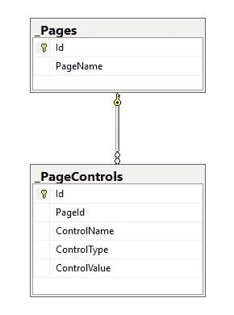

# 全寿命软件系统可维护性第 2 部分用户界面

> 原文：<https://medium.com/hackernoon/life-long-software-system-maintainability-part-2-ui-67c8d2f6d260>

> 第一部分:[https://medium . com/@ amrswalha/lifetime-软件-系统-可维护性-part-1-7e0af04a179e](/@amrswalha/lifelong-software-system-maintainability-part-1-7e0af04a179e)
> 
> https://www.nuget.org/packages/LifeLongSoftware/
> 
> GitHub:【https://github.com/amr-swalha/llsoftware 

在上一篇文章中，我们讨论了如何从数据库中导出当前的数据实体，并将它们转换成 JSON 或 XML 表示，这样我们的软件就变得独立于框架和更加可移植。

在本文中，我们将研究如何将我们的 UI 导出为 JSON 和 XML，以便在以后需要时可以重新生成它们。

首先，在数据库中您需要定义以下表格:

_Page and _PageControls Tables

这些表不包括在生成过程中，也不会得到输出。这些表格将包含页面和控件的定义，因此我们可以将它们导出为 JSON 和 XML。

因此，从 _Page 表开始，我们定义页面及其名称。接下来，我们在 _PageControls 中定义页面内的控件。请记住，页面中的控件没有特定的类型，您可以设置任何类型的控件(AngularJS 组件、HTML、ASP.NET web 窗体控件，甚至桌面控件)。您可以定义控件名称(Id)和默认值(如果有)。然后，您可以为页面生成所需的 JSON 和 XML，如下所示:

在 C#中，调用以下方法:

> XML generator XML = new XML generator(connection)；
> 
> JSON generator JSON = new JSON generator(连接)；
> 
> json。generate ui(@ " D:\ ui . JSON))；
> 
> xml。generate ui(@ " D:\ ui . XML))；

# 可扩展标记语言

> <pages><Page Name = " Home Page ">
> <control control Name = " header " ControlType = " h1 "/>
> <control control Name = " second " ControlType = " H2 "/>
> </Page>
> <Page Name = " sign up ">
> <control control Name = " header " control type = " h1 "/>
> <</pages>

# JSON

> [{
> "Id": 1、
> "PageName ":"主页"、
> 、"控件":[{
> "Id": 1、
> "PageId": 1、
> "ControlName": "header "、
> "ControlType": "h1 "、
> "ControlValue ":"主页"
> }、{
> "Id": 2、
> "PageId": 1、
> "ControlName ":"第二"、【第二】。
> 【PageId】:2、
> 【ControlName】:" username "、
> 【ControlType】:" input "、
> 【control value】:" username "
> }、{
> 【Id】:5、
> 【PageId】:2、
> 【ControlName】:" password "、
> 【ControlType】:" input "、
> 【control value】:" password "
> }]
> }】

在您的[未来](https://hackernoon.com/tagged/future)项目中，您可以直接引用 JSON 或 XML 并重新生成 UI，没有任何麻烦或问题。

我已经更新了源代码和 NuGet 包，所以您可以下载并使用新的 UI 生成器。

在下一篇文章中，我们将讨论如何将业务逻辑导出到 JSON 和 XML。