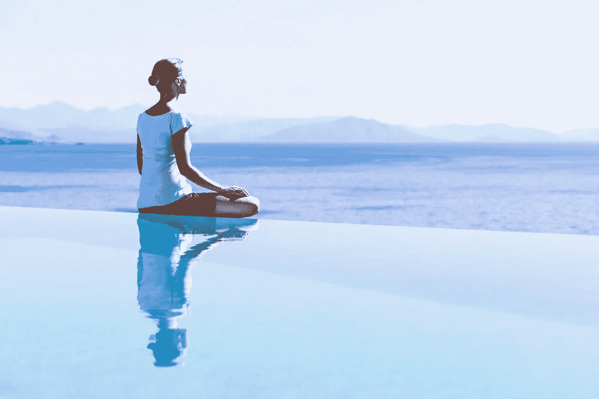

# 卸下肩上的重担:6 种缓解压力的自然方法

> 原文：<https://medium.com/hackernoon/lifting-the-weight-off-your-shoulders-easy-natural-ways-to-relieve-stress-a9e6a2ae2132>

在过去的十年里，我患有慢性背痛，时不时会突然发作。在很大程度上，flareups 很容易被忽略，因为它们会像来时一样很快消失，但在过去的六个月里，疼痛变得如此严重，以至于我甚至无法工作。

当我开始呼吸困难时，我去看医生，发现我患有脊柱侧凸以及颈部和背部的椎间盘突出，导致心脏和肺部周围的肌肉痉挛。

就在那个时候，我认真审视了我是如何对待自己的身体的——不是我的饮酒习惯或睡眠模式，而是我的工作方式，这是我压力、紧张和疼痛的主要原因。

现在，作为一名自由作家，休假来恢复不是一个选项，然而，继续工作并给我的身心增加压力也不是一个选项。

那么，一个独立的专业人士(有着黯淡的保险)该做些什么呢？

# 创建一个减压程序

对我来说，那就是瑜伽…每天都是。

我开始去健身房上瑜伽课，报名参加当地瑜伽馆的课程，掸掉家里的瑜伽垫，甚至买了一本关于瑜伽的书来“深化我的练习”。

坚持每天减压的习惯将确保无论你的生活中发生了什么，你都有“x”的时间让你的大脑和身体休息和恢复活力。

帮助我坚持下去的一件事是提前报名上课，所以我觉得有义务去，不太可能在最后一刻放弃。

另一个动机是避免疼痛。如果你是一个有慢性疼痛或压力的人，知道你的减压程序是你的安全网，只有当一个重要的截止日期到来或你有一个忙碌的星期时，专注于它才会对你有长远的好处。

以下是一些你自己减压的方法:

*   瑜珈
*   跑步/散步
*   冥想(早上和/或晚上)
*   闭着眼睛听轻音乐
*   阅读
*   拉伸
*   深呼吸

# 得到你需要的东西来支持你的日常生活

当开始建立你的减压程序时，你的大脑会尝试并想出各种方法来摆脱它。

但是如果你把所有的事情都安排好了(比如得到你需要的供给，报名上课，等等)，你会有更少的借口退出，更多的理由让自己保持正轨。

以下是一些对我有帮助的事情:

**得到一张新瑜伽垫**——我发现了这张彩色的瑜伽垫，我喜欢在练习瑜伽时看着它。也是新的干净，用起来感觉神清气爽。

**专门为我寻找瑜伽视频** —我在 YouTube 上搜索了一堆脊柱侧弯/背痛视频，当我需要做 20-40 分钟的快速练习时，我会把它们放在手边。这些视频是免费的，如果你做得足够多，你可能会想出自己的变化。以下是我最喜欢的几个:[视频 1](https://www.youtube.com/watch?v=k9wph_-iKys) ，[视频 2](https://www.youtube.com/watch?v=X0Lro_RoeCc&index=7&list=PLP7Ou7uUiYzAo-48PkugdXQ8cD0xL-uPQ) ，[视频 3](https://www.youtube.com/watch?v=Fziwbxdkpso&index=10&list=PLP7Ou7uUiYzAo-48PkugdXQ8cD0xL-uPQ)

**冥想音乐**——如果你想减压，听听能让你沉醉其中的音乐会非常有帮助。[这是我最喜欢的 3+小时混音](https://www.youtube.com/watch?v=HHtVyGhrPm0)。

**熏香**——这听起来可能有点嬉皮，但是当我试图减压时，有一种香味可以燃烧是让我前进的关键动力。我喜欢烧 Palo Santo 木材，当我做下犬式时，它会在空气中散发出很好的雪松味。[在这里找到你自己的。](http://www.amazon.com/Peruvian-Specialty-Incense-Santo-Sticks/dp/B005YNRL32)

# 调整你的工作条件

无论你是否有健康的脊柱，整天坐在办公桌前对任何人的身体都没有好处。对我来说，坐在办公桌前使我的背部下垂，并给我的脖子和上背部带来难以置信的压力。

有一张桌子(或空间)让你的电脑/屏幕与眼睛齐平(或略高)，并有一个地方让你的手/胳膊休息，这对缓解你身体的压力非常重要。

**站立的“桌子”** —对我来说幸运的是，我的书架是一个高大的空间，有多个均匀间隔的架子，这使得我的笔记本电脑可以与我的头部齐平，下面的架子可以让我在打字时舒适地休息我的手腕和手。

在你自己的家里或工作场所寻找可以很容易转换成你自己的站立式办公桌的空间；有时候最意想不到的地方也能成为你最喜欢的地方。

L 形“书桌” —当我站累了，我会走到我的 L 形沙发前，坐直，背后有两个垂直的枕头支撑我的脊椎和脖子。然后我让我的脚底接触(几乎盘腿，但呈菱形)，并在我的腿上放两个枕头，这两个枕头将我的电脑支撑在眼睛的高度。我的胳膊两侧有两个枕头，在我打字的时候，它们支撑着我的肘部，防止我的肘部向下滑落并拉伤颈部的肌肉。坐着的时候，我也会试着把我的背直着向上推到枕头里，这样当我工作的时候，我的脖子会得到充分的支撑，而不是向前伸长。

看看你的家里或办公室里是否有一个沙发或区域可以让你坐直，但要能支撑你的上半身，包括你的头、脖子和手臂。

**腿部支撑**——我发现的另一个有助于缓解身体压力的方法是在我的椅背上使用一个支撑物(比如一个从脊椎底部到脖子顶部的坚硬的垂直枕头)，为我的手臂找到一个休息的地方(通常在桌子上)，为我的腿找到一个休息的地方(通常在我面前的另一把椅子上或稍微偏侧的椅子上)。

当你坐着的时候，保持你的整个身体得到支撑，这将有助于减轻你在工作时可能经历的任何疼痛或不适。

# 找个人聊聊

如果你的精神压力过大，它很容易在你的身体上表现出来，从你的脖子、下巴和肩膀开始(曾经醒来时下巴疼痛？晚上你会因为压力而咬紧牙关)，所以保持头脑清醒对全面缓解疼痛非常重要。

一个简单的选择(尤其是对于有糟糕保险的自由职业者)是 TalkSpace，这是一个在线治疗平台，它将你与你自己的治疗师配对，你可以以每月 100 美元的价格随时与他交谈。

我报名了，到目前为止，一切顺利。即使我没有时间每天和我的治疗师交谈，只要知道有人在我感到压力和/或不知所措时，我可以向他求助，真的会有帮助。

# 做一些与工作无关的事情

有时当我压力过大/最痛苦的时候，我想继续工作只是为了“完成它”，或者也许我感到如此不堪重负，我不相信我能休息一下。

但事实是，如果你不休息，你只会伤害你自己，也可能伤害你的工作成果。

试着不要等到你感到疼痛/害怕的时候才休息；你做得越有规律，你的身体就会越感谢你。

以下是我最喜欢的一些与工作无关的减压方式:

*   在家里的垫子上做快速伸展运动或瑜伽动作(或者去上一个 1 小时的课)
*   捡起花，把它们插在花瓶里
*   给我的植物浇水
*   跑腿
*   看一集我喜欢的节目
*   花一个小时阅读或躺下
*   坐在室内或室外阳光充足的地方
*   写一些与工作无关的东西(比如这篇文章！)
*   和朋友一起喝杯咖啡，吃顿午餐或者共度一段快乐时光
*   为自己或他人做饭(或看食谱)
*   闭着眼睛躺了 15 分钟

# 当心

这听起来很容易，但是对你的身体和压力水平保持高度警觉是减少压力的第一步。

例如，当你坐在办公桌前时，注意你的脖子和脊柱的位置；当你工作时，你的脖子向前伸吗？你会在打字时变得兴奋，并开始萎靡不振地向前坐着，而不是放松地直立坐着吗？当你坐着打字时，你的肚子是向前挺着，还是向后缩着，帮助你的脖子和脊柱保持挺直？

当你感到有压力时，你会不吃饭，喝太多咖啡吗？你允许忧虑在你的胸中显现吗？

你还在呼吸吗？

在工作之前、之中和之后，注意所有这些微小的感觉、动作和身体的位置最终会增加更多的舒适和更少的痛苦。

# 现在轮到你了！

多年来，我让压力主宰并摧毁了我的生活，但我终于找到了一个地方，在那里我可以致力于在工作和个人生活中过一种更没有压力的生活。

我邀请你也这样做——我保证从长远来看，你会更快乐、更健康！

Annie 是纽约的一名产品文案，专门为初创公司和小型企业服务。有问题吗？annie1maguire@gmail.com

> [黑客中午](http://bit.ly/Hackernoon)是黑客如何开始他们的下午。我们是 [@AMI](http://bit.ly/atAMIatAMI) 家庭的一员。我们现在[接受投稿](http://bit.ly/hackernoonsubmission)并乐意[讨论广告&赞助](mailto:partners@amipublications.com)机会。
> 
> 如果你喜欢这个故事，我们推荐你阅读我们的[最新科技故事](http://bit.ly/hackernoonlatestt)和[趋势科技故事](https://hackernoon.com/trending)。直到下一次，不要把世界的现实想当然！

