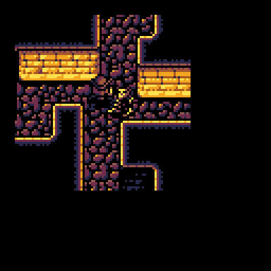
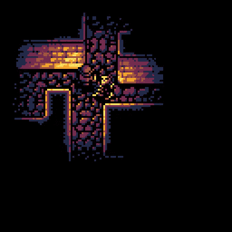
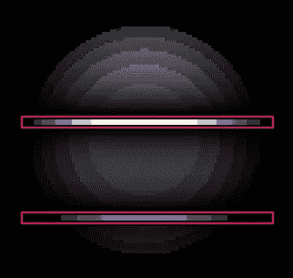
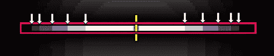
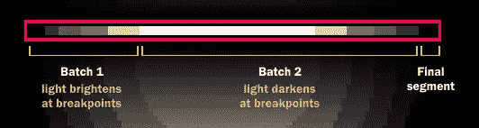
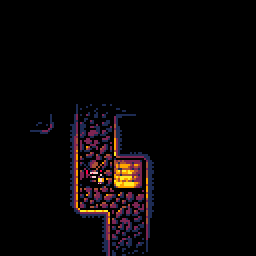

# 手工照明#2:将线条缝合在一起

> 原文：<https://medium.com/hackernoon/lighting-by-hand-2-stitching-lines-together-24edc9f819bf>

## 皮科-8

几周前，我开始了一个项目。我想在 [PICO-8](http://www.lexaloffle.com/pico-8.php) 上做实时照明，这是一个故意限制马力的幻想控制台。这不仅有效，而且看起来很棒(这里是[演示](http://www.lexaloffle.com/bbs/?tid=28785)，所以我决定写一篇文章解释我是如何做到的，来分享其中的乐趣。不出任何人所料，解释技术主题会占用很多空间。我最初的文章变成了多篇文章，你现在正在阅读其中的第二部分。


I’m going to sue whoever is responsible for floors in this temple.

[第 1 部分](https://hackernoon.com/pico-8-lighting-part-1-thin-dark-line-8ea15d21fed7#.pojyj8rkh)，解释了如何给一行应用调色板效果，写起来相当容易。我所要做的就是和你一起浏览 PICO-8 的内部结构，解释一点它的内部工作原理，并试图让每个人对像内存中像素顺序这样有趣的珍闻感到兴奋。这一部分会有点困难，因为一些有趣的复古细节将被实际的数学运算所取代。好的一面是，到最后，我们会有一个工作照明效果。

## 阐明这个问题

我们的起点是屏幕上的一个矩形，我们的场景已经就位，被正确剪辑，但是还没有应用光照。我们的目标是使这个矩形中的每个像素变暗正确的量，这意味着我们必须首先弄清楚正确的量是多少。



Before-after pictures — as useful in programming tutorials as in dieting

你离得越远，自然界的许多东西就会变得越弱。这与声音、重力以及方便的光(T8)一起工作。古老的平方反比定律描述了支配所有这些事情的确切规则，其四页的维基百科文章归结为:光的亮度随着你与它的距离的平方而下降。距离增加一倍，照射到你眼睛的光线就会减少四倍——这是下次宿醉时要记住的一个方便的事实。

在现实世界中，这种变化是持续的，光线一微米一微米地变暗。另一方面，我们只有六种不同的光线级别，其中一种实际上是漆黑一片。


The basic structure of our light with each level shown as a color.

因此，我们不直接使用光的亮度，而是制作一个截止距离表——每个亮度级所能达到的最远距离。为了方便以后使用，我们将存储这些距离的平方，因为这是我们以后要用的。

```
*-- the dimmest light level reaches 42 pixels out*
**light_rng = {** 10*42, 18*42, 26*42, 34*42, 42*42 **}**
```

一旦我们有了表，最明显的(我们怀疑，完全没用的)使用方法是:

```
**for each pixel we need to filter:** calculate the **distance-squared** from this pixel to the light
  pick a **light level** based on that
  **apply the palette** for that level, darkening the pixel
```

如果这听起来像是每像素大量的工作，那是因为它是。这在 PICO-8 上肯定行不通——除非我们找到一种方法将 GPU 插入一个实际上并不存在的控制台。

## **重新审视**

因为一个像素一个像素地进行是行不通的，所以让我们使用我们已经在第 1 部分中学习过的技巧。我们将一次只关注一条线，而不是一次性考虑整个矩形。



这样做突出了一些我们可以用来改进我们的解决方案的东西。当我们从左到右时，无论我们选择哪一条线，有三件重要的事情永远不变:

*   有很长一段时间，照明保持不变
*   当灯光在这两者之间变化时，它只会变亮或变暗一个等级
*   当我们越来越接近光的时候，光的强度开始增加，只有当我们过了中点的时候，光的强度才开始下降

拥有这些统一的拉伸是非常幸运的，因为我在第一部分花了 2000 字解释我们如何有效地绘制它们。将我们的问题从逐像素绘制重新架构为逐段绘制，我们的算法变成:

```
**for each horizontal line in our rectangle:**
  **find all the breakpoints** where the lighting level changes
  **find the light level** for each segment between the breakpoints
  **draw each segment** using our fast palette routine
```

这样，我们不必对每个像素都进行数学计算，而只需对我们的行中发现的几个断点进行数学计算。更重要的是:由于我们的光线是对称的，所以我们可以只计算一半的断点，并将它们水平镜像以获得其余的断点。总的来说，每行大约要计算五次，而不是为八十多个像素中的每一个像素计算一些东西。

## 数学上的轻

我们都害怕的时刻到来了:我将试着解释一些适度复杂的数学，而不是把这篇文章变成一堂课。手指交叉。

为了使我们的计算更容易，我们将在光的参照系中工作。这只是一种奇特的说法，即我们的计算将假设`(0,0)`是光所在的地方。屏幕空间坐标必须首先通过简单地减去灯光的位置移动到灯光空间。一旦我们到达屏幕上的实际绘图，我们将做相反的事情。



The points in question — on both sides of the symmetry line.

我们在最开始介绍的`light_rng`表存储了每个光级的截止距离——断点就是位于离光源正好那个距离的点。因为我们在光空间工作，所以距离它的平方很容易计算:

```
D² = x² + y²
```

`light_rng`表直接存储距离平方，我们知道我们线的`y`坐标。花一些时间在餐巾纸的背面，可以得出每个断点的`x`公式:

```
L = light_rng[light_lv]
x² = L — y²
x = ±√(L — y²)
```

正如我们所料，有两个对称的解决方案——一个是负的，一个是正的，对应于光线两侧的断点。

由于该公式以平方根为特征，它仅在`L — y² ≥ 0`时有效。有一个很好的理由——如果没有解决方案，这意味着我们的`y`离光太远，这个特定的光级永远不会达到。知道了这一点，我们就可以一下子计算出我们需要绘制的断点和最亮亮度:

```
ysq = y*y
**for** lv = 5, 1, -1 do
  lrng = light_rng[lv]
  xsq = lrng - ysq
  **if** xsq > 0 **then**
    brkpts[lv] = sqrt(xsq)
  **else**
    brightest_lv = lv + 1
    break
  **end**
**end**
```

## 被拉出来

一旦我们有了所有断点的位置，我们就可以开始实际绘制一些线了——我们将分三批进行。



第一批从该行的最左端开始。由于断点在光线的参考框架中，我们必须通过添加`lx`，光线的 x 坐标，将它们转换回屏幕空间。在这部分线上，所有断点都是负的，所以它们的实际坐标变成了`lx — brkpts[lv].`

我们一个断点接一个断点地进行，逐渐画出较低的亮度，直到我们到达线的最亮部分。

```
xs = x1
**for** lv = start_lv, brightest_lv+1, -1 **do**
  xe = lx - brkpts[lv-1]
  fills[lv](xs, xe-1, y)
  xs = xe
**end**
```

一旦我们完成了，光线就会变暗。我们的光照水平现在将会增加，所有的断点将会在相对于光源的正 X 坐标上。

```
**for** lv = brightest_lv, end_lv-1 **do** 
  xe = lx + brkpts[lv]
  fills[lv](xs, xe-1, y)
  xs = xe
**end**
```

最后一段很特殊，因为它不在断点处结束，而是在我们的行结束的地方结束。我们需要循环之外的一个额外语句来结束它:

```
fills[end_lv](xs, x2, y)
```

## 函数的函数

在上面的片段中，关于实际的线条画有一件奇怪的事情。我们可能会期望每个片段的调用类似于`apply_light(xs, xe-1, y, lv)`。这确实是最简单的方法，但是如果我们学到了什么，那就是简单的方法通常是可以改进的。

有两种特殊的光线级别可以比其他级别更有效地处理。最亮的级别 1 有一个调色板，它什么也不做，所以我们干脆不画它。同时，最暗的级别(6)只是让所有的东西都变成黑色——所以我们可以画一条黑线，而不是一个昂贵的调色板。

这两个级别加起来占了我们滤镜面积的 25%以上，所以绝对值得。不幸的是，不同地处理每一层将意味着大量的条件——我们不希望这些混淆 CPU 和搞乱我们纤细的循环。进入`fills`表:

```
**fills = {** 
 fl_none, 
 fl_blend(2), fl_blend(3), fl_blend(4), fl_blend(5), 
 fl_color(0) 
}
```

对于每一个光线水平，该表包含一个以最有效的方式绘制的**函数**。第一级使用`fl_none`——一个空函数，什么也不做，但是可以安全地调用。最暗的级别使用`fl_color(0)`，它使用内置的`rectfill`绘制纯黑色。第 2 级到第 5 级使用我们在第 1 部分中编写的例程，因为我们无法避免为它们做一些实际的混合工作。

预先准备好这些函数意味着我们可以简单地调用`fills[lv](…)`并让它使用该光线级别的最佳方法，而不需要任何条件。

## 成功的界限

在我们的绘图程序中还有一件小事需要解释:变量`start_lv` 和`end_lv`，它们分别用于线条最左端和最右端的亮度。

在一个理想的世界中，我们应用效果的矩形将总是包含被照亮的圆的整个区域。这意味着每条线的起点和终点都是漆黑一片。`start_lv`和`end_lv`都是六点，我们就到此为止。

令我们懊恼的是，这个简单的方法将被所有图形程序员都讨厌的东西所挫败:裁剪。


当光源接近屏幕边界时，整个照亮的圆圈不适合屏幕——它被剪切了。如果我们没有画出整个区域，我们实际上必须计算直线最左边和最右边点的亮度。如果我们想支持离屏光源，还有更烦人的情况要处理，因为我们还必须正确计算达到的最亮水平(它通常所在的中点可能甚至不在屏幕上)。

另一种选择是不对矩形进行裁剪，而是对我们绘制的每条线进行裁剪。虽然在概念上更简单，但它也会慢得多，因为我们绘制的每条线段都必须单独检查和剪裁。如果我们使用内置的图形例程，剪辑将为我们完成——但是我们将像素直接存储到内存中，因此需要额外注意不要将它们放在错误的位置。

## 让那里有光

当我们把它们放在一起时，我们就有了一个函数，它可以做一条光线适当的直线。我们所要做的就是将这些线形成一个矩形，然后*瞧！*



这看起来已经很不错了，但是感觉没有成品那么“生动”。第 3 部分将专注于使效果真正闪耀所需的最后润色，并引入更多的 mad 优化科学来将其性能推向极限。

像往常一样，如果你有任何问题，我很乐意在 Twitter 上回答它们[，在那里我也会让你知道第三部分什么时候准备好。](https://twitter.com/krajzeg)

在那之前，愿[编程](https://hackernoon.com/tagged/programming)给你的生活带来一缕光明！

[*第一部分*](/@krajzeg/pico-8-lighting-part-1-thin-dark-line-8ea15d21fed7) *|* ***第二部分*** *|* [*第三部分*](https://hackernoon.com/lighting-by-hand-3-breath-of-life-7a775617697e#.tbtcy74bb) *|* [*第四部分*](https://hackernoon.com/lighting-by-hand-4-into-the-shadows-a92bc8bc6d97#.ff98yyjb0) *|* [*玩游戏*](https://krajzeg.itch.io/dank-tomb)

[](http://bit.ly/HackernoonFB)[](https://goo.gl/k7XYbx)[](https://goo.gl/4ofytp)

> [黑客中午](http://bit.ly/Hackernoon)是黑客如何开始他们的下午。我们是 [@AMI](http://bit.ly/atAMIatAMI) 家庭的一员。我们现在[接受投稿](http://bit.ly/hackernoonsubmission)并乐意[讨论广告&赞助](mailto:partners@amipublications.com)机会。
> 
> 如果你喜欢这个故事，我们推荐你阅读我们的[最新科技故事](http://bit.ly/hackernoonlatestt)和[趋势科技故事](https://hackernoon.com/trending)。直到下一次，不要把世界的现实想当然！

