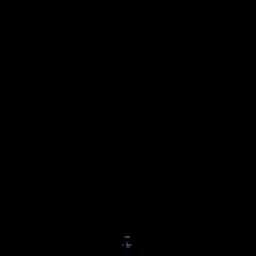
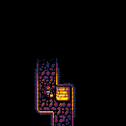
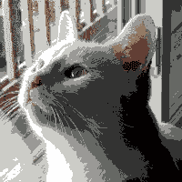
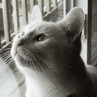
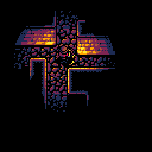
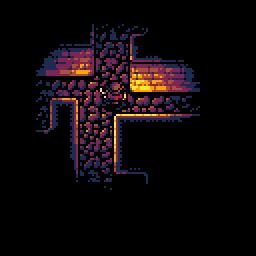
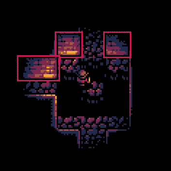
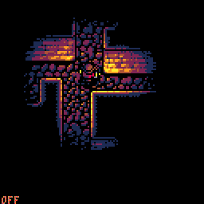
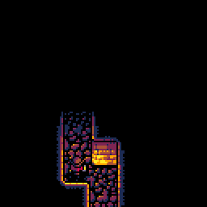

# 手工照明#3:生命的气息

> 原文：<https://medium.com/hackernoon/lighting-by-hand-3-breath-of-life-7a775617697e>

## 皮科-8

前段时间，我开始了一个疯狂的实验，试图让实时照明在 [PICO-8](http://lexaloffle.com/pico-8.php) 上工作，这是一个可爱的小幻想控制台，马力有限。

What we can only assume is an Egyptian merry-go-round.

这在[进行得相当顺利](http://www.lexaloffle.com/bbs/?tid=28785)，所以我开始了一个更加疯狂的尝试，试图在一系列文章中解释它背后的所有原理。这是第三部分。

## 《匹克 8 照明》前情提要。

[第一部分](https://hackernoon.com/pico-8-lighting-part-1-thin-dark-line-8ea15d21fed7#.pojyj8rkh)和[第二部分](https://hackernoon.com/lighting-by-hand-2-stitching-lines-together-24edc9f819bf#.glbk87bk6)处理我们效果工作的基础——制作一个足够快的混合程序，并弄清楚如何应用该程序来制作一个平滑的圆形。

Where we ended up last time.

作为一个[编程](https://hackernoon.com/tagged/programming)的壮举，结果令人印象深刻，但看起来有点暗淡。不知何故，尽管调色板的色调温暖，最终的结果却是办公室荧光灯的温暖和好客。

我们追求的感觉绝对不是*那个*。我们是在一个火炬点燃的古墓中嬉戏，而不是在一个隔间模拟器中，所以我们必须想办法给这个东西注入一些生命。

## **生命的银行**

火炬的特点是它们的光似乎总是在移动——闪烁、溅射、时刻变化。就目前的情况来看，我们的效果没有做任何类似的事情。事实上，情况恰恰相反——如果角色停止移动，屏幕上没有一个像素会发生变化，这让整个事情看起来很不自然。

当前实现的另一个缺点是亮度级之间的边缘明显。当你知道要寻找什么的时候，你实际上可以数清楚不同的波段，尤其是当角色在移动的时候。

任何照明系统基本上都是魔术。我们试图说服观众相信一些不真实的东西——也就是说，屏幕后面的世界是真实的。就像任何魔术一样，一旦背后的结构变得太明显，我们就已经输了。

## **获得生活**

如果我们想解决这个问题，我们必须混淆观众的眼睛，使边缘不再可见。由于性能问题，增加光级别的数量不是一个选项，但是每当颜色空间太小而不舒适时，人们和算法都使用一个可靠的方法:*。*

***

Undithered vs dithered image. Notice how the bands on the neck disappear in the dithered one. (image from [English Wikipedia](https://en.wikipedia.org/wiki/Dither))* 

*不幸的是，抖动的标准方法不适合我们的算法，因为它严重依赖于相同照明水平的长水平延伸。抖动背后的整个想法是打破这些长的延伸，使用快速变化的像素模式来隐藏接缝。*

## ***模糊边缘***

*幸运的是，我们可以使用一种不同类型的抖动——时间抖动。*

*就像我们的算法一样，生物学也有其局限性。坦白地说，我们的眼睛很糟糕。当提供的输入信号变化太快，以至于锥细胞和杆细胞无法应付时，我们的湿件就认输，将一切平均化，然后就到此为止。*

*这意味着，如果我们让边缘的位置逐帧变化，我们的眼睛和大脑将无法跟上。框架之间的差异将被消除，边缘的准确位置将很难确定。*

*因为我们的另一个主要问题是我们的灯光太静态，增加一点运动是一个双赢的局面。改变光线到达每一帧的位置听起来很像闪烁的手电筒。*

## ***变坏变好***

*让边缘在每一帧移动的最简单的方法之一是缩放。这将模拟真实火焰发生的情况，其亮度随着燃烧不均匀而变化。*

*我们可以很容易地做到这一点，方法是在每一帧中选取一个随机因子，然后将`light_rng`表中的所有条目(其目的是定义边缘的位置)乘以该因子。*

**

*Scaling uniformly and blinking incessantly*

*这在活泼部分看起来好一点，但不幸的是边缘仍然可见——它们只是看起来在移动。此外，从长远来看，闪烁有点烦人。帧之间的跳跃太明显，而*仍然*没有实现模糊边缘位置的目标。*

*如果我们尝试将一点空间抖动引入等式中会怎么样？我们不能分解水平的部分，但是我们可以自由分解垂直的部分。我们可以分别缩放每条线，而不是缩放整个灯光。这也将使帧的亮度平均变化较小，避免了刺耳的闪烁效果。*

***

The final approach and a single frame of the scaling affecting the light itself.* 

*这解决了我们两个的问题。乐队不太明显，我们保持了火炬光的生动感觉，没有任何恼人的闪光。*

## ***平坠***

*我们已经成功地将人工感觉的圆环变成了模糊、温暖的光。这很有帮助，但我们仍有一些方法可以做得更好。*

*考虑到一个重要的假设:世界必须是完全平坦的，我们计算照明的方法基本上是正确的。不幸的是，我们所习惯的真实世界是恼人的三维世界，并伴随着各种后果。最大的一个问题是，表面相对于光源的角度可能不同，因此反射的光量也不同。*

*真正的 3D 引擎会考虑到这一点，角度是决定表面亮度的主要因素之一。我使用的经典“SNES RPG”视角可能不是 3D 的，但它仍然有两种不同的表面:地板(看起来已经很棒了)和垂直的墙壁(现在感觉有点假)。*

**

*I’m talking about these pesky things.*

*一个更理智的人可能会选择完全自上而下的视角来解决这个问题，就像鸵鸟会做的那样——没有任何可见的垂直表面。我显然不是一个理智的人，所以我有两个想法让墙更有深度:*

*   *使它们的表面根据光的位置正确地工作*
*   *让它们在其他物体上投射出真实的阴影*

*阴影是一个大话题，将在第 4 部分中出现，所以现在让我们坚持第一个想法。*

## ***奥卡姆剃刀为代号***

*为了在我们的光照实现中完全正确，我们必须计算光线和墙壁之间的角度，这是我们绘制的每个像素的角度。我们可能会尝试这样做，PICO-8 可能会尽职尽责地为本文的第四部分及时呈现第一帧。*

*相反，我们将专注于“物有所值”。我们应该选择最大的问题是什么，就我而言，这是一个事实，当灯在它们后面时，墙仍然是亮着的。解决这个问题将大大有助于使它变得可信(我实际上首先称之为“逼真”，但后来发现任何没有拼写检查就无法输入的单词肯定太过做作)。*

*首先，我们必须弄清楚哪些表面受到了影响。这可以通过简单地用一个特殊的标志在瓷砖集中标记所有的墙面来完成。*

*由于所有可见的墙都面向同一个方向(这是我们的视角工作的方式)，一旦我们知道它们在哪里，就相对容易知道我们在它们后面。每当我们角色的`y`坐标小于墙底的`y`坐标时，我们就落后了。*

*我们现在基本上有一个调色板效果的硕士学位，所以当你走到他们后面时，用它来使墙壁变暗似乎是显而易见的。当你穿过一个魔法屏障时，突然从全亮切换到暗会太不和谐，所以我们会逐渐地这样做，每落后 2 个像素就暗一级。*

**

*Dynamic darkening of vertical walls — with and without*

*这就好多了，而且灯光滤镜仍然被应用在我们所做的任何事情的上面，完成了幻觉。*

## ***优化弯路***

*下一件我们想要处理的事情是添加阴影，但是有一个问题:如果我们将光线半径保持在可用于游戏的水平，渲染需要将近 100%的 PICO-8 CPU，阴影当然不会免费出现。*

*这意味着我们必须回头优化我们已经拥有的东西。稍微分析一下(使用低技术含量的策略应用注释方法，并查看`stat(1)`)就会发现，最大的性能消耗是`fl_light()`，这个函数将水平线分割成亮的线段。我花了很多时间将它塑造成型，我想向您展示我使用的两个技巧——一个非常通用，可以在任何地方使用，另一个非常不寻常，专门针对 Lua。*

## *事情正在好转*

*事实证明，函数缓慢的原因之一是 sqrt()函数。计算平方根比乘法要复杂一点——任何试图手工计算√13 的人都可以证明这一点(试试吧，我等着)。*

*每当我们遇到速度慢的函数时，我们的优化反应都会告诉我们一件事——预计算！我们唯一的遗憾是，我们不能真正预计算每个可能数字的平方根，因为无限的时间和内存还不是一个东西。*

*幸运的是，我们不需要知道所有东西的平方根。我们使用它的唯一公式是`√light_rng[lv]-y²`。`y`和`light_rng[lv]`都是整数——这意味着我们永远都不需要处理分数。该值也永远不会大于`light_rng`中的最大值，即我们光线最大半径的平方。*

*如果我们假设半径为 64(PICO-8 屏幕大小的一半)，我们预计算的表只需要 4096 个条目(64)。这让我们可以用更快的`_sqrt[x]`表查找来代替昂贵的`sqrt(x)`。*

## ***一路表下来***

*哪段代码执行速度更快:`a = 3`和`b = 4`？除非我们认为更大的数字需要更多的时间来存储在内存中(剧透:不是它是如何工作的)，否则我们可能会说这些是相同的。然而，大多数编程语言的真实答案是“取决于 a 和 b *是什么*”。*

*至于 Lua，是表的大粉丝。它非常喜欢它们，在任何事情上都使用它们:不仅作为一个单一的结构来表示数组和对象，而且作为一种避免实际实现全局变量的方法。*

*每次你尝试像`global = 12`这样天真的东西，Lua 都会在心里把它翻译成`MY_MAGICAL_GLOBAL_HIDEYHOLE[“global”] = 12`。我们所看到的全局变量，Lua 认为是一个巨大的全局表中的条目。对全局的每次访问都要承担散列表索引的负担。*

*局部变量没有这样的问题，它们被有效地实现为特殊堆栈上的位置。这意味着将全局变量存储在局部变量中这种直觉上疯狂的、令人难以置信的优化实际上是一件事。这对我这个疯狂的 PICO-8 科学家来说很好，因为我可以加快代码速度，一下子看起来很疯狂。*

*我们用来计算光线的代码使用了一些全局变量。其中一个是`fills`表，存储每行多次访问的绘图函数。事实证明，将该表复制到一个局部变量中，基本上可以免费为我们每帧节省 5%的 CPU。*

## *包扎*

*我们已经得到了既吸引人又合理快速的灯光效果，这是一个很好的借口来结束今天的工作，并认为第 3 部分已经完成。*

**

*这一部分比前几部分稍显模糊，但不用担心——第四部分也是最后一部分将会是关于矢量数学，有效的多边形渲染，并结合一些额外的工作来得到我们效果中缺少的最后一样东西:真实的阴影。*

*在那之前，愿你生命中的每一盏灯都温暖诱人。*

*[*第一部*](https://hackernoon.com/pico-8-lighting-part-1-thin-dark-line-8ea15d21fed7#.pojyj8rkh) *|* [*第二部*](https://hackernoon.com/lighting-by-hand-2-stitching-lines-together-24edc9f819bf#.glbk87bk6)*|*|***第三部***|[|*第四部*](https://hackernoon.com/lighting-by-hand-4-into-the-shadows-a92bc8bc6d97#.ff98yyjb0) *|* [*玩游戏*](https://krajzeg.itch.io/dank-tomb)*

******

> *[黑客中午](http://bit.ly/Hackernoon)是黑客如何开始他们的下午。我们是 [@AMI](http://bit.ly/atAMIatAMI) 家庭的一员。我们现在[接受投稿](http://bit.ly/hackernoonsubmission)并乐意[讨论广告&赞助](mailto:partners@amipublications.com)机会。*
> 
> *如果你喜欢这个故事，我们推荐你阅读我们的[最新科技故事](http://bit.ly/hackernoonlatestt)和[趋势科技故事](https://hackernoon.com/trending)。直到下一次，不要把世界的现实想当然！*

**