# 手工照明#4:进入阴影

> 原文：<https://medium.com/hackernoon/lighting-by-hand-4-into-the-shadows-a92bc8bc6d97>

## 皮科-8

本文是描述我为 [PICO-8](http://www.lexaloffle.com/pico-8.php) 设计的实时灯光引擎的系列文章的最后一部分，PICO-8 是一款马力有限的可爱幻想控制台。它可以作为一篇独立的文章，但是如果你还没有阅读之前的条目，你可能仍然想要[从头开始](https://hackernoon.com/pico-8-lighting-part-1-thin-dark-line-8ea15d21fed7#.q578i21cc)。

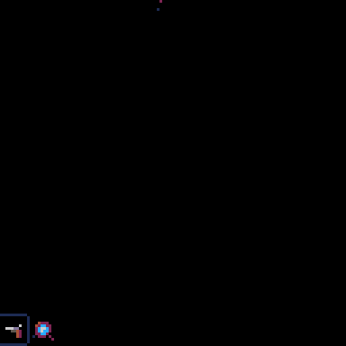

The engine in question.

上次我们分手时，我们有一个可爱的闪烁的[灯](https://hackernoon.com/tagged/light)，大部分功能已经就绪，但一个重要的组成部分仍然缺失:实时阴影。为了增加缺失的部分，我们需要弄清楚一些事情:如何表示阴影，如何计算它们在哪里，以及如何有效地绘制它们。

我们很幸运，因为这就是这篇文章的全部内容。

## **说话量**

每一个被照亮的物体都在背后投下一个[阴影](https://hackernoon.com/tagged/shadow)。在现实世界中，这是由光源发出的光线被物体阻挡造成的。

一些渲染技术，如[光线追踪](https://en.wikipedia.org/wiki/Ray_tracing_(graphics))，创建虚拟光线并模拟它们的行为。这些模拟光线就像真实光线一样被阻挡，所以漂亮的阴影是免费的。没有发生的是任何一种合理的性能——尽管自发明以来所有的技术进步，光线跟踪仍然非常慢，并且大多不足以进行实时渲染。

GPU 实际上的工作方式是专注于对象本身。现代渲染管道中没有光线。相反，我们从物体表面的一个像素开始，根据它相对于光源的位置对它进行光照。这样做的缺点是反弹光线产生的效果(如阴影和反射)变得更加难以实现，因为我们不再有实际的光线来工作。

两种常见的解决方法是 [*阴影体积*](https://en.wikipedia.org/wiki/Shadow_volume) 和 [*阴影贴图*](https://en.wikipedia.org/wiki/Shadow_mapping) 。后一种方法是目前人们通常使用的方法，但两者都有自己的优势，阴影体有一个重要的优势——它们很容易适应 2D，并且不需要屏幕外缓冲区，这在 PICO-8 上很难做到。

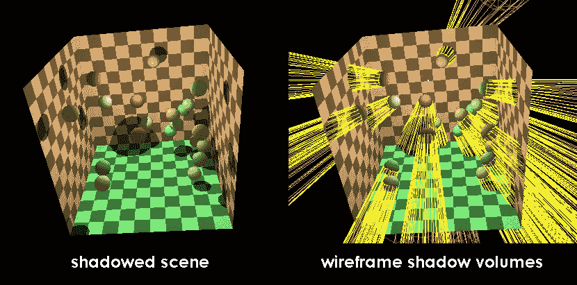

Each yellow shape is a shadow volume for one of the spheres (image from [English Wikipedia](https://en.wikipedia.org/wiki/Shadow_volume#/media/File:Shadow_volume_illustration.png))

阴影体积背后的想法都在名称中。对于每一个物体，我们可以把它的影子想象成一个空间体，在这个空间体中，一切都是黑暗的。这些体积本身是三维对象，使用它们的基本方法如下:

```
**for each lit object**: 
  generate a **shadow volume**
  draw this **shadow volume** to a special **buffer
when we draw actual objects later:** check each pixel against the **buffer** to see if it's in shadow
  **light it** only if it's not
```

详细解释这一点将会是一篇关于它自己的的[文章，但是我们可以从中得出的核心思想是:一个物体的阴影可以用一个形状来表示。](https://www.gamedev.net/resources/_/technical/graphics-programming-and-theory/the-theory-of-stencil-shadow-volumes-r1873)

## **平压**

阴影体积的二维等价物实际上是一个**阴影区域**——一个平面形状，代表给定对象阴影中的所有像素。

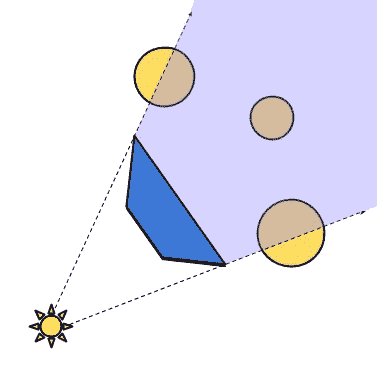

A 2D object and the shadow “volume” behind it

计算一个复杂物体的面积可能会很麻烦，所以我们将使用我们最喜欢的借口:我们将把它分解成更简单的组件。在 3D 世界中，这通常是通过将表面分成三角形来实现的。计算三角形的阴影体积要比计算茶壶的阴影体积容易得多。

三角形的 2D 等价物是线段。就像我们可以将一个三维物体的表面分解成三角形一样，我们也可以将任何二维形状分解成它的组成边缘。

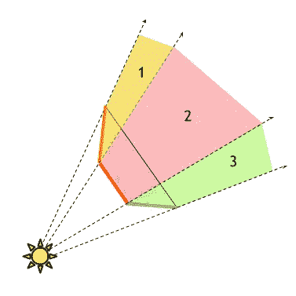

How the shadow volumes of the three segments add up

每个片段的阴影体积可以单独计算。相邻线段的体积会相互连接，加起来就是整体的影子。

## 筑起城墙

一旦我们知道所有阴影投射者将由线段来表示，我们必须告诉我们的引擎这些线在哪里。

基本思想是这样的:游戏中的每个物体(墙、柱子、敌人)都允许有一个`walls`列表——投射阴影的线条。这些线由线段本身的端点`s`和`e`表示，还有一个单位向量`d`，它指向远离墙壁的方向，让我们知道墙壁的哪一侧是外面(如果你精通向量:墙壁的法线)。

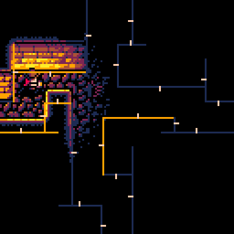

Walls and their d-vectors in a sample corridor.

一旦我们有了投射阴影的结构，是时候利用它了。

最初的 3D 算法使用一种特殊的屏幕外缓冲区，能够快速判断像素是否在阴影体积内。这在 PICO-8 上并不是一个真正的选项，而且对每个潜在发光像素进行多边形中点碰撞检查的替代方案听起来也不太有前景。

幸运的是，我们可以以一种更简单的方式使用阴影体:我们可以在渲染场景的顶部用黑色绘制它们。对于一个单一的光源和漆黑的阴影，最终结果将是相同的，但渲染一个多边形将比检查我们画的每个像素更有效。

在这个简化之后，添加阴影到引擎的整个过程可以归结为渲染循环最底层的一个循环。

```
**for each wall:** figure out if its shadow is **visible** at all
  if it is, calculate the **shadow volume**
  **draw the shadow volume** in solid black
```

第一步是至关重要的，因为它大大减少了我们需要绘制的阴影的数量。上图显示了这一点，我们实际需要处理的墙壁用黄色突出显示。只有两条规则:

*   如果光源在墙的后面，就不需要画阴影
*   如果墙的两端都在灯光的最大范围之外，我们也可以忽略那面墙——反正阴影是看不见的

## 阴影里有什么

现在我们知道哪些墙可以安全地忽略，我们的新任务是计算出那些我们必须处理的阴影体积。警告:此部分可能包含微量的矢量数学。

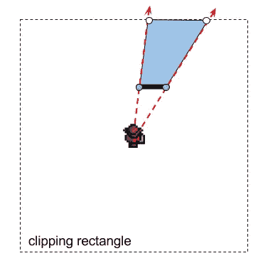

A shadow volume and the light rays bounding it (shown in red)

从上面的插图来看，很明显一面墙的阴影区域是某种多边形。投射阴影的墙成为多边形的一条边，因为它是阴影周长的一部分。通过将光源与墙壁的每个端点连接起来并向前投射，可以获得另外两个边缘——我们实际上可以将这些视为限制我们阴影的光线。理论上，这些射线会到达无穷远，但是画出无限多边形就像数到无穷远一样有效。

幸运的是，光线已经有了一个有限的范围，由包含所有潜在发光像素的方便的裁剪矩形表示。我们可以使用这个矩形，利用光线与矩形的交点，将我们庞大的无限多边形截断成一个更小的、独立的等价物，没有宏伟的错觉。

```
*-- light position and range*
**local** p,rng = lgt.pos,lgt.rng
*-- wall endpoints*
**local** s,e = wall.s, wall.e
*-- calculate light rays towards s and e*
**local** ds,de = s-p,e-p
*-- extend the rays until they intersect with the
-- nearest boundary defined by light range
-- (white points)*
**local** cs, ce=
  rng/max(abs(ds.x),abs(ds.y)),
  rng/max(abs(de.x),abs(de.y))
**local** proj_s, proj_e=
  p+ds*cs, p+de*ce
```

这给了我们四个顶点，我们现在可以连接成一个多边形，并在这个简单的例子中得到一个合理的阴影。到目前为止，我们已经了解到简单的情况并不是唯一的。

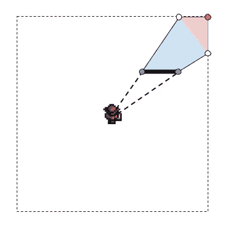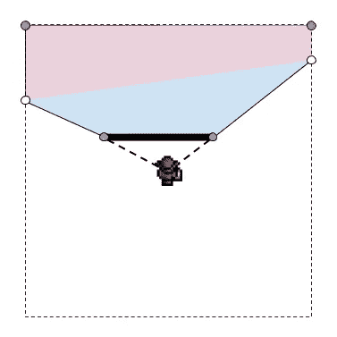

Two situations in which four points aren’t enough — the regions in red would miss out on all the fun

当光线与矩形的不同边缘相交时，仅使用四个点是不会切割它的。为了击中矩形内的所有阴影像素，我们需要添加更多的顶点，也就是说，我们沿着周长从一个交叉点到另一个交叉点会遇到的拐角。我们通过检查每个交点属于哪个象限并顺时针迭代，直到我们得到所有丢失的角点。

```
*-- find the quadrants*
**local** qs,qe = quadrant(ps), quadrant(pe)
*-- make sure qe->qs is increasing*
**if** (qs<qe) qs += 4
*-- assemble vertices in clockwise order*
**local** vertices = {s, e, proj_e}
**for** q = qe,qs-1 **do**
  *-- corners are pre-stored in a table as [*±*1,*±*1] vectors
  -- we just have to translate/scale them to our rectangle*
  **add**(vertices, p+corners[q]*rng)
**end**
**add**(pts, proj_s)
```

## 绘制和排序

我们有我们的阴影体积，但实际绘制它是另一回事。大多数光栅化算法只处理三角形，但我们可以是从四边形到六边形的任何东西。

对于面更丰富的多边形，最常用的解决方案是首先将它们分解成三角形。这在 GPU 世界中非常有效，因为“渲染三角形”在那里被加速到基本免费的程度。在 PICO-8 上，绘制三角形的开销非常大，这对我们和我们的六边形来说是个坏消息，六边形总共由四个烦人的三角形组成。

幸运的是，有一个简单的算法来渲染多边形，不管它们有多少个面，只要它们是[凸的](https://en.wikipedia.org/wiki/Convex_set)——我们的阴影体就是这样。

第一步将是我们在处理渲染一个形状时通常要做的事情:我们将把多边形分割成单独的线条。这将渲染多边形的问题转化为简单地逐行计算其范围。

```
ymin, ymax = **Y coordinates of the top/bottom of the polygon
for each y between** ymin, ymax:
  xls[y] = find the leftmost x still inside the polygon at line y
  xrs[y] = find the rightmost x still inside the polygon at line y
**for each y between** ymin, ymax:
  fill(xls[y], xrs[y], y)
```

多边形的工作方式是，两个极端都必须位于其中一条边上。这意味着我们可以获取所有的边，遍历每条边上的所有像素(就好像我们想把它画成一条线)，并相应地更新`xls`或`xrs`表。唯一的问题是我们不知道要更新哪个表:我们不知道任何给定的边是在多边形的左侧还是右侧。

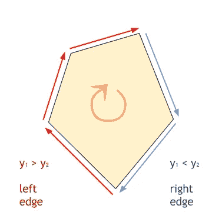

What is stuffily known as the clockwise winding order.

解决这个难题最简单的方法是对顶点做一个假设，即它们总是以一个确定的顺序出现:顺时针或逆时针。一旦我们这样做了，我们可以很容易地通过观察它的走向来判断它属于哪一边。我们的阴影体积代码给了我们顺时针排序的点，所以任何上升的边(结束`y`小于开始`y`)一定在多边形的左边。另一方面，如果一个边是向下的，它一定在右边。

```
**function** ngon(pts, ln)
  **local** xls, xrs, npts = {}, {}, #pts
  -- update xls and xrs using each edge in turn
  **for** i=1, npts **do**
   ngon_edge(
    pts[i],pts[i%npts+1],
    xls, xrs
   )
  **end**
  -- use the tables to draw each horizontal line
  **for** y, xl **in pairs**(xls) **do**
    **local** xr = xrs[y]
    ln(xl, xr, y)
  **end**
**end**
```

在这个代码片段中，伪代码中的“计算出 y 的最小值/最大值”部分不见了。这是因为我们免费得到了这个部分:`xls` / `xrs`表将只包含我们的多边形实际到达的 y 坐标的条目。我们可以直接迭代这些表中的一个，而不是按顺序遍历所有的`y`。

## **反转导流**

经历了这么多麻烦，我们终于准备好把所有东西都插上了。我们设置墙壁，插入阴影渲染循环，然后…

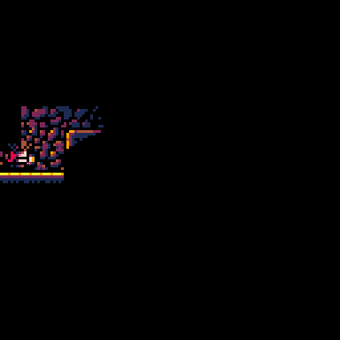

嗯，我们确实看到了一些阴影，所以这是个优点。问题是每面墙的影子完全遮住了墙本身。这可能对某些游戏有用，但是我们并没有大费周章地绘制一个很酷的古代寺庙磁砖，只是为了将我们的渲染限制在地板上。我们想阻止墙壁自己投射阴影。

有几种方法可以做到这一点，我们将要使用的是一个肮脏的伎俩。我们将通过反转`d`向量来翻转我们的墙壁，使所有的阴影投射部分面向*内侧*。因为我们检查的是墙的哪一边，这将使只有背面能够投射阴影。引擎会表现得好像只有当*离开*一个固体物体时，光线才会被阻挡，而不是当试图进入时。

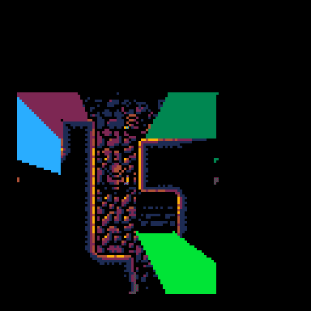

Back-face shadows, in garish Technicolor

这让我们得到了我们想要的。后墙的阴影形成了正确的形状，但是墙的内部没有被改变。

## **洞内整体**

既然它对坚固的墙壁如此有效，让我们把它应用到更古老的东西上——坦普尔。比如说一个蚀刻的柱子。

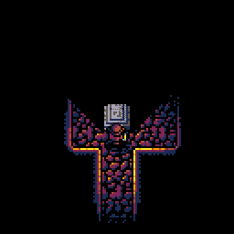

The base behind the spire casts a shadow *on* the spire. MC Escher approves.

好吧，那仍然不是它。底座投下的阴影遮住了它上面应该很高的部分，完全破坏了深度的错觉。

这是第二次垂直表面给我们带来痛苦，也是第二次我们将通过使用一个简单的技巧来解决这个问题。具有垂直组件的对象将在它们的`walls`表中定义一个特殊的`hole`掩码，它只是一个标记为“请勿触摸”的矩形。我们可以用这个矩形来覆盖垂直的塔尖，确保它不会被阴影覆盖。

我们扩展了 polygon 例程来接受这样的遮罩，并在绘制时考虑它们。对于每一条线，我们将把正在绘制的线段分成“洞前”和“洞后”部分，并绘制这些部分——保持矩形的内部完整。

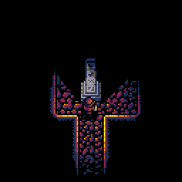

MC Escher no longer approves.

## 结果好一切都好

此时，我对阴影的样子很满意。引擎有时仍然会画出一些无意义的东西，比如一个物体遮挡了它不应该遮挡的东西，但是当你关注整个游戏的时候，这种情况很少发生，很难注意到。我非常肯定，最终解决这些遗留问题的唯一方法是用 3D 技术来实现——我必须为以后的文章留下一些有趣的东西，不是吗？

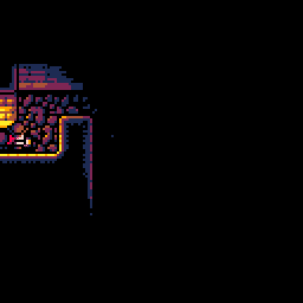

这就结束了我们在 PICO-8 上从黑屏到可用照明引擎的四部分旅程。我希望你和我一样喜欢它。为了在下个世纪到来之前完成这篇文章，我不得不省略了很多细节，所以如果你有任何问题或反馈，我很乐意在推特上发表。

写这些既有趣又累，所以我可能会暂时停止写作。不过，请继续关注我的下一篇文章——我们将讨论严格的限制(比如 PICO-8)如何影响游戏设计向更好的方向发展。

在那之前，愿你一直有始有终。

[*第一部分*](https://hackernoon.com/pico-8-lighting-part-1-thin-dark-line-8ea15d21fed7#.pojyj8rkh) *|* [*第二部分*](https://hackernoon.com/lighting-by-hand-2-stitching-lines-together-24edc9f819bf#.glbk87bk6) *|* [*第三部分*](https://hackernoon.com/lighting-by-hand-3-breath-of-life-7a775617697e#.xw8c30as1) *|* ***第四部分*** *|* [*玩游戏*](https://krajzeg.itch.io/dank-tomb)

[](http://bit.ly/HackernoonFB)[](https://goo.gl/k7XYbx)[](https://goo.gl/4ofytp)

> [黑客中午](http://bit.ly/Hackernoon)是黑客如何开始他们的下午。我们是 [@AMI](http://bit.ly/atAMIatAMI) 家庭的一员。我们现在[接受投稿](http://bit.ly/hackernoonsubmission)并乐意[讨论广告&赞助](mailto:partners@amipublications.com)机会。
> 
> 如果你喜欢这个故事，我们推荐你阅读我们的[最新科技故事](http://bit.ly/hackernoonlatestt)和[趋势科技故事](https://hackernoon.com/trending)。直到下一次，不要把世界的现实想当然！

