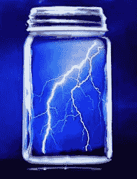

# 瓶中闪电:微型风险投资的演变

> 原文：<https://medium.com/hackernoon/lightning-in-a-bottle-the-evolution-of-micro-vc-5e0cb8bc5bdc>

2006 年，当 Weathergage 首次涉足这一领域时，微风险投资(Micro-VC)甚至还没有一个名字。当时，我们可以看到技术的进步，主要是基于软件的技术进步，使得初创企业可以用少量的资金实现产品/市场的契合。此外，这些公司的估值非常低。我们还可以看到，由于多种原因，现任风险投资集团与这些资本效率机会不匹配。首先，传统风险投资所需的资金规模至少比种子期公司实际需要的资金规模大一个数量级。第二，这些新公司中有许多是由大多数风投公司现有网络之外的企业家创办的。他们不是沙丘之路之前支持的那种创始人——他们是小规模的首次团队，在许多情况下，他们真的很年轻。

我们最初的见解是，这些资本效率极高的种子期公司提供的机会是真实而持久的。我们认为市场上有一个缺口，可以被那些既有技巧又愿意募集一只适当规模的小型基金的投资者*和*所利用。这部分经理人数不多，但也不为零，我们很幸运地接触到了许多这些先锋经理，他们已经成为了微型风险投资的领导者。

这些早期实践者中的佼佼者几乎完美地抓住了当时的时代精神。技术在激增，有才华的工程师正涌向初创企业。在这样一个强大的机会面前，早期的从业者撒下一张大网，以最大限度地暴露于那些可能抓住瓶中闪电的公司。许多公司就是这么做的。

年轻的企业家非常乐意与这些种子投资者合作，他们中的许多人对传统的风险投资公司不太重视，也对放弃大量股权不感兴趣。在气质层面上，创业者和种子基金经理关系良好。套用音乐剧*汉密尔顿*中的一句歌词，他们就像他们的国家一样——年轻、好斗、饥饿——他们不会浪费他们的机会。

大概在 2009 年左右，这种类型有了一个名字，微型风险投资这个术语也就诞生了。但直到大约 2012-2013 年，早期从业者的成功才变得如此明显，以至于微型 VC 成了“一个东西”。曾经蔑视这些基金为“小球”的机构投资者突然开始尝试接触微型风险投资。由于许多定位最佳的微型风投已经关闭，进入门槛很低，这是不可避免的事情。新的微型风险投资基金的激增满足了投资者的需求。

那么我们今天在哪里？许多开创性的微型风险投资集团已经在我们所谓的风险投资“新精英”中站稳了脚跟。他们的业绩在多个年份超过了他们的风险投资同行，他们是风险投资生态系统中有价值的节点。最重要的是，他们也打上了重要企业家的烙印。

这些都是很好的事实，但必须指出的是，当这种流派形成时，事情已经不是原来的样子了。像风险投资曲线上的所有其他阶段一样，估值更高，竞争更激烈。许多种子期公司的资本效率仍然很高，但成本比以前高了，尤其是在旧金山湾区。我们认为估值在 2015 年的某个时候见顶，但生态系统需要几个季度来调整。

有太多的微型风险投资基金，我们相信，许多在过去两年中成立基金的新的、无差别的经理将会有一段艰难的日子。

精英微风投是如何适应变化了的环境的？他们中的佼佼者正在调整他们的做法。他们(大部分)仍然是种子阶段的投资者，但他们已经在许多方面修饰了他们的做法:筹集更多的资金，投资更少的公司，主导交易并增加股权，缩小辛迪加，加倍投资更成功的公司，在价格上保持合理的纪律，为他们的公司提供额外的服务，适度扩大他们的团队。过去没有改变的是精英微风投对成功的不懈追求。找到一个优势是很难的，但是我们相信精英从业者仍然聪明、敏捷、饥渴，不会被陈旧的想法和过程所阻碍。我们认为这些特征增加了他们继续成功的机会。

> [黑客中午](http://bit.ly/Hackernoon)是黑客如何开始他们的下午。我们是 [@AMI](http://bit.ly/atAMIatAMI) 家庭的一员。我们现在[接受投稿](http://bit.ly/hackernoonsubmission)，并乐意[讨论广告&赞助](mailto:partners@amipublications.com)机会。
> 
> 如果您喜欢这个故事，我们建议您阅读我们的最新科技故事和[趋势科技故事](https://hackernoon.com/trending)。直到下一次，不要把世界的现实视为理所当然！

