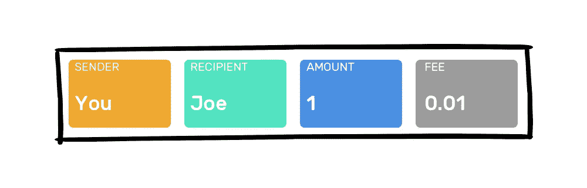
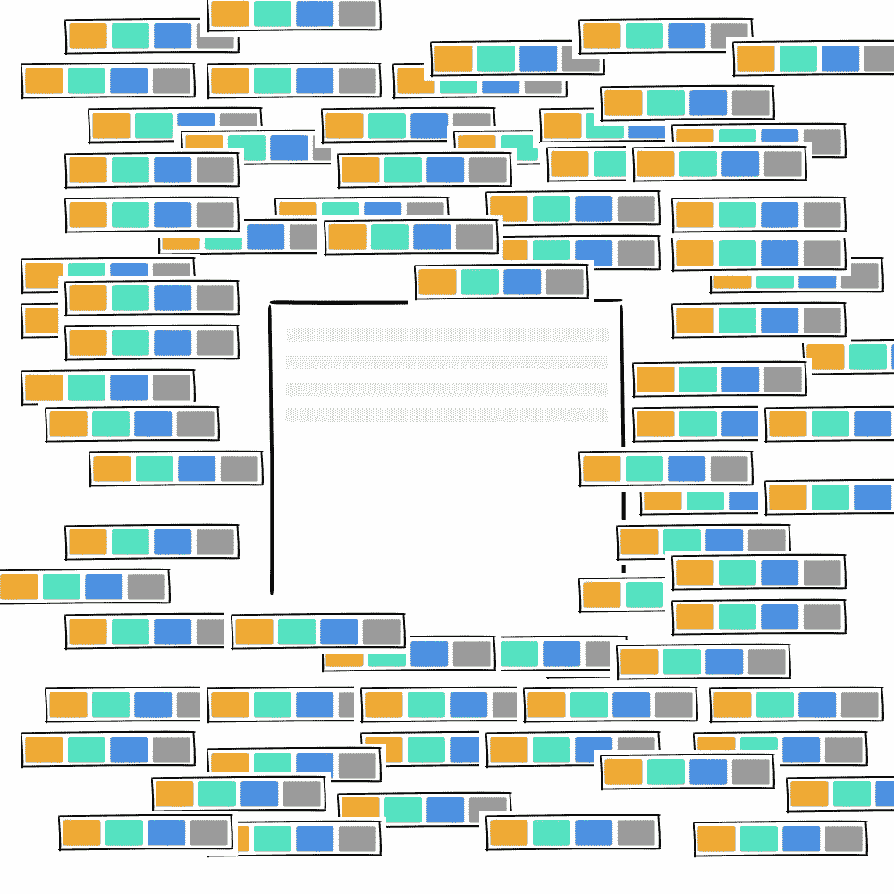
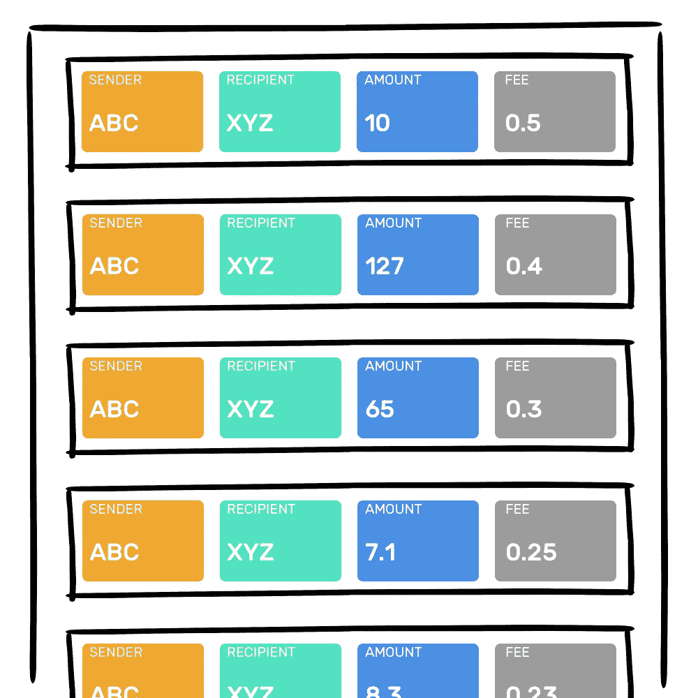
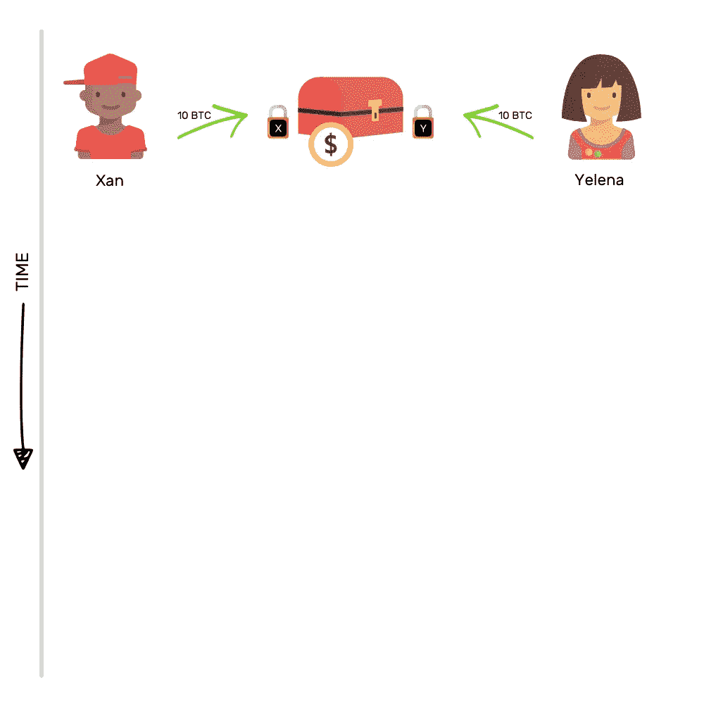
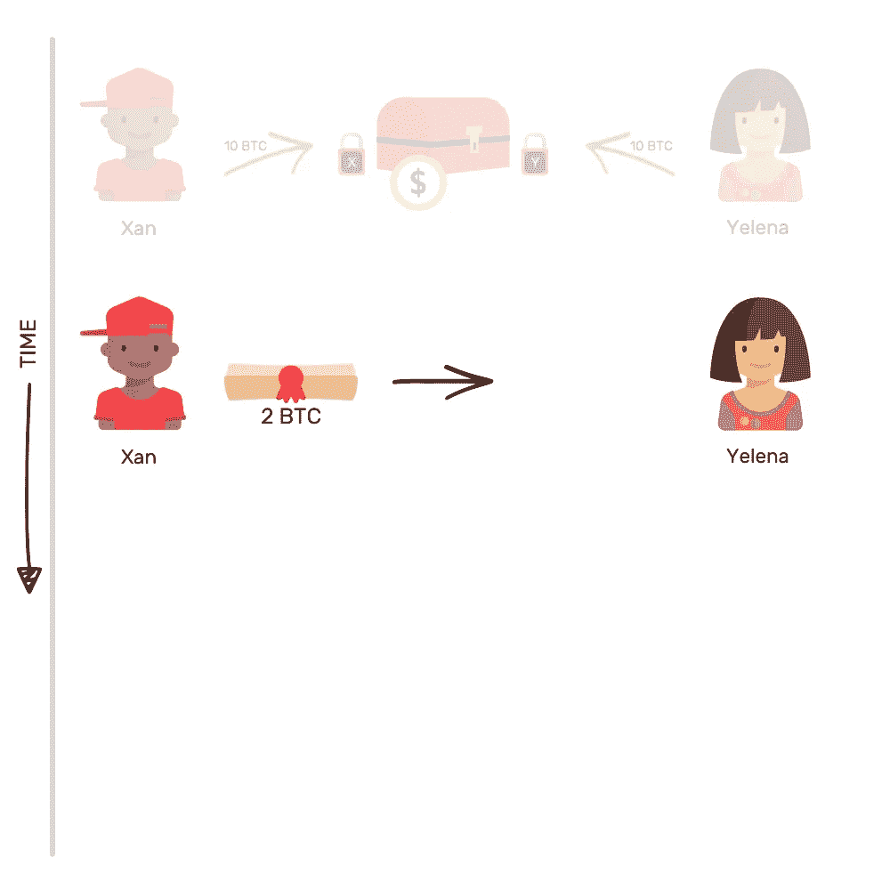
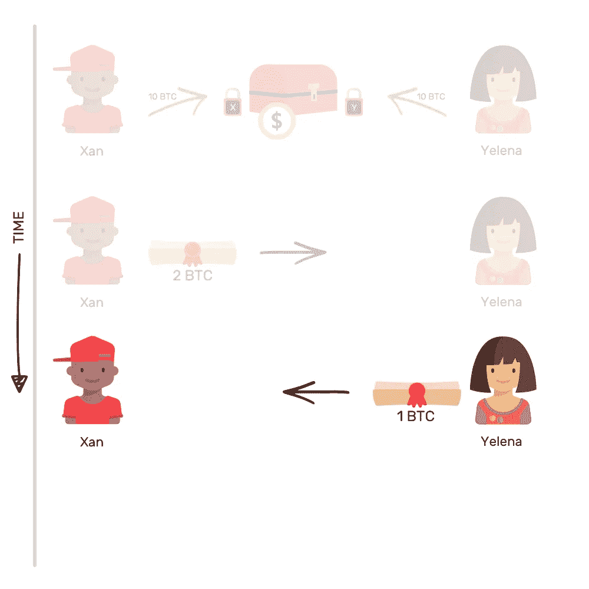
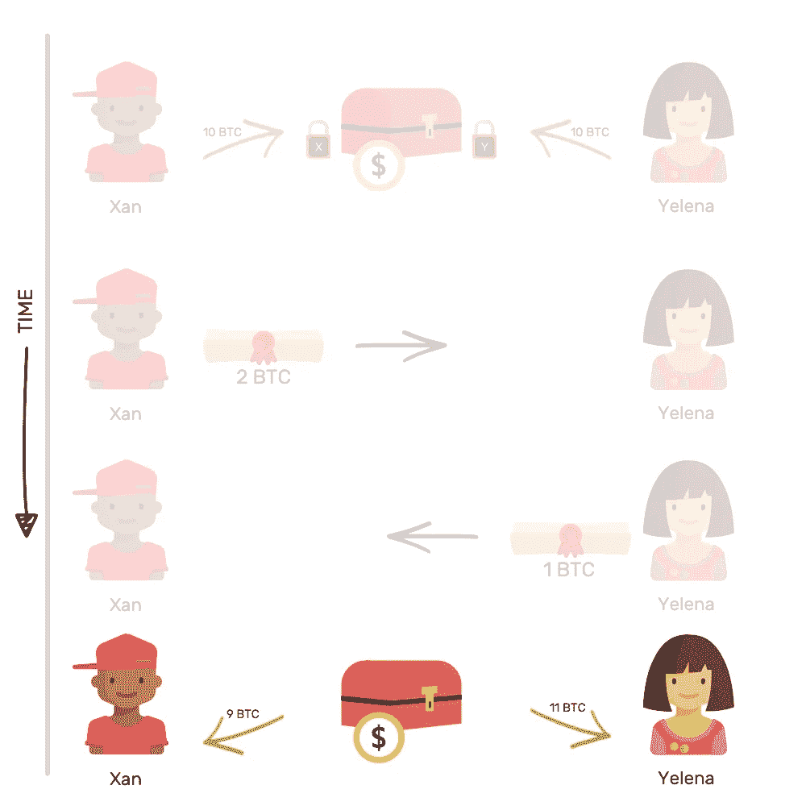
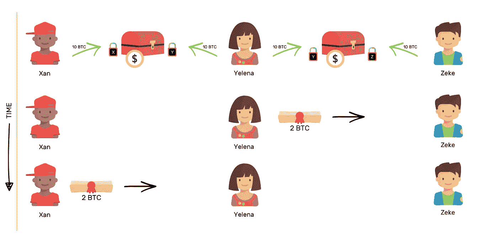

# 如何向你的非技术朋友解释闪电网

> 原文：<https://medium.com/hackernoon/lightning-network-explained-d4615c12ad09>

## 互联网上最简单的解释。

区块链很慢。因而，贵。如果我不得不给你寄一些比特币，你会在几个小时内收到，我也会支付一大笔交易费。有了这样的名声，区块链将如何接管世界？

任何可以解决区块链不可伸缩性的想法都值得关注、花费时间和精力。闪电网络就是这样一个想法。但是在我们了解解决方案之前，我们需要了解问题。

如果你已经意识到这个问题，你可以直接跳到下一节。

# **⚡️** 为什么区块链行动迟缓？

> "我走得很慢，但我从不后退。"—亚伯拉罕·林肯

**把区块链想象成一个寄存器。**该寄存器包含多个页面(块),其中每个页面包含多个事务。一旦一个页面被事务填充，就需要在开始在下一个页面记录事务之前将其添加到寄存器中。

在将一个页面(块)添加到寄存器(链)之前，需要进行一些处理，以确保每个人都同意它包含的内容。每个区块的过程大约需要 10 分钟(对于比特币区块链)。

想象一下，你给你的朋友乔寄去 1 BTC。该事务看起来会像这样。

其中，交易包含关于发送者、接收者、金额和交易费用的信息。

# **⚡️** 等一下，交易费？

> "顾问是这样一种人，他为客户节省的钱几乎足以支付他的费用."阿诺德·格拉索

是的，需要额外付费。 你可以支付它来激励矿工尽快将你的交易纳入区块。没有固定的价格，你愿意付多少钱来加速这个过程完全取决于你。费用越高，你的交易就越快。

在任何给定的时刻，都有几个事务可以记录在当前页面上。

矿工，即在区块链网络中工作的计算机，必须决定将哪些可用交易包括在当前区块中。为了帮助他们做出决定，他们会查看哪些交易会产生最多的回报，这意味着交易费用最高的交易将首先被包括在内。

如果有足够多的交易比你的交易费用高，那么你的交易将不得不排队等待。等待时间从几分钟到几个小时不等。有时，甚至几天。您支付的交易费用越多，交易处理的速度就越快。

这就是为什么区块链速度慢，因此，每个人都开始使用昂贵。理想情况下，采用区块链将意味着更多的交易发生，但随着交易数量的增加，网络将变得缓慢，这为采用带来了障碍。真是自相矛盾！

闪电网络(LN)是解决这一问题的潜在方案。

# **⚡️** 那么闪电网络又是什么呢？

> “雷声好，雷声大；但是是闪电在起作用。”——马克·吐温

**LN 背后的想法是，并不是所有的交易**都需要记录在区块链上。

想象一下，你和我在我们之间进行了多次交易。在这种情况下，我们可以绕过记录区块链上的交易，并将其带出链。

最简单地说，它将如何工作——我们将在我们之间打开一个叫做支付通道的东西，并在区块链上记录它的打开。现在，你和我可以通过这个支付渠道进行任何次数的交易，它可以保持开放任何数量的小时、天、周或十年。我们唯一会再次触及区块链的时候，将是我们想要关闭渠道的时候。然后，我们将在区块链上写入通过通道发生的交易的最终状态。

使用这种支付渠道的想法，我们可以创建一个支付渠道网络，这样就很少需要在区块链上进行交易。想象有三个角色——赞恩、庞雅文和齐克。

如果赞恩和庞雅文之间开通了支付通道，庞雅文和泽克之间开通了支付通道，那么赞恩可以通过庞雅文给泽克汇款。

假设赞恩想送 2 个 BTC 给泽克，庞雅文会送 2 个 BTC 给泽克，赞恩会给庞雅文报销 2 个 BTC。

这就是闪电网的理念。因为你不会经常接触区块链，交易将以闪电般的速度发生。你可能已经猜到了，所有的奇迹都发生在支付渠道。那我们来学魔术吧。

# **⚡️** 那些支付渠道是什么？

> “就个人而言，我们是一滴水。合在一起，我们就是一片海洋。”—龙之介·萨多罗

这就像一个保险箱，两个人存入等量的钱，然后每人给它上一把锁。

这种将等量的钱存入一个公共盒子的行为会以“开放交易”的形式记录在区块链上，此后这两个人之间的支付通道就会开放。

把钱锁在这样一个盒子里的想法是，没有一个人可以在没有另一个人的情况下花掉盒子里的钱。这个盒子里的钱被用来在彼此之间进行交易。

想象一下，赞恩和庞雅文每人在 10 个 BTC 池的共同包厢里。现在，如果 Xan 想把 2 个 BTC 送到庞雅文，他会怎么做？

为了做到这一点，他会将他在共同盒子中的两个比特币的所有权承诺转让给庞雅文。在这一承诺的转移之后，如果盒子被打开，Xan 将能够从中获得 8 个 BTC，庞雅文将能够获得 12 个 BTC。

但是他们不会打开盒子，因为他们想继续他们之间的交易。这就是这种安排的美妙之处。

现在，如果第二天，庞雅文必须向 Xan 发送 1 BTC，她也会这样做——将她的一个比特币的所有权承诺转移给 Xan。在这两次交易之后，如果盒子被打开，Xan 可以得到 9 BTC，庞雅文可以得到 11 BTC。

为了想象链外交易是什么样子，考虑一下这个:

综上所述，支付渠道无非是将一些资金汇集在一起，然后以约定的方式转让汇集资金所有权的承诺的组合。如果 Xan 或庞雅文想关闭频道，他们可以。

关闭一个渠道仅仅意味着打开盒子，把钱拿进去。盒子的打开发生在区块链上，谁拥有多少盒子被永远记录下来。

支付渠道就是这么运作的。但这还不足以定义他们的真正潜力。当两个或更多的支付渠道合作形成一个网络——闪电网络——时，它们的真正力量就会释放出来。

# ⚡️明白了，那么它实际上是如何工作的呢？

> "伟大的事情是由一系列小事情集合起来完成的."—文森特·梵高

**LN 的工作原理是将价值从**比特币的所有权转移到比特币所有权的承诺上。

这种转变是巨大的。像往常一样，我们将用一个例子来理解这一点。假设有三个人——赞恩、庞雅文和齐克——赞恩和庞雅文之间打开了一个支付通道，庞雅文和齐克之间也打开了另一个通道。注意 Xan 和 Zeke 之间没有支付通道。

在这种情况下，如果 Xan 想将 2 BTC 转让给 Zeke，他可以使用庞雅文和 Zeke 之间的支付渠道来实现这一目的。那看起来像什么？

Xan 要求庞雅文在庞雅文-泽克支付渠道上向泽克转让 2 BTC 的承诺，然后他在 Xan-庞雅文渠道上用 2 BTC 偿还庞雅文。

有了这样的支付渠道网络，大量交易可以从区块链上卸载下来，在链外进行，因此释放了链的带宽。使用支付渠道网络，数以百万计的交易可以发生，而且也不需要高昂的交易费用。

那是闪电网络。现在你知道如何向你的朋友解释了。或者如果你觉得懒，就把它们发给这篇文章。😉

## 感谢阅读！:)如果你喜欢，请鼓掌支持👏🏻还有分享帖子。请随意发表评论💬下面。

[Mohit Mamoria](https://twitter.com/mohitmamoria)

*莫希特·马莫里亚是* [***权威资本***](https://authorito.com)**(一家加密基金)的首席执行官，也是一份每周时事通讯的编辑，*[*un made*](https://unmade.email)*，将一个来自未来的创业想法发送到你的收件箱里。**

*他定期为世界上最大的出版物撰稿，包括 HackerNoon、TechCrunch、TheNextWeb、CoinTelegraph 等。这个故事最早出现在《每日电讯报》上的**。***

***有反馈吗？在推特上做朋友***。*🙌🏻***