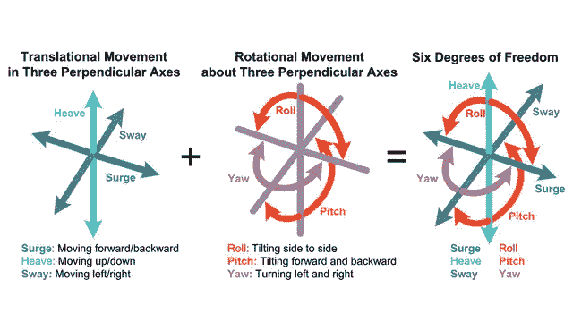
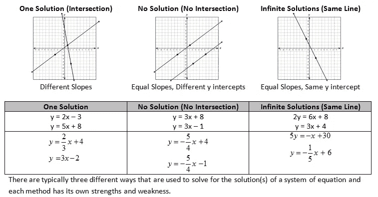

# 限制发展的自由度

> 原文：<https://medium.com/hackernoon/limit-degrees-of-freedom-in-development-4c543bb6f806>

[*https://www.scalawilliam.com/1612/limit-degrees-of-freedom/*](https://www.scalawilliam.com/1612/limit-degrees-of-freedom/)

*您正在从事的工作的潜在自由度:*

*   *对工具不够了解*
*   *对领域不够了解*
*   *没有明确的范围*
*   *在达到之前的要求之前改变范围。*

*最近，我的一个同事正在从一种语言向另一种语言重写代码，试图让它增加一个新的特性，并试图修复领域逻辑中的一个 bug。他做得太多，却毫无进展。*

*早些时候，当我在[学习](https://hackernoon.com/tagged/learning) [Scala](https://hackernoon.com/tagged/scala) 的时候，我试图用分布式设施和各种美好的想法实现一个游戏统计系统。但是我一无所获，所以我在一段时间内不断缩小我的范围——以至于只有我正在做的事情才是唯一的自由度。*

**

*Easier to build a system that moves in one direction than in six.*

*这里有一个双重性:如果你试图满足太多的约束，那么你将永远得不到解决方案。*

**

*Math helps*

*什么是*领域*是:它是你试图解决的业务问题。一种算法。用户界面。用户的需求。金融或电子商务或媒体出版或…*

*新领域和新工具？可能会很困惑。所以，除了一个变量，其他变量都要修正。*

> ***如果你想学习一个新工具，使用你已经知道的领域。***
> 
> ***如果你想在一个新的领域解决，使用你已经知道的工具。***

*这就是我如何想出'[Scala](https://www.scalawilliam.com/essential-sbt/)基本 SBT '指南，让一个新手以最小的布朗运动开始使用 SBT 和 Scala。*

******

> *[黑客中午](http://bit.ly/Hackernoon)是黑客如何开始他们的下午。我们是 AMI 家庭的一员。我们现在[接受投稿](http://bit.ly/hackernoonsubmission)并乐意[讨论广告&赞助](mailto:partners@amipublications.com)机会。*
> 
> *如果你喜欢这个故事，我们推荐你阅读我们的[最新科技故事](http://bit.ly/hackernoonlatestt)和[趋势科技故事](https://hackernoon.com/trending)。直到下一次，不要把世界的现实想当然！*

**