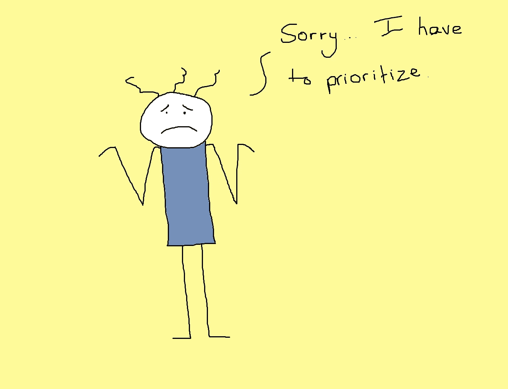

# 限制 PIP(进行中的承诺)

> 原文：<https://medium.com/hackernoon/limit-pip-promises-in-progress-d77774802bbd>

我最近重复了 PIP(进行中的承诺)的想法。

我越来越喜欢这个想法。首先，因为它解释了一些组织是如何走下坡路的。第二，它帮助我反思我在日常工作中如何以及为什么抛弃承诺(有时不遵守这些承诺)。

[https://louisandmelcomics.wordpress.com/tag/cartoon/](https://louisandmelcomics.wordpress.com/tag/cartoon/)

想象一下，你有一个可以随意使用的笔记机器人。这个机器人会记录你公司里的人做出的每一个新承诺——显性的或隐性的，情感的或功能的或社会的，有抱负的或现实的。一切！拥有无限的电力供应(和存储)，它继续调查现有的承诺、期望和承诺。机器人每天都这样。

名单有多长？每天增加多少个项目？有多少事情被忽略了？谁让希望破灭了？可能没人管？也许他们有。

在最近的一天工作中，我试图成为那个机器人。我记录下了那天三个小时会议中所做承诺的每一个暗示。这个清单很大，只有很小一部分承诺被记录在某个地方(在我的清单之外)。大多数官方认可的承诺缺乏真正的明确性、后续步骤和共识。含蓄的说法到处都是……谁知道人们是如何解读它们的。即使似乎达成了一致，我也说不清。

一位首席执行官曾经告诉我，他希望“有动力”的人“让自己承担太多要做的事情，并经常丢球，但不要搞砸重要的任务。”根据他们对工作(和生活)的看法，除非有人已经筋疲力尽，否则他们还不够努力。现在在整个组织中倍增。发生了什么事？可以预见的是，人们在与令人衰弱的压力作斗争。但他们也受到了伤害，因为其他队友(包括领导者)违背了对他们的承诺，通常是无意的。局势逐渐失控。

那里的每个人都想取悦别人，想让事情顺利进行。当我们努力遵守一些承诺，却让其他承诺溜走时，衰退就开始了。我们的本意是好的，但我们无法做到面面俱到。大部分时间还好。我的意思是地狱，每个人都很忙！但是信任、心理安全和尊重的裂痕开始形成。

也许我们开始偏离一些基本的东西——比如承诺提供高质量的产品，为客户做正确的事情，雇佣最好的员工，或者尊重我们的同事。但是漂移的增量很小。它们一次发生一次迭代，一个虚荣特征，一次雇用，一次沮丧的讽刺评论。与此同时，我们正在产生新的善意和充满希望的承诺。有多少会议以几个好主意和一些“检查并跟进”的提议而结束？有多少全能选手以一个小团队决定承担日常工作之外的问题而告终？

在[漂移入失败:从寻找坏组件到理解复杂系统](https://www.amazon.com/Drift-into-Failure-Components-Understanding/dp/1409422216)中，Sydney Dekker 描述了漂移是如何工作的:

> 漂移是一小步一小步发生的。这可以被视为减量主义，即围绕目标冲突和不确定性的持续组织和运营适应，对先前被判断为异常或被视为违反某些安全约束的情况产生小的逐步正常化。每一次减量都只是与以前接受的标准的一个小的偏差，持续的操作成功被认为是小的适应是安全的保证，不会损害未来的安全。

我观察过这种违背承诺的动态(德克尔可能称之为“目标冲突”)。如上所述，许多承诺从未具体化或明确化。

大卫·艾伦(把事情做好的大师)称这些事情为“开放循环”、“不完整”或“东西”他的方法建议将这些事情“从你的头脑中取出，放入一个系统中”，这样你就可以专注于完成事情。但是任何管理过产品积压工作(或者一个复杂项目的一组行动项目，或者软件开发团队)的人都知道这种情况会多快失控。你很快就达到了急性认知超负荷的临界点。你不可能把所有东西都放在一起，还能完成任何工作。

在任何繁忙的环境中，你都会发现人们处于绝对的极限。

有些东西必须放弃。因此，在高水平运作的同时，我们也让事情顺其自然。这就带来了德克尔的“逐步规范化”当我与那些对工作环境感到沮丧的人交谈时，他们经常提到我现在称之为失信的人:

*   有人背叛了他们的信任或者不再尊重他们
*   人们的行为方式与既定的价值观不一致
*   额外的资源从未到达
*   另一个队没有履行他们的义务
*   他们的队友在困境中没有提供帮助
*   该公司违背了对工艺和质量的承诺
*   晋升感觉不公平，没有得到平等的应用
*   他们的团队从未像承诺的那样迭代 MVP
*   富有挑战性的项目永远不会到来
*   成功的戏剧是努力工作的回报
*   该公司已经不再关心创新

更糟糕的是，他们经常没有注意到自己违背的诺言。

这里最可怕的是，要扭转这种趋势，你需要 1)开始兑现你的承诺，2)在缺乏信任、需要别人帮助的时候兑现。当你最需要信任的时候，它却不见了。这真的很难，尤其是当这个人可能在责怪同样处于超负荷状态的人和情况。具有讽刺意味的是，在当前形势下，所有艰苦的、认知上费力的工作都变得正常化了，而变革所需的艰苦工作却是尖锐而令人厌恶的。保持现状更容易。

但是还记得当公司把[一些努力]推出公园的时候吗？一切似乎都变了，对吗？

大多数软件产品开发人员都经历过高优先级计划的“蜂拥”或“激增”或“最后推动”。团队聚集起来完成一些高优先级的事情。后来在酒吧里(因为，你知道，你庆祝这种类型的事情……这实际上是有回报的)，典型的高管会说这样的话:

> 难道你看不出当我们用心去做的时候我们能做什么吗？为什么不能所有的努力都是这样！我们应该一直这样做！

对此，最受欢迎的个人贡献者回复道:

> 当然成功了…因为我们专注于某件事。你愿意让我们以后专注吗？还是我们需要遵守所有其他的承诺。

一个项目经理拿着他们的白葡萄酒慢慢走着，说着类似这样的话:

> 嗯，如果我们有一个更好的系统来跟踪我们所有的可交付成果，并进行更好的评估，我们将能够处理所有这些。我们只是需要一个更好的流程。然后，我们可以将故事点划分到我们所有的任务中，并进行每日的依赖和风险缓解检查。

接下来会发生什么？有什么变化吗？不，漂移还在继续。有所付出(可能是质量，或者留住你最好的团队成员)。进度最终会下滑，因为质量已经下滑，你已经失去了你最好的团队成员。低信任度的环境会渗透，只有最适者(在低信任度的环境中适应性最强)才能生存。

我已经写了很多关于看板和 WIP(在制品)约束的价值的文章。但我最近意识到，“工作”只是我们在“工作”中信守的承诺的一小部分。当我们为我们的产品、组织和关系增加复杂性时，我们通过创建一个承诺和承诺的网络来做到这一点，从明确的和行动的到“开放的循环”、“不完整的”和“东西”。承诺实际上是依赖。我们可以打破它们——打破依赖——但这将在其他地方产生连锁反应。

为了抵消这种漂移，我想提出限制 PIP(进行中的承诺)的想法，并将你的承诺开销减少到可管理和人道的程度。优化有希望流动效率。

为什么要用一个像承诺这样有内涵的词呢？感觉有点紧。这感觉就像一个经理要求*可预测性*，并且“做你说过要做的事情”。我想的不是这个。尽管这可能是副产品。

我觉得信任是通过经常遵守我们的承诺来建立和成长的。研究表明，经常兑现小承诺胜过不经常兑现的大承诺。我不只是指我们完成项目或检查行动项目的承诺(这可能确实是我们做出的最不重要的承诺)。我的承诺包括在你的文化中的承诺，保持合理工作时间的承诺，心理安全的承诺，指导同事的承诺，以及让人们参与具有挑战性但有意义的工作的承诺。

为了成功实现我们的承诺，我们需要在沟通和建立共同理解方面非常自律。一个人的“你必须马上去做的好主意”是另一个人的“我可能最终会尝试的事情”一个人的“他们将帮助我在职业生涯中前进”是另一个人的“我们会偶尔聊一些职业上的事情。”所以你需要自律。

少做承诺！多信守承诺。兑现承诺。尊重积极承诺的认知开销。分清主次。做出最重要的承诺:信任和尊重你的同事。