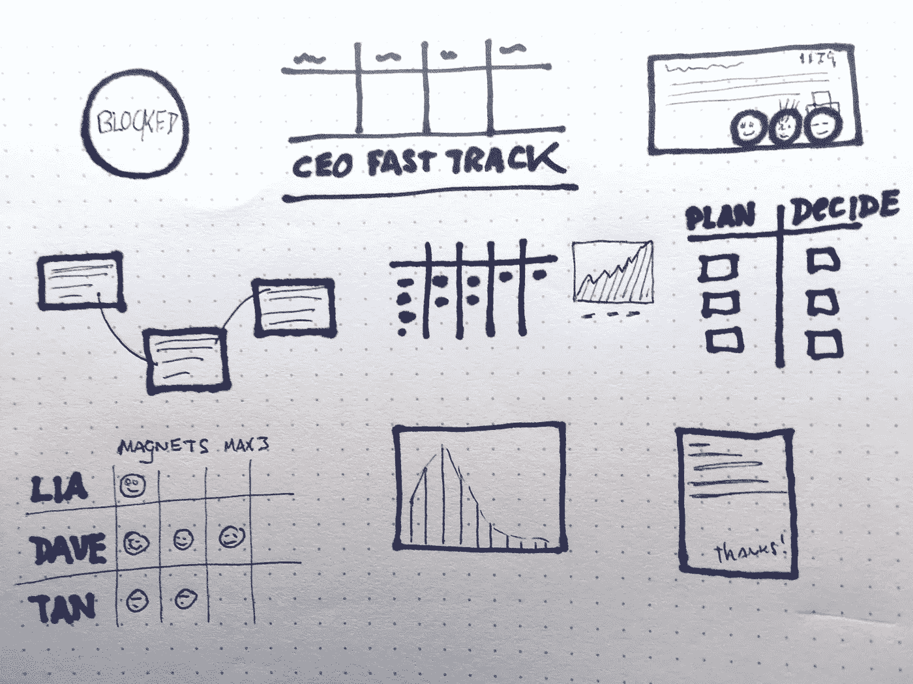
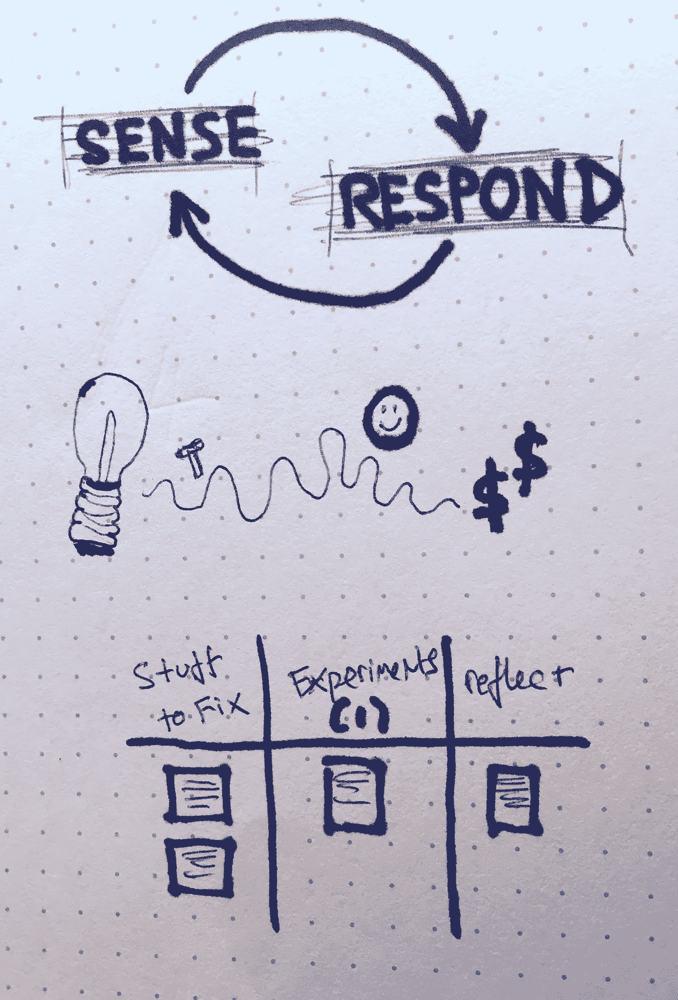

# 限制、想象和改进

> 原文：<https://medium.com/hackernoon/limit-visualize-and-improve-19c0620e4a43>

我最近一直在思考在产品开发工作中遵守纪律意味着什么。我们如何做*正确的*事情，即使做正确的事情对外人来说是困难的、不方便的、违反直觉的？

(几乎每天)我敦促团队对他们的工作协议、“过程”、持续改进和原则负责。不，这不是代码或设计。但在我看来，倡导工艺、可持续性和不偷工减料是最好的方式。我经常被要求“设置好它”。但我解释说，你必须内化并实践这些原则。不能外包。

1.  拉动(不要推动)并限制工作进展
2.  想象事物的本来面目
3.  持续改进

退一步说，这一切都有一种近乎禅意的特质。这是一个永远无法解决的难题。有些人可能会说(好吧，我可能会说)这很有趣。

# 1.拉动(不要推动)并限制工作进展

忙碌是一种毒品。这是一种英雄主义和实用主义……一种职业戏剧的形式。相反，拥抱专注和心流的挑战。这是艰苦而有纪律的工作。

在 **WIP 受限系统中，**没有个人或团队超负荷工作。你处于最佳利用水平。你努力*又*聪明。

在基于**拉动的系统**中，开始某件事必须包括完成另一件事。

这些共同创造了流动，以及检查和适应的机会。

# 2.想象事物的本来面目

实际发生了什么？我们如何工作？

将想法、工作、决策、信息、流程、分配、阻碍者、成功、失败、团队能量和实验可视化。想象一切。别想了。秀不说。澄清工作协议。

我们用尽一切办法…让看不见的东西变得可见。当现实发生变化时，我们将这种变化视觉化。一直都是。

# 3.持续改进

通过限制正在进行的工作和可视化一切(和测量)，我们可以进行正确的对话。瓶颈出现了。我们追逐它。

“在董事会”上进行对话。应该把重点放在哪里？我们应该放大什么，抑制什么？邀请房间里的大象出去喝咖啡。确保安全。

问题就是机会，每个人都有。感知并抓住这些机会。

*作为这篇文章的同伴(也为了理解我的一个关键灵感)，我推荐阅读大卫·安德森的* [*看板方法的原理*](http://www.djaa.com/principles-kanban-method-0) *。我特别喜欢“从你现在做的事情开始”这个原则*