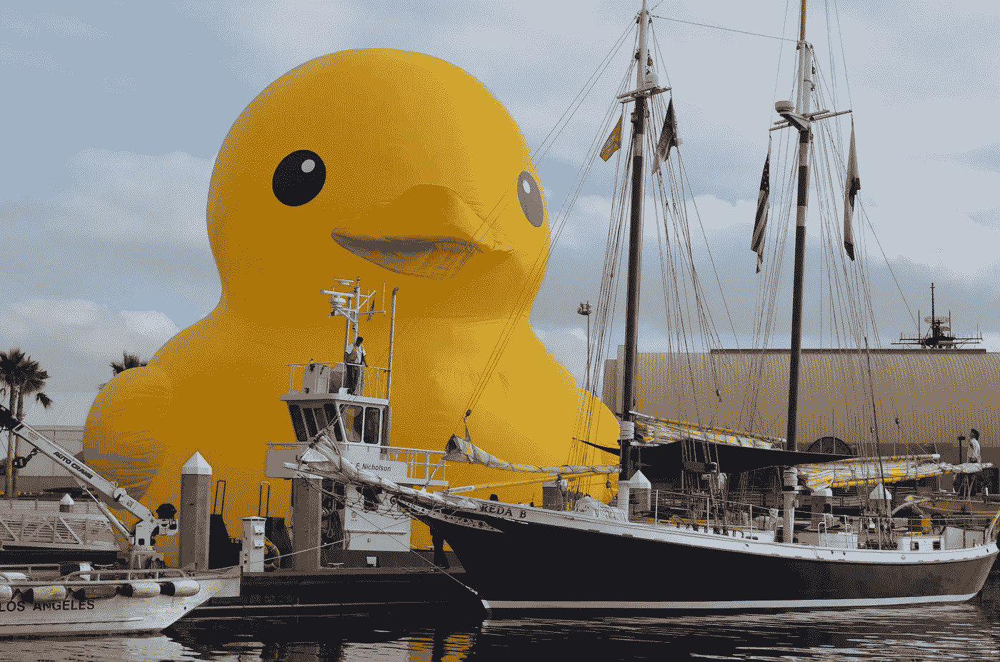

# 有限合伙人，不限制机会

> 原文：<https://medium.com/hackernoon/limited-partners-not-limited-opportunity-a06a8d20b8bc>

## 风险资本在有限合伙人的投资组合中是一只奇怪的鸭子。

One of these vessels is not like the other. Also, the schooner in the foreground is probably a metaphor for private equity or something.

风险基金有很长的寿命，它们以神秘的方式被标记为 T2，投资组合的回报遵循 80/20 法则(T4，尽管 99/1 可能更接近真相)。从技术上来说，它们属于私募股权(它们是私人的……它们是股权投资)，但需要一种非常不同的方法或思维方式——当投资者获得 CFA 或 CAIA 称号时，不一定会被赋予这种方法或思维方式。

上周，彭博发表了一篇文章，阐述了我们目前在私募股权领域是如何处于“类固醇时代”的。尽管这种描述似乎忽略了私募股权中其他展示创造性使用杠杆的时代，但本文讨论的策略确实允许普通合伙人 1)更快地进行投资，2)增加他们投资的 IRR(内部回报率)。这让每个人都很高兴——开玩笑，这造成了激励的错位，普通合伙人可能会更关注交易的时机和持续时间，而有限合伙人可能会发现自己所在的基金产生的现金回报较低。

谈判双方对 IRR 的短期关注不利于风险投资。难以估值的长尾风险基金不会参与短期 IRR 游戏，但它们有潜力产生天文数字的现金对现金回报。然而，如果一个有限合伙人通过他们的私募股权分配的棱镜来评估风险，它可能在短期和中期看起来表现不佳。还有一个问题是如何获得持续表现最佳的风险基金，这对刚接触该资产类别的有限合伙人来说是困难的和/或不可能的。那么，有限合伙人如何在不牺牲长期价值的情况下谨慎地接触风险资本呢？

有限合伙人可以对他们的风险投资组合采用单独的基准，只包括风险基金。这是有道理的，因为风险基金中的基础资产与私募股权中的基础资产截然不同，尤其是当它与增长率、融资策略、团队规模和产品供应相关时。很大一部分(如果不是大部分)风险基金也被保留用于后续投资，而私募股权基金留出的金额要小得多。这些类型的基金之间的比较是不可比的。不过，正如我在永久学校基金的前同事可以证明的那样，在没有对现有基准进行多年研究的情况下，人们不会简单地“采用一个单独的基准”。这是有道理的，因为基准最终会驱动所有的投资决策。

即使有限合伙人决定慎重考虑投资风险资本，仍然存在准入问题。红杉并没有说“进来吧！”对那些敲打旗舰基金大门的投资者来说——我不是在挑剔红杉，而是那些持续表现优异的基金不需要增加新的投资者。如果与这些公司的普通合伙人没有某种特殊关系，新的有限合伙人就无法进入。那么，有限合伙人如何才能接触到可投资机会宇宙中最有趣的企业家和公司，同时产生(潜在的)最高现金对现金回报呢？

对于有创业精神的机构投资者来说，这是最令人兴奋的机会所在。种子/A 轮领域中新兴的低于 1 亿美元的风险基金为有限合伙人提供了一个机会，让他们在早期向有前途的经理做出小额承诺(甚至为他们的基金提供种子资金)，然后随着经理们筹集未来的资金，逐步扩大他们的承诺。同样，这些基金以较低的成本对公司进行较小的初始投资，减轻了公司的负面影响，同时为赢家保留了资金。像 [Cendana Capital](https://medium.com/u/22bbc1351bac?source=post_page-----a06a8d20b8bc--------------------------------) 的 [Michael Kim](https://medium.com/u/c381aaf4700e?source=post_page-----a06a8d20b8bc--------------------------------) 和 Foundry Group Next 的 [LD Eakman](https://medium.com/u/96f8f539b437?source=post_page-----a06a8d20b8bc--------------------------------) 这样的人已经在微风险领域确立了自己的领导者地位，同时非常开放地为投资者提供了一个可以遵循的介绍性模板(通过播客[这里](http://notationcapital.com/origins-podcast)、这里[这里](http://www.thetwentyminutevc.com/michaelkim/)和[这里](http://www.thetwentyminutevc.com/lindeleakman/)，以及这篇博文[这里](http://www.ldeakman.com/archives/2015/12/foundry-group-next.html))。借用 Lindel 的话来说，他们正在展示如何最好地优化风险投资敞口，风险投资生态系统的新有限合伙人应该好好关注一下。

尽管他们天生多样化，找到最好的基金机会并不容易。真的很难。去年绝大多数筹集资金的风险基金都属于这种微型风险投资类别，除非你从表面上看他们并不都是顶级经理人。但对于了解精心构建的风险投资组合能做什么的有限合伙人来说，他们需要通过不仅仅是与顾问和配售代理交谈的方式来寻找潜在投资。首先，听播客和参与 Twitter 辩论实际上有助于获得必要的模式识别技能，以确定谁是聪明的投资者。也绝对有理由让 [ILPA 研究所](https://ilpa.org/events-training/ilpa-institute/)为其成员有限合伙人增加关于如何最好地接近和评估风险投资经理的培训。我甚至认为有理由开发软件来跟踪哪些种子投资者的投资比例最高，可以进入后期融资阶段或流动性事件，或其他类型的成功指标(我假设 [Mattermark](https://medium.com/u/40233f4ee393?source=post_page-----a06a8d20b8bc--------------------------------) 有能力做到这一点)。

尽管风险投资面临挑战，有限合伙人将继续投资这些基金。无论他们选择哪种方式来应对这个领域，很明显，如何应对的困惑为谨慎的投资者提供了一个支持下一代人才的巨大机会。这一点也不奇怪。

Hey look it’s a baby sequoia tree, I wonder what that’s supposed to represent.

> [黑客中午](http://bit.ly/Hackernoon)是黑客如何开始他们的下午。我们是 [@AMI](http://bit.ly/atAMIatAMI) 家庭的一员。我们现在[接受投稿](http://bit.ly/hackernoonsubmission)并乐意[讨论广告&赞助](mailto:partners@amipublications.com)机会。
> 
> 如果你喜欢这个故事，我们推荐你阅读我们的[最新科技故事](http://bit.ly/hackernoonlatestt)和[趋势科技故事](https://hackernoon.com/trending)。直到下一次，不要把世界的现实想当然！

