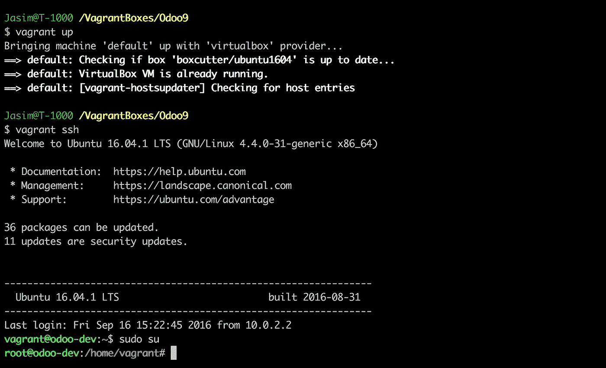
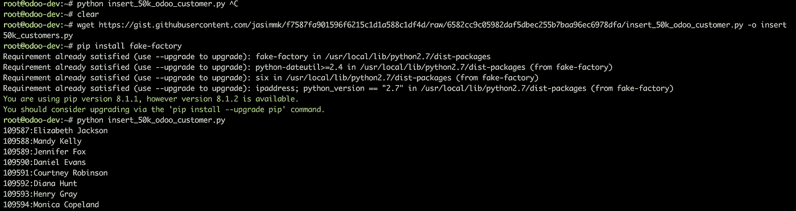
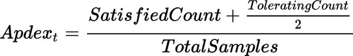
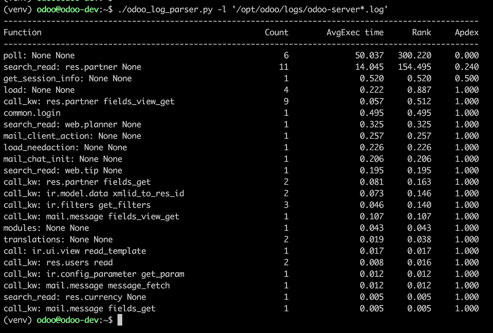

# 线分析 Python——以 Odoo 9 为例

> 原文：<https://medium.com/hackernoon/line-profiling-python-odoo-9-as-example-864e9e3cdd7a>


## 链接猛犸象— Odoo/PostgreSQL — 1

编码标准，干代码，[设计](https://hackernoon.com/tagged/design)模式，版本[管理](https://hackernoon.com/tagged/management) t，标准化工作流，微服务，自动部署，可扩展系统..

黑客在创业中要实现的梦想。当你努力实现这些目标时，你会花很多时间去修复遗留下来的问题。具有无限系列快速修复、重复代码和数百万行代码的系统。

用像 odoo 这样的电池供电的 ERP 系统开始业务是没问题的。它可以帮助您快速构建满足业务需求的应用程序。但随着时间的推移，你将更难扩展应用程序，因为大多数计算资源将被浪费在不需要的功能和支持这些“易于开发”的功能上。确保您正在开发优化的并行应用程序，并为现有数据制定了良好的迁移计划。如果你探索和破解 openerp 的基础/内部系统，你会看到很多优化步骤。

分析应用程序代码有助于您识别应用程序中的时间/空间问题。您将获得典型问题的答案，如每个函数/方法需要多长时间来执行？应用程序在内存消耗等方面有多好？在 web 应用程序世界中，长时间运行或高内存消耗的请求是对应用程序稳定性的威胁(即使在阻塞和非阻塞请求中)。如果您一直使用这些高负载终端，而不投入时间进行优化，并且确实进行了横向扩展，那么您最终会在云提供商的发票上花费很多。

在 python world 中，有多种工具和库可用于分析。 [cProfile](https://docs.python.org/3/library/profile.html) 、 [valgrind](http://valgrind.org/) 免费提供。第三方网络监控服务，如 [NewRelic](https://newrelic.com/) 、 [App dynamics](https://www.appdynamics.com/) 、 [Dynatrace](https://www.dynatrace.com/) 可支付一定费用。本文重点介绍用 python [行分析器](https://github.com/rkern/line_profiler)分析 odoo。尽管“线分析器”会增加代码的开销，并且您不能相信“线分析器”的准确计时，但是对于确定相对时间消耗而言,“线分析器”是一个不错的选择。

## 我们在这里要做的事情

*   安装 Ubuntu 16.04 流浪机。
*   设置 Odoo 9/Postgres 9.5。
*   将 50 k 触点插入 Odoo。
*   用日志解析器分析 odoo 中的慢速请求。
*   设置线路剖面仪示例脚本。
*   为 odoo 设置线路剖面仪。
*   识别代码中的性能瓶颈。

## 测试环境

*   Ubuntu 16.04(64 位)，虚拟盒使用[流浪汉](https://gist.github.com/jasimmk/c2a10ce0526b82be4294805145a653d6)
*   Python 2.7.9
*   [Odoo 9](https://github.com/odoo/odoo/tree/9.0) (v 9.0 分支)
*   [轮廓仪](https://github.com/rkern/line_profiler)

## 设置流浪者

*   在你的机器上安装[浮动](https://www.vagrantup.com/docs/installation/)。
*   将[流浪文件](https://gist.github.com/jasimmk/c2a10ce0526b82be4294805145a653d6)下载到文件夹
*   运行`*流浪起来*
*   运行`*流浪 ssh`* ，
*   运行` *sudo su`* 以 root 用户身份登录



Vagrant with virtualmachine. Running ubuntu 16.04

## 安装 Odoo 和 PostgreSQL

让我们看看如何为开发设置 odoo 9。您可以使用下面的脚本来自动配置环境。运行脚本来设置 odoo 9 和 PostgreSQL 9.5。如果您想为您的环境定制用户名、密码等，请下载脚本并编辑脚本中的配置，然后运行它。

该脚本为 odoo 安装 PostgreSQL 9.5 和依赖包。Python 包安装在用户' *odoo* '下的虚拟环境中。

```
root@odoo-dev:~# wget --quiet http://bit.ly/2cE6pfY -O install_odoo9.sh && bash -u install_odoo9.sh
```

Odoo 9 and PostgreSQL 9.5 auto installation on Vagrant machine

## 应用程序的初始设置

让我们设置初始 odoo 数据库并加载一些演示数据。使用以下配置进行初始数据库安装

```
Odoo admin password: odoo_admin
Odoo database: odoo_test
Odoo username: test123@mailinator.com
Odoo password: 123456
```

默认安装时安装在 odoo 应用程序下

*   项目
*   销售管理
*   货品计价

请看[脚本](https://gist.github.com/jasimmk/f7587fa901596f6215c1d1a588c1df4d)来填充身边的` *5 万`*联系人到 odoo。脚本基于 Odoo API。(*它非常慢，没有使用任何多处理技术来加快它的速度。在后台运行时，大约需要 2 个小时才能填充完毕*。

[下载 Odoo 联系人插入脚本](https://gist.github.com/jasimmk/f7587fa901596f6215c1d1a588c1df4d)



*Inserting 50 thousand contacts to Odoo*

## 运行 Odoo 9 进行记录

让我们记录一些来自 odoo 的请求和响应时间。

*   停止现有的 odoo 服务
*   登录到 odoo 用户
*   激活奥多虚拟
*   从命令行以单工作模式(默认)运行 odoo。
*   将请求和响应记录到标准输出和一个文件(`*/opt/odoo/logs/odoo-server-request . log*`)

```
root@odoo-dev:~# systemctl stop odoo-server
root@odoo-dev:~# su odoo
(venv) odoo@odoo-dev:~$ which python
/opt/odoo/venv/bin/python
(venv) odoo@odoo-dev:~$ python src/odoo.py --config /etc/odoo-server.conf --log-handler openerp.http.rpc.request:DEBUG --logfile /dev/stdout|tee /opt/odoo/logs/odoo-server-request.log
```

请浏览 odoo 的典型操作，以在日志中生成一些随机响应和定时。

> 在 odoo 的工作模式下，服务器将使用同步和非线程模式运行 wsgi 标准。如果我们有 4 个工作线程，每个请求需要 1 秒钟来生成输出，那么我们系统的并发性将是每秒 4 个请求。

让我们找出需要很长时间的请求。作为一项基本措施，检查生成响应的时间是否超过 500 毫秒。我们可以使用这三种方法中的任何一种。

*   Chrome webtools/Firebug，并从那里监控响应时间。
*   如果 odoo app 前面有 nginx 代理，可以在 nginx 日志中启用[请求/响应定时，在这里](https://lincolnloop.com/blog/tracking-application-response-time-nginx/)指定，记录请求/响应定时。
*   在 odoo 中启用“ *—日志处理程序 openerp . http . RPC . request:DEBUG*”,并解析请求/响应时间的日志文件(我们将在这里使用这个方法)

## 我们将选择优化哪个端点/url？

1.  **简单排名**:生成每个 url 的请求数*平均响应时间的表格，选择数值最高的一个
2.  **Apdex 规则**:[https://en.wikipedia.org/wiki/Apdex](https://en.wikipedia.org/wiki/Apdex)



根据前面的命令，我们将请求和响应时间记录到 stdout 和“*/opt/odoo/logs/odoo-server-request . log*”中。

让我们使用 odoo 对数线解析器。为了生成日志文件，我们需要传递日志处理程序参数

```
--log-handler openerp.http.rpc.request:DEBUG 
```

跑 odoo 的时候。该处理程序将把请求和响应时间添加到日志文件中。请查看解析器的附加文件。

[下载解析器脚本](https://gist.github.com/jasimmk/c74cbad826c3f06ea08981d7aad46238)

您可以运行以下命令来生成日志慢速响应 odoo 请求。

```
root@odoo-dev:~# wget --quiet [http://bit.ly/2ceKpfa](http://bit.ly/2ceKpfa) -O odoo_request_log_parser.py && python odoo_request_log_parser.py -l '/opt/odoo/logs/odoo*.log'
```

## 分析响应时间

我玩了`*无限`*清单的`*10 万*联系人好多次。odoo 中的无限制列表是一个危险的特性，如果一个表的记录数量非常多，那么“All”列表将会是 web 工作者的一个大阻塞操作。处理这些记录也会消耗大量内存。



Odoo request/response apdex score analysis

让我们从 log parser 中检查这里列出的函数。`*轮询*`用于长时间轮询，在生产 ERP 中，我们可以用` gevent `异步端口对其进行配置。所以这对我们来说不是什么大问题。`*search _ read:RES . partner*`的 apdex 得分为 **0.240** ，平均执行时间为 **14 秒**。OMG！！。这是完全不能接受的。` *get_session_info* `的 apdex 得分为 **0.5** ，生成需要 **520 ms** 。

我们可以对这些函数进行线分析，以确定瓶颈。

## 线路剖面仪

Cpython 作为解释型语言，在逐行分析代码方面具有优势。我们可以确定每条线路之间的时差以及该线路被呼叫的次数。缩小性能瓶颈允许我们直接优化代码。虽然 cpython 有多种分析器，但是 [line profiler](https://github.com/rkern/line_profiler) 使用起来很简单，可以将我们引导到可聚焦的区域。

## 安装线路轮廓仪

激活虚拟环境。安装

```
(venv) odoo@odoo-dev:~$ pip install cython
(venv) odoo@odoo-dev:~$ pip install line_profiler
```

看看我们如何在日志解析器脚本中逐行检查消耗。

编辑该文件，并将 decorator ` *@profile* `添加到主函数 generate_fn_table 中。并使用-lv 选项运行命令。

```
(venv) odoo@odoo-dev:~$ kernprof -lv -o /tmp/lp.prof odoo_log_parser.py -l '/opt/odoo/logs/*.log'
```

> **PS** :我们将忽略/tmp/lp.prof 文件中的概要文件输出，详细模式`-v `确保我们在使用 CTRL + C(发送 SIGINT 信号)终止应用程序时得到概要文件报告。

# 为 Odoo 设置线条轮廓

要在 Odoo 中启用分析

*   禁用工作模式并启用线程模式(默认情况下是线程模式，除非您在命令行中放置 number ` *— workers* 选项，或者在` odoo-server.conf `文件中放置` *workers = X`* )
*   激活虚拟环境并运行 odoo 应用程序。确保你在虚拟环境中。

我们确定了要调试的端点方法。其具有较低的 apdex 分数。让我们先来看看这个方法。

*   search_read: res.partner 无

> 确保您已经创建了自己的 git 分析分支。因为这涉及到在某些地方编辑代码部分。

```
(venv) odoo@odoo-dev:~$ kernprof -lv -o /tmp/odoo.lprof ~/src/odoo.py --config /etc/odoo-server.conf  --logfile /dev/stdout
```

*   确保您正在使用' *kernprof* '运行` *odoo.py* `脚本。它将` *profile* 方法注入到 scope。
*   将` *@profile* `作为装饰符放在您需要分析的函数之前。
*   有时一些方法是用元类来修饰的。对于` *@profile* ` decorator 来说，排序很重要。有时我们需要挖掘方法调用并覆盖函数，如` *fn = profile(fn)*

在 Odoo web 界面中多次执行慢速加载操作。按 CTRL +C 终止应用程序。您将获得个人资料报告。

*   如果您点击名称错误:名称“配置文件”未定义。这可能是因为多个问题。
*   确保您正在运行带有 kernprof 的 odoo.py 脚本，该脚本将配置文件注入 builtin。
*   您可能已经在您的虚拟 env 中安装了 future 包。在这种情况下，您需要按照该拉取请求中指定的[从主分支安装“ *line_profiler*](https://github.com/rkern/line_profiler/pull/25)
*   服务器可能正在多处理模式下运行，或者您可能在 werkzeug 中启用了` *allow_reload* '选项。由于剖析器将代码注入丢失给了具有多重处理的内置程序

## 分析后修复代码

剖析给我们带来了代码瓶颈。我们需要使用不同的方法来加速代码的执行。我们可以使用的一些技术有

*   循环优化
*   直接查询代替 ORM
*   为表列添加索引
*   应用不同的算法
*   移除不需要的代码执行

# 摘要

*   使用像 Odoo 这样的现有 ERP 系统来开始你的业务是有好处的
*   随着时间的推移，考虑采用微服务方法的独立解决方案。有效利用计算资源，轻松将负载分配到多个节点。
*   行分析有助于您识别性能瓶颈。

***复习学分:***

*   [吉内什·纳拉亚南](https://medium.com/u/4705f10a1b4f?source=post_page-----864e9e3cdd7a--------------------------------)

***封面图片:***

*   [*https://en.wikipedia.org/wiki/History_of_the_steam_engine*](https://en.wikipedia.org/wiki/History_of_the_steam_engine)

[](http://bit.ly/HackernoonFB)[](https://goo.gl/k7XYbx)[](https://goo.gl/4ofytp)

> [黑客中午](http://bit.ly/Hackernoon)是黑客如何开始他们的下午。我们是阿妹家庭的一员。我们现在[接受投稿](http://bit.ly/hackernoonsubmission)并乐意[讨论广告&赞助](mailto:partners@amipublications.com)的机会。
> 
> 如果你喜欢这个故事，我们推荐你阅读我们的[最新科技故事](http://bit.ly/hackernoonlatestt)和[趋势科技故事](https://hackernoon.com/trending)。直到下一次，不要把世界的现实想当然！

[](https://goo.gl/Ahtev1)