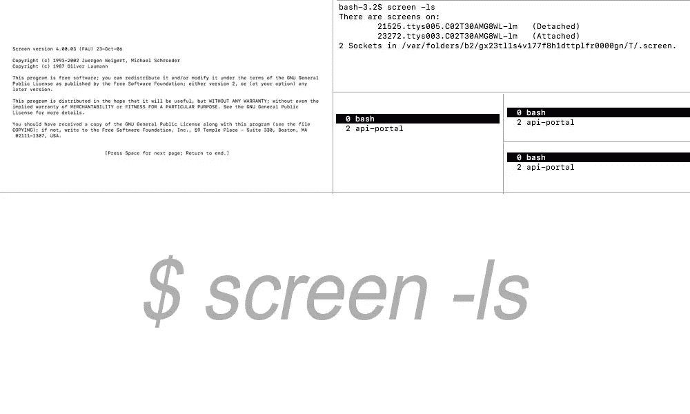
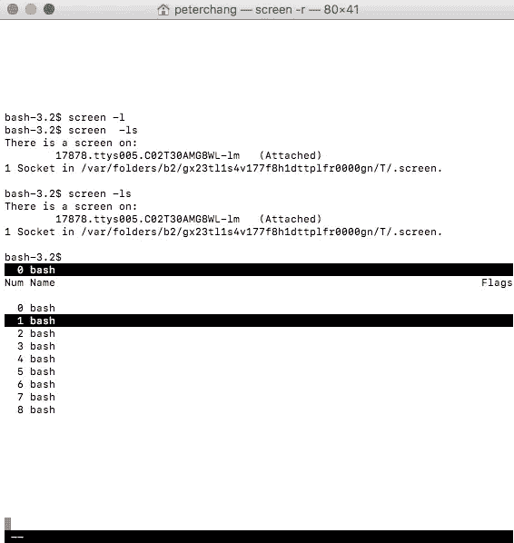

# $ screen 备忘单(多屏幕)

> 原文：<https://medium.com/hackernoon/linux-tmux-split-screen-tutorial-example-command-control-cheatsheet-terminal-ea4450f938f>



我是 tmux 的忠实用户，喜欢它的多会话和分屏功能。然而，我最近在一个不支持 tmux 的环境下开发。

总有一个替代方案， **tmux** 的兄弟是**屏幕**，在玩了一会儿屏幕后，我会说它有我需要的一切。

## 屏幕优点:

*   极其稳定(1.0 版是在 **1987 年**)
*   用`TERM=screen`修正了一些终端问题
*   多路传输时，任何连接的终端都可以调整窗格的大小
*   更快的

## 开始前需要了解的内容

使用会话名称启动新的屏幕会话

```
$ screen -S *<name>*
```

列出正在运行的会话/屏幕

```
$ screen -ls
```

附加到正在运行的会话

```
$ screen -x
```

附加到会话*名称*

```
$ screen -r *<name>*
```

## 开始

```
*$ screen*
```

## 创建新屏幕

```
***Ctrl+a, c***
```

## 下一个屏幕

```
***Ctrl+a, n***
```

## 上一个屏幕

```
***Ctrl+a, p***
```

## 终止屏幕(保留在背景中)

```
***Ctrl+a, d***
```

# 多屏使用



## 创建/拆分新终端

*注意*:分割后需要进入新区域，通过 ***Ctrl+a，c*** 开始新的会话，才可以使用那个区域。

```
***Ctrl+a, S***
```

## 列表/开关终端

```
***Ctrl+a, "***
```

## 下一个终端

```
***Ctrl+a, space***
```

## 前一个终端

```
***Ctrl+a, backspace***
```

## 终止终端

```
***Ctrl+a, q***
```

## 重命名终端

```
***Ctrl+a, A***
```

## 第 n 个终端

```
***Ctrl+a, 3***
```

## 出口多终端

```
***Ctrl+a, Q***
```

## 参考:

[http://aperiodic.net/screen/quick_reference](http://aperiodic.net/screen/quick_reference)

[http://UNIX . stack exchange . com/questions/7453/how-to-split-the-terminal-to-over-one-view](http://unix.stackexchange.com/questions/7453/how-to-split-the-terminal-into-more-than-one-view)

[https://www . Reddit . com/r/command line/comments/1y 91 LZ/tmux _ vs _ screen/](https://www.reddit.com/r/commandline/comments/1y91lz/tmux_vs_screen/)

[](http://bit.ly/HackernoonFB)[](https://goo.gl/k7XYbx)[](https://goo.gl/4ofytp)

> [黑客中午](http://bit.ly/Hackernoon)是黑客如何开始他们的下午。我们是这个大家庭的一员。我们现在[接受投稿](http://bit.ly/hackernoonsubmission)并乐意[讨论广告&赞助](mailto:partners@amipublications.com)机会。
> 
> 如果你喜欢这个故事，我们推荐你阅读我们的[最新科技故事](http://bit.ly/hackernoonlatestt)和[趋势科技故事](https://hackernoon.com/trending)。直到下一次，不要把世界的现实想当然！

