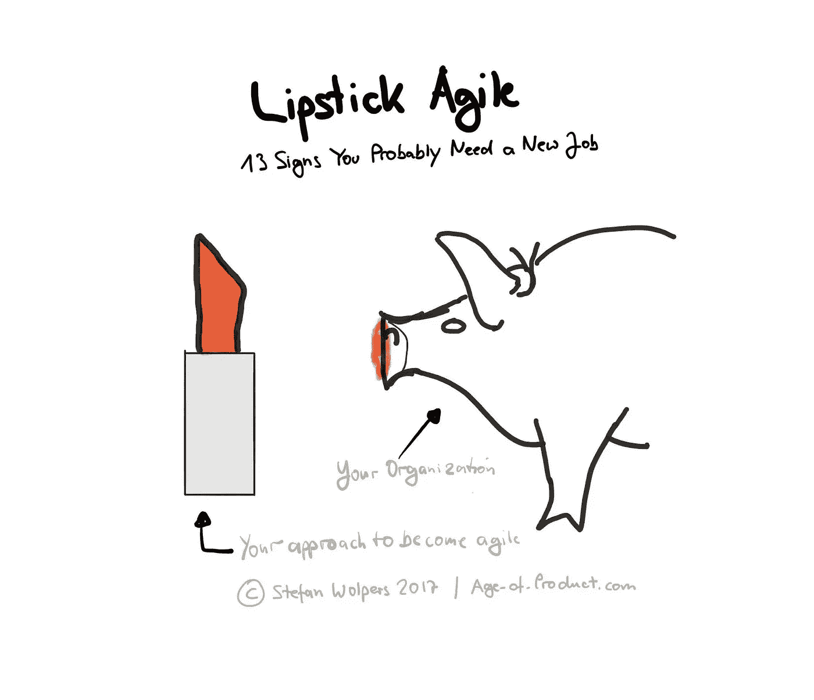

# 口红敏捷

> 原文：<https://medium.com/hackernoon/lipstick-agile-2cce052b9bda>

# 敏捷和快乐在战壕里

你有没有注意到敏捷领域有多少人对他们的工作状况不满意？

Scrum 大师和敏捷教练，他们要么接近精疲力竭，要么漠不关心。仅仅通过名字“拥有”产品的产品所有者，以及质疑为什么 Scrum a)跳过所有使 XP 工作的实践，以及 b)经常被证明只是另一种形式的微观管理的开发人员。

# 声明和意见

以下是我的一些问题，这些问题让我在过去没有接受工作机会，或者开始重新考虑是否加入某个组织:

1.  “你能同时处理多少个团队——三个还是四个？”(一个潜在的客户。)
2.  "会议室的可用性是这里的一个难题。"(一点空间都没有。)
3.  “我们不需要物理电路板；我们用吉拉。”(“当你把问题放进电脑时，盒子里藏着答案。问题必须是可见的！”[横井秀史](http://runningahospital.blogspot.de/2009/08/problem-must-be-visible.html)，美国肯塔基州厄兰格市丰田生产系统支援中心前总裁。)
4.  “测试自动化对我们不起作用。我们总是手动测试。”(一个没有工程背景的公司质量保证部门经理。)
5.  “我们每周部署一次，以便治理团队有机会签署我们的工作。”(该团队创建了一个优秀的构建管道，可以随意部署。)
6.  “作为一名 Scrum 大师，你还将在每次冲刺后向项目经理报告团队的[绩效指标](/swlh/agile-metrics-the-good-the-bad-and-the-ugly-65639d28fd29)。”(一个潜在的客户。)
7.  “一旦我们交付了(应用程序)并证明了我们的有用性，我们就可以在学习上投入更多。”(知识分享作为奖励。)
8.  “我认为结对编程是对资源的浪费。记住，是事半功倍。”(萨瑟兰先生，谢谢你没有指着细则，以免每个生意人都弄错。)
9.  “你为什么要在用户访谈中包括开发人员？他们应该写代码。业务分析师可以进行沟通。”
10.  “我们需要满足数字和期限。这比实现一些 C 级的花哨计划更重要，比如“变得敏捷”。"
11.  “我们知道我们需要构建什么，与用户交谈会分散注意力。”
12.  *观察*:涉众不参与仪式，比如[冲刺评审](https://productcoalition.com/sprint-review-anti-patterns-283d1b6c8cdf)。从来没有。
13.  *观察结果*:物理板上的胶粘物似乎与气泡水平仪对齐。(一个潜在的客户，正在为一个五人团队寻找一个专职的 scrum 大师。)

是什么让你重新考虑你的处境？

*请点击“拍手”*👏*,如果你觉得这篇文章有用——它对我来说意义重大！*

*你想读更多这样的书吗？嗯:*

*   📰*加入 13，152 位同行和* [*报名参加本周简讯*](https://age-of-product.com/subscribe/?ref=Food4ThoughtMedium)
*   🐦*关注我的* [*推特*](https://twitter.com/stefanw) *订阅我的博客* [*产品时代*](https://age-of-product.com)
*   💬*或者，免费加入* [*Slack 团队的 2100 多名同行*](https://goo.gl/forms/XIsABn0fLn9O0hqg2) *…*