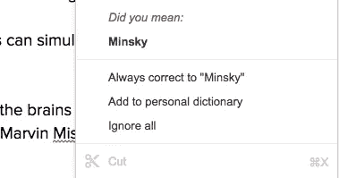
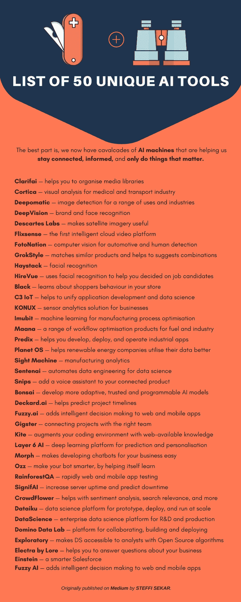

# 50 种独特的人工智能技术列表

> 原文：<https://medium.com/hackernoon/list-of-50-artificial-intelligence-technologies-b1d9dc1de787>

本博客末尾的简短信息图。

## 人工智能是为了更好的生活而模仿人类的智能。

学习和执行动作的**人工物**的发明发生在古典时代。除了 [**微积分推理机**由 **Llull**](https://www.youtube.com/watch?v=Z_N89UhRti0) 制作，还有许多虚构的故事和戏剧描绘了人造事物及其巨大的潜力。

[**嫁给雪莱的弗兰肯斯坦？**](https://www.youtube.com/watch?v=Lg17y6iz7Xs) **没看过的一定要看。**

机器能够模仿人类，以及他们像**分析**、**整理**，找出**模式**这样的认知过程背后的想法是，

**丘奇-图灵论题**——这意味着机器可以模拟任何形式推理的过程(来自*维基*)。

> 通俗地说，机器可以模仿任何有关联和有意义的信息(数据集)的东西。

支持像艾伦·纽厄尔、希尔伯特·西蒙、约翰·麦卡锡、马文·明斯基、亚瑟·萨缪尔和 T31 这样的创造者的理论。

## PDAbM —机器注意力的公开显示；)

当机器看不到有人拼错他们创造者的名字时，

嗯，这些是我们过去围绕 **AI** (人工智能)的一些大胆的故事。如果我们看看人工智能的现状和我们正在做的事情——**人工智能**正在流行，从在线的**机器人**到我们家里的**东西**。

最棒的是，我们现在有了人工智能机器**的**团队****帮助我们**保持联系，获得信息，**和**只做那些需要处理的事情**

对于后者来说，**自动化工具**和几乎不需要我们注意的物体携手而来。

想象一下，有一天语音识别会转变成从眼球的扩张范围识别意图。

或者，一个叫做**的量子博士**，它存储了一个实验对象的每个粒子的行为模式。根据要求让实验对象通过加密的粒子模式并产生一个全新的结果。

> 你还认为**时间永远不会停止**吗？它缺少时间单位？这里是 [**超时空**](https://www.youtube.com/watch?v=fU2D9KCTiqg) 。

让我们快速进入 50 种人工智能工具的**列表，它们让我们的日常生活变得毫不费力！**

> **“这个** AI **作为一个搭便车的人是如此的聪明，它在我们最不知道发生了什么的情况下驶向我们想要的目的地”**

## **人工智能视觉**

[**Clarifai**](https://www.clarifai.com/) —帮助您组织媒体库

[**Cortica**](http://www.cortica.com/) —医疗和运输行业的可视化分析

[**Deepomatic**](https://www.deepomatic.com/) —适用于各种用途和行业的图像检测

[**DeepVision**](http://deepvisionai.com/) —品牌和人脸识别

[**笛卡尔实验室**](http://www.descarteslabs.com/)**——让卫星图像变得有用**

**[**Flixsense**](http://flixsense.com/) —首款智能云视频平台**

**[**摄影**](https://www.fotonation.com/products/automotive/) —用于汽车和人体检测的计算机视觉**

**[**GrokStyle**](https://grokstyle.com/) —匹配相似的产品并帮助建议组合**

**[**草堆**](https://www.haystack.ai/) —面部识别**

**[**HireVue**](https://www.hirevue.com/) —使用面部识别来帮助你决定求职者**

## ****物联网/IIoT 的人工智能****

****

**[**黑色**](http://black.ai/)**——**了解你店里的购物者行为**

**[**C3 物联网**](http://c3iot.com/)**——**有助于统一应用开发和数据科学**

**[**KONUX**](https://www.konux.com/) **—** 面向企业的传感器分析解决方案**

**[**Imubit**](http://www.imubit.com/)**—**用于制造过程优化的机器学习**

******—**一系列用于燃料和工业的工作流程优化产品****

****[**Predix**](https://www.predix.io/)**—**帮助您开发、部署和运营工业应用****

****[**Planet OS**](https://planetos.com/)**—**帮助可再生能源公司更好地利用数据****

****[**瞄准镜**](http://sightmachine.com/)**——**制造分析学****

****[**Sentenai**](http://sentenai.com/)**——**自动化数据科学的数据工程****

****[**Snips**](https://snips.ai/)**—**为您连接的产品添加语音助手****

## ******人工智能促进发展******

********

****[**盆景**](https://bons.ai/)**——**开发更多自适应、可信、可编程的 ai 模型****

****[**deckard . ai**](http://deckard.ai/)**—**帮助预测项目进度****

****[**fuzzy . ai**](http://fuzzy.ai/)**——**为网络和移动应用增加智能决策****

****[**Gigster**](https://gigster.com/)**—**将项目与合适的团队联系起来****

****[**风筝**](https://kite.com/)**——**用网络可用知识扩充你的编码环境****

****[**第六层 AI**](http://layer6.ai/) **—** 预测和个性化的深度学习平台****

****[**Morph**](https://morph.ai/)**—**让开发聊天机器人为您的业务服务变得简单****

****[**Ozz**](http://ozz.ai/)**——**帮助你的机器人自我学习，让它更聪明****

****[**雨林 QA**](https://www.rainforestqa.com/) **—** 快速 web 和手机 app 测试****

****[**意义重大**](https://www.signifai.io/) **—** 增加服务器正常运行时间并预测停机时间****

## ******用于数据分析的人工智能******

********

******—有助于情感分析、搜索相关性等******

******[**大数据**](http://www.dataiku.com/) —用于原型、部署和规模化运行的数据科学平台******

******—研发和生产的企业数据科学平台******

******[**Domino 数据实验室**](https://www.dominodatalab.com/) —协作、构建和部署的平台******

****[**探索性**](https://exploratory.io/)——让分析师能够使用开源算法访问 DS****

****[**Kaggle**](https://www.kaggle.com/) —帮助你学习、工作和玩机器学习模型****

****[**rapid miner**](https://rapidminer.com/)**—提高数据科学团队的工作效率******

******[**塞尔顿**](http://www.seldon.io/) —帮助 DS 团队将机器学习模型投入生产******

****[**SherlockML**](https://sherlockml.com/) —一个构建、测试和部署人工智能算法的平台****

****[**火花**](http://www.sparkbeyond.com/) —研究引擎，能够发现数据中的复杂模式****

## ******用于 BI(商业智能)的人工智能******

********

****LOL!****

****[**Arimo**](https://arimo.com/)**——**面向物联网的行为 AI****

********—**企业智能应用套件******

****[**data robot**](https://www.datarobot.com/)**—**改善企业产品的一系列产品****

********—**在新闻之前发现事件和突发信息******

********—**帮助你回答关于你的企业的问题******

****[**爱因斯坦**](https://www.salesforce.com/au/products/einstein/overview/)**——**更聪明的销售队伍****

****[**模糊人工智能**](https://fuzzy.ai/)**——**为网络和移动应用增加智能决策****

****[**logz . io**](http://logz.io/)**—**帮助您索引、搜索、可视化和分析您的数据****

****[**NXT AI**](https://nxt.ai/)**—**是一个时态模式识别和预测的框架****

****[**Pax ATA**](http://www.paxata.com/)**—**将原始数据自动转化为有用信息****

## ****似乎很多？还有许多其他常规的人工智能技术可以为我们提供精确和可操作的数据。****

> ****数据用得越好，我们的未来就越好。****

## ****如果你遇到任何值得注意的人工智能技术，请在评论中添加它们。****

****正如我所承诺的，这是 50 种独特人工智能技术的信息图****

********

# ****还有什么！留下一些👏👏👏 :)****