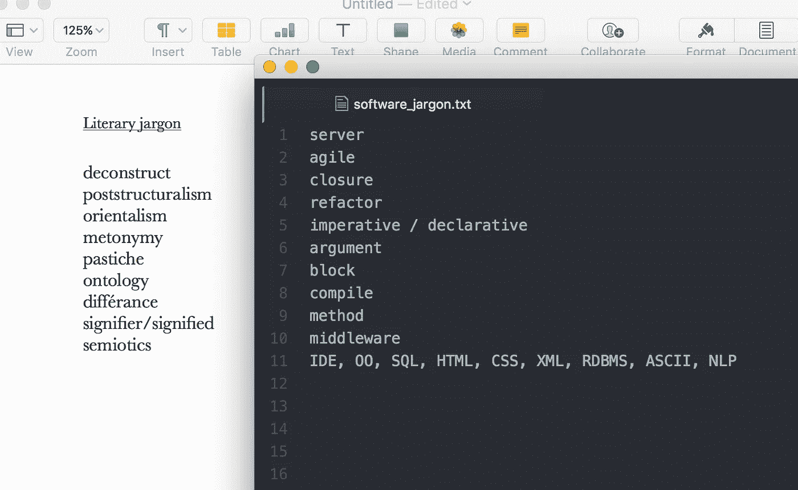
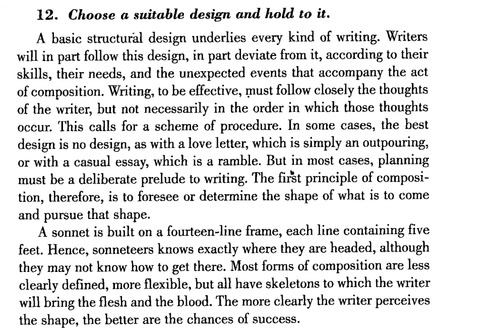
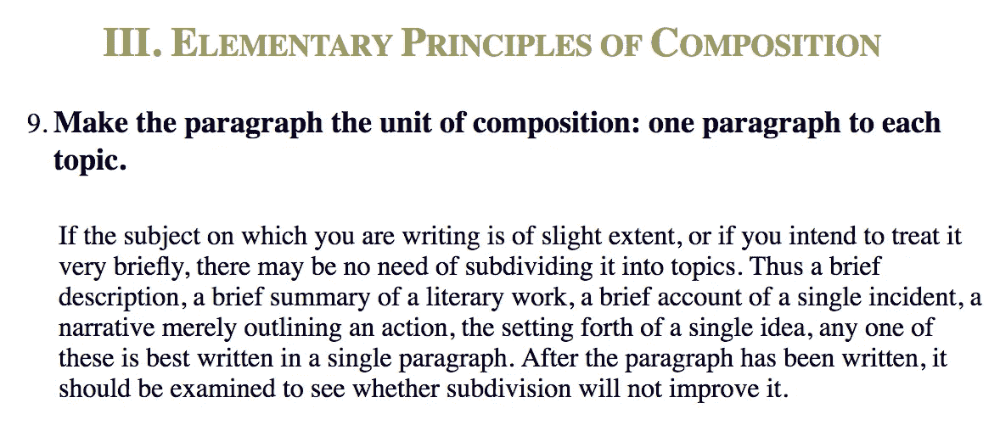
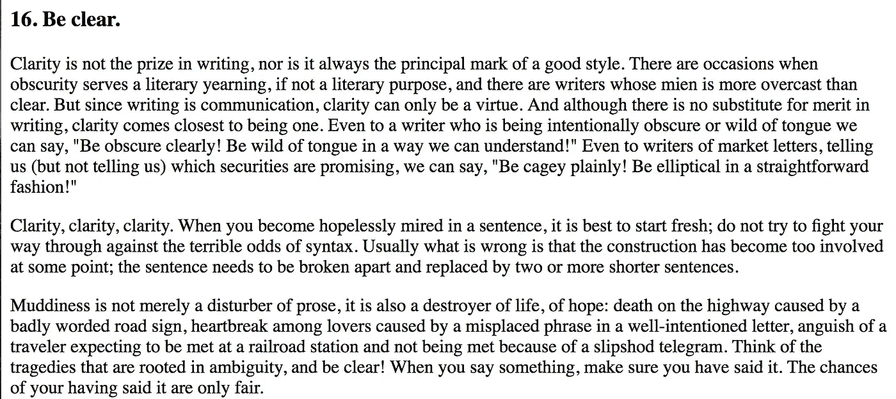
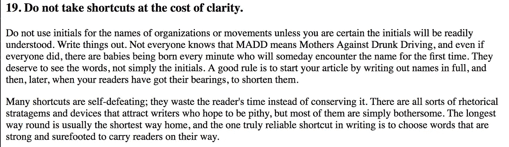
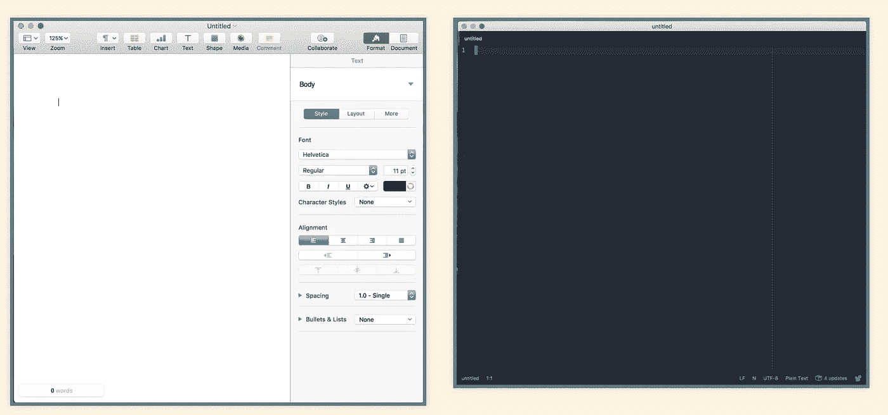
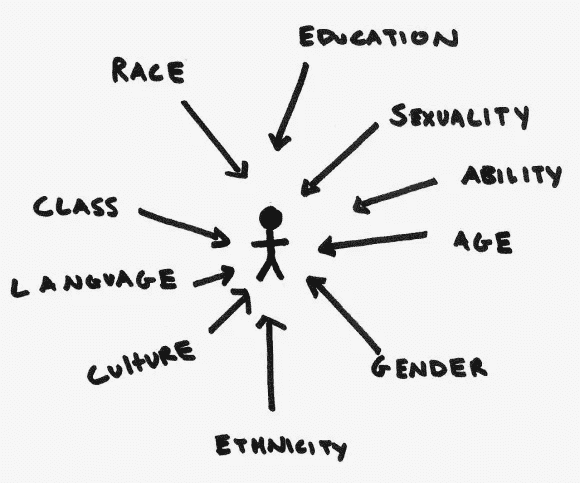

# 文学研究:软件开发之路

> 原文：<https://medium.com/hackernoon/literary-studies-a-path-to-software-development-8d92674a9eae>

在过去的一年里，我或多或少有意识地在脑海中写下这篇博文的片段。最近的一次 [SmartLogic](http://www.smartlogic.io) 公司活动——内部会议(一个下午致力于分享几乎任何自定主题的知识，技术或其他),最终为我提供了时间和动力，以更有凝聚力的方式组织这些想法，并将其展示给我的同事。以下是一些稍微不同形式的想法。

在这篇博文中，我希望证明非传统的[编程之路](https://hackernoon.com/tagged/programming)可以为成为一名反思型、高效的软件开发人员提供重要的技能。我将列举一些具体的例子，说明六年的文学学习是如何让我(当时并不知道)成为一名开发人员的。我也将加入那些呼吁科技更加多元化的人的行列，并建议科技公司和科技文化通常需要来自人文学科的想法和人才。

# 一些快速背景(关于我缺乏技术背景)

我在密苏里州的农村长大，几乎没有接触过任何形式的计算(我想我的高中有一两门以微软办公套件为重点的课程，它们构成了整个“技术”课程。).我去了一个小的文理学院(也没有计算机科学课程)，在那里我学习文学和理论。毕业后，我在日本花了一年时间从事日本女性主义文学批评的研究项目，然后于 2014 年 8 月回到美国开始为期 7 年的文学硕士/博士课程。在 2015 年 2 月之前，我从未看过一行代码，我也不知道“[软件开发](https://hackernoon.com/tagged/software-development)是什么意思。在第一年从研究生课程中退学后，我自学了大约四个月的 Python(同时写了一篇关于它的[博客](https://paigelearnscode.wordpress.com/)), next 在获得全额奖学金后在加利福尼亚的一个简陋的训练营学习了两个月的 JavaScript，然后开始在纽约市找工作。2016 年 4 月，我在 [Def Method](https://www.defmethod.com/) 开始了我的第一份开发者工作(一个很棒、薪水丰厚的学徒角色)。现在我住在巴尔的摩，在 SmartLogic(我极力推荐的另一个工作场所)做开发人员。

# 我从研究文献中学到的软件开发技巧

我读的第一本关于写好代码的技术书籍是鲍伯·马丁的**干净代码**。尽管这些例子都是用 Java 编写的，而且我当时只学习了 Python，但我可以看到我从撰写文学文章中学到的概念和 Martin 关于清晰、可维护代码的论述之间有明显的相似之处。为了说明其中的一些观点，我将展示引用自 **Clean Code** 本身以及小威廉·斯特伦克和埃尔文·布鲁克斯·怀特的《英语写作指南》、 **The Elements of Style** 。

# 1.)如何应对不熟悉的行话

不管你是在雅克·德里达的“解构主义”文学理论中，还是在 HTTP。学习如何找到理解新术语的资源，并适应遇到大量行话的解释性文本，如次要文章、图书馆文档和回购读物，是一项重要的技能。

# 2.)如何识别逻辑中的瑕疵

在文学研究中，在语法错误的情况下没有编译器可以抛弃，对有效的文学研究的要求通常不如对软件程序的要求具体，在软件程序中，冒烟测试可以迅速揭示是否存在逻辑缺陷。然而，挖掘软件程序的语法和逻辑以确定哪里出错的过程惊人地类似于通读文学分析以确定作者是否提供了足够的文本证据和逻辑基础来支持他或她的结论。

# 3.)如何构造和组织整体的片断

关于[软件设计模式](https://en.wikipedia.org/wiki/Software_design_pattern)的实现和使用的书籍、文章和教程比比皆是。在文学分析和软件开发中，能够识别、评估和实现各种设计模式，以便打造一个有凝聚力的整体是同等重要的。

来自 ***风格*** 的元素:

[II. Elementary Principles of Composition, #12](http://www.cwrowe.com/wp-content/uploads/2015/02/Strunk-and-White-Elementary-Principles-of-Composition.pdf)

# 4.)如何将一个概念分解成更小的部分

清晰、有效的写作(以代码或其他方式)由简洁、逻辑的部分组成。你如何将一个程序分解成既不太多也不太少的功能，与你如何将一篇文章分解成可管理的、有凝聚力的段落和句子有着相似的影响。

***清理代码*** ，关于功能:

来自 ***风格*** 的元素:

[III. Elementary Principles of Composition, #9](http://www.bartleby.com/141/strunk5.html#9)

# 5.)怎么写清楚

学习在写作中清晰有效地交流是一种技能，在几乎所有情况下都能很好地服务于一个人。

干净的代码是 ***可读的*** :

[Clean Code, pg. 8](http://ptgmedia.pearsoncmg.com/images/9780132350884/samplepages/9780132350884.pdf)

来自 ***风格*** 的元素:

[IV. A Few Matters of Form, #16](http://www.keck.ucsf.edu/~craig/The_Elements_of_Style.html)

[IV. A Few Matters of Form, #19](http://www.keck.ucsf.edu/~craig/The_Elements_of_Style.html)

# 6.)如何在空白屏幕上创建东西

坐在一个空白的文本编辑器前从头开始写东西的经历，通常持续几个小时，会在心理上和身体上都很累。无论你是在写一篇文学文章还是一个软件程序，你为创造性的一代培养的心智策略对于在屏幕上产生文本是至关重要的。

# 为什么科技需要人文学科

## (为什么人文学科的人应该进入科技行业)

除了我上面描述的技能之外，我认为这些技能可以在各种学术和工作环境中培养，我认为还有其他更具体的人文学科分析工具和视角是技术所缺乏的。

许多比我更有口才、更有能力的人已经写了关于技术劳动力中令人发指的缺乏多样性以及由此产生的问题。例如，参见 Medium 的[技术多样性文件](https://medium.com/tech-diversity-files)。我想说的是，欢迎来自人文背景/领域的人进入技术领域不仅有助于增加在技术领域工作的人的多样性，而且还提供了重要的分析工具，用于在考虑多样性、特权和访问的情况下处理软件。

我经常听到这样的笑话和批评:文学系的所有奖学金都只关注三个主题中的一个:种族、阶级和性别。以我在文学学术界六年的经验来看，这并不是完全不公平的(尽管当然过于简单化)评价。然而，我认为，如果我们要选择三个(非常复杂的)主题来分析它们如何塑造人类经验和文学作品，那么种族、阶级和性别可能是最重要的。文学研究的最新成果也分析了对人类经验和社会关系有重要影响的其他相关因素。

Image credit: [ASHLEY J. VELÁZQUEZ](http://www.nymgamer.com/?author=23)

在文学研究中，这种分析通常集中在特定的文学作品上。(事实上，何为“文学”的概念本身也经常引起争论。)但是，这些相同的分析方法和关键评估可以很容易地应用于软件应用程序及其在世界上日益重要的影响。

我决定离开学术界的原因之一是，我觉得我全心投入的工作(典型的女权主义、以阶级为中心的批评)永远不会对世界产生实质性影响。虽然对我个人来说，写 20 多页关于各种文学作品的文章是一个刺激和具有挑战性的过程，但在某一点上，这个过程开始感觉没有结果。许多人仍然阅读文学作品(我想？)，但学术界之外几乎没有人阅读二级学术分析文本。

软件开发是不同的，因为我积极参与了许多人将直接体验的程序(互动和交流的网站)的创建。我现在的主要职业重点是学习合理的技术开发过程，我对我正在开发的软件的社会影响基本上漠不关心(尽管在道德上并不反对)。然而，在某种程度上，我知道我对发展的关注将转移到应用这些技能上，以一种更加公开的方式关注我在文学分析中优先考虑的问题类型。与此同时，我觉得我已经准备好考虑我正在编写的软件的物质后果了——我花了相当多的时间来发展这项技能。

我不相信这样的分析技能只能在人文系培养——那仅仅是迄今为止我接触到它们的唯一地方。但无论这种形式的分析是从哪里产生和传播的，在我看来很明显，我们在技术领域很大程度上错过了它们，促进它们发展的一种方式是让技术社区更容易被具有人文背景的人所接受。

> [黑客中午](http://bit.ly/Hackernoon)是黑客如何开始他们的下午。我们是 [@AMI](http://bit.ly/atAMIatAMI) 家庭的一员。我们现在[接受投稿](http://bit.ly/hackernoonsubmission)，并乐意[讨论广告&赞助](mailto:partners@amipublications.com)机会。
> 
> 如果你喜欢这个故事，我们推荐你阅读我们的[最新科技故事](http://bit.ly/hackernoonlatestt)和[趋势科技故事](https://hackernoon.com/trending)。直到下一次，不要把世界的现实想当然！

