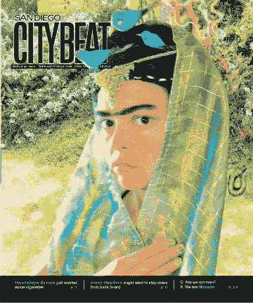
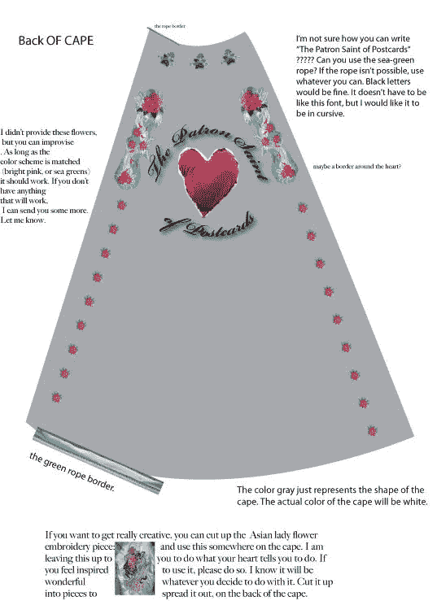
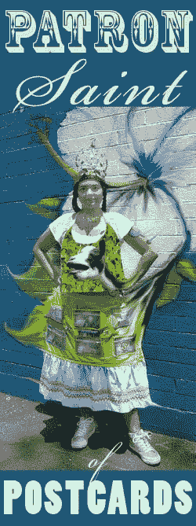
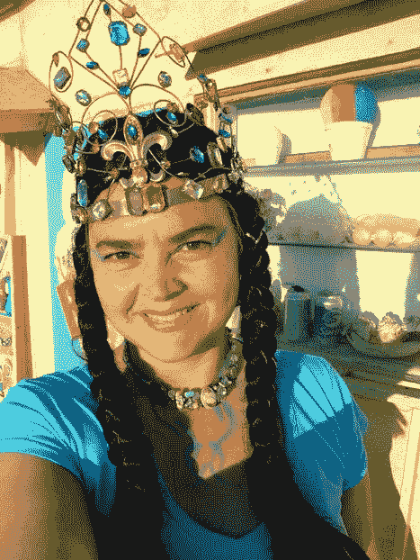
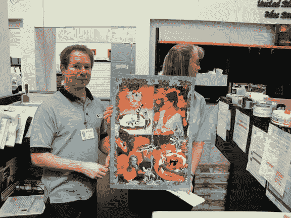
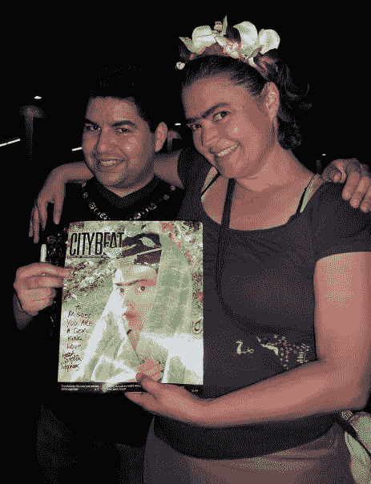

# 如何让你的作品登上杂志封面

> 原文：<https://medium.com/hackernoon/live-out-a-creative-fantasy-and-end-up-on-the-cover-of-a-magazine-95f8ddca7f77>

My self-portrait on the cover of San Diego CityBeat 2009

2009 年，我意外登上了《圣地亚哥城市节拍》 的封面。我从未向编辑投过稿，那时我还不是一个知名的艺术家。我没有社交媒体粉丝(除了我的 YouTube 频道上的少数观众)，我的目标也不是登上杂志封面。

那么，这是怎么发生的呢？

这是我在 2009 年创作的一个创意幻想的副产品。

让我澄清一下，这不是行为艺术。它不是现场展览的一部分，也不是由艺术委员会资助的。它是由我日益贬值的 401K 资助的。这种特殊的创造性幻想没有经过深思熟虑的象征意义或理由。

我仍然不知道我为什么这么做。

然而，我能说的是，我正经历着比我所能忽视的更强烈的幻觉和创作冲动。我觉得这种创造性的幻想选择了我，有组织地来到我身边，因为我已经创造出了聆听它所必需的安静空间。

2006 年，我带着仅有的 2000 美元搬到了加州，在一家公司做印前技术员，过着简单而微薄的生活。但该公司在 2008 年末开始崩溃。衰退开始了，我失去了工作和 401K。

我所到之处，人们都吓坏了，走出他们价值百万美元的豪宅，失去一切，有些人甚至结束了自己的生命。我，嗯，我没什么可失去的，真的。我已经很穷了，所以我开始学习不同的课程。当其他物质富裕的人失去理智时，我让自己平静下来，让自己的创造力发挥作用，而不去质疑它的价值。对我来说，活在纯粹的创造性幻想中就足够了。我的想象力看到并感觉到了一个机会。

一天晚上，我深夜梦见一件斗篷、一顶王冠和一条明信片围裙。我把自己想象成一个仁慈的人，与各种各样的人交往，取悦他们，逗他们笑，无缘无故地给他们礼物。我想象的是一个善良的超级英雄。这个景象牢牢地占据了我的头脑，我勾勒出它的内容。我画出了斗篷和围裙的图片，并把它寄给了我的阿姨，她是一名女裁缝。

她给我缝了一件明信片围裙和斗篷，在我买了皇冠后，我开始每天以明信片守护神的身份走进世界。

PIctured with postcard apron sewn by my aunt

一天晚上，我在市中心的一家酒吧偶然遇到了一名《都市节拍》的记者。我在做我通常做的事情:随机会见一些人，问他们是否想买一张荒谬的明信片。记者恩里克·利蒙写了一篇关于我的文章:

> 在里面，我遇到了出生于密苏里州的艺术家 Leah Stella Stephens，她问我是否有兴趣购买一张“荒谬的手工明信片”其中大部分都是斯蒂芬斯在不同的国家地理背景前的照片。
> 
> 斯蒂芬斯戴着一顶镶有宝石的皇冠，上面有一只人造的蓝色小鸟，它的羽毛与她蓝绿色的眼影完美搭配。她告诉我，她在日本教英语时精神崩溃，从此迷上了制作明信片这种失传的艺术。
> 
> “我回来后开始在堪萨斯州的一家贴纸厂工作，结果患上了腕管综合症——真他妈的糟糕！”自称明信片“守护神”的说。
> 
> 我带着一张独一无二的明信片离开了，上面写着:“在加利福尼亚的海滨，有一个全新的你。去那里找你自己，”主演，你猜对了，艺术和手工艺的泼妇自己。**——恩里克·利蒙《城市节拍》**

在 Enrique 采访了我之后，他把我的联系方式告诉了他的编辑和*city beat 的其他记者。几个月后，当另一名记者需要报道一个艺术故事时，我出现在了《城市节拍》的封面上。恩里克高度赞扬了我，并建议我作为一个可能的贡献者。我在*结束了在*的比赛，至少赢了 3 次。作为我创造性幻想的一个活生生的体现，我走进了媒体，而我甚至没有试图去那里。*

这是一个视频，我在和我为加州卡尔斯巴德的一个街头集市制作的明信片说再见。这段视频展示了当时扣人心弦的激情和兴奋*(和疯狂)*。请观看它。

我不知道该如何结束这一切。

我觉得我的明信片守护神阶段是我一生中最神奇的一次。我很高兴我有勇气这么做，因为这让我看到了人性积极的一面。这也向我表明，我有力量和勇气将我纯粹想象的内容公之于世。当然，我遇到了一些取笑我的混蛋和混蛋，但我真的没有太在意。大多数人欣赏我创造的新奇事物。

感谢您对此事的关注。

在这里加入我的简讯[。](http://leahstephens.weebly.com/sign-up-for-my-newsletter.html)

我喜欢你读我的故事，
Stellabelle

> [黑客中午](http://bit.ly/Hackernoon)是黑客如何开始他们的下午。我们是 [@AMI](http://bit.ly/atAMIatAMI) 家庭的一员。我们现在[接受投稿](http://bit.ly/hackernoonsubmission)，并乐意[讨论广告&赞助](mailto:partners@amipublications.com)机会。
> 
> 如果你喜欢这个故事，我们推荐你阅读我们的[最新科技故事](http://bit.ly/hackernoonlatestt)和[趋势科技故事](https://hackernoon.com/trending)。直到下一次，不要把世界的现实想当然！

