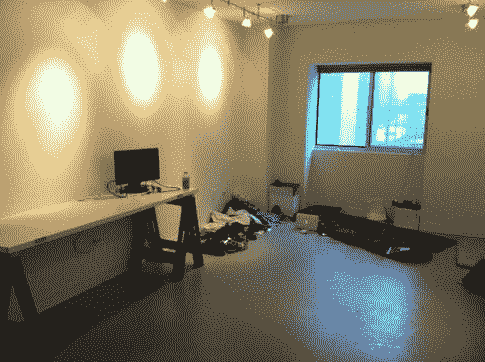

# 如何住在旧金山租来的办公室里

> 原文：<https://medium.com/hackernoon/living-in-rented-office-space-in-san-francisco-a-quick-guide-b5efa2c51af7>

*#回到 scrappy 2012…这篇文章是对 Quora 问题的回答:“* [***在三藩市租办公室生活有哪些挑战？***](https://www.quora.com/What-are-the-challenges-of-living-in-rented-office-space-in-San-Francisco)****

正如布鲁斯·费尔德曼建议的那样，住在办公室里可能对你的健康有害。但是大学期间那些高楼林立，石棉绝缘，发霉的宿舍不是很不健康吗？

在寻找你的办公空间/ [公寓](https://hackernoon.com/tagged/apartment)时，你应该寻找一间具有以下特征的办公室:

# "可以全天候

办公室全天候开放至关重要。你绝不会想晚上被困在办公室里。幸运的是，大多数办公室都有 24 小时服务。一小部分办公室有淋浴；如果你的办公室没有淋浴，确保你有全天候的通道，然后去最近的健身房淋浴。

# 带门的私人房间

原因如下:

*   想睡觉的时候就睡觉，不要让人注意到。关上门，拉上你办公室的窗帘，然后睡觉。总比睡在公共区域或空旷的地方要好，在那里你不得不熬夜直到其他人都走了。
*   **办公室有摄像头。**摄像头通常集中在公共区域和入口，几乎从不出现在私人房间。知道避开摄像头并在晚上带你去洗手间的路径。否则就在你的办公室里呆到早上*(在角落里放个桶什么的)*。
*   **储存。为了实现这个目标，你需要成为一个极简主义者。你不能拥有很多东西。你应该拥有 3-4 件衬衫，几条裤子，内衣，一双鞋/凉鞋，你的电脑，你的淋浴/浴室套件，一个枕头，一个睡袋(你是野营芽)，和一个睡垫(去 REI)就这些。存储很重要。你将无法在你租的健身房的小储物柜里存放这些少得可怜的物品…除非你加入了一家更高端的健身房，这家健身房实际上提供洗衣服务，并有相当大的储物柜(例如 Equinox)。但那是一大笔额外费用。**
*   把“朋友”带回办公室…咳咳，**每个人都需要私人时间**

# 宽松的装饰标准

拿几个纸箱来存放。你必须能够关闭盒子，以隐藏你的衣服和睡眠装备。如果有人发现你的装备并问你，就说你把你的约塞米蒂露营装备放在办公室了。

对于你的办公桌，省下钱，买两匹锯木马或者水泥块。找一扇旧门，把它放在混凝土块/锯木架上，靠在墙上。这些被称为“艺术家办公桌”或制图桌。总共要花你 25-50 美元。找把椅子。完成了。

****注意，*** *当被问及你斯巴达式的办公室装饰时，就说“我在自举”他们会会意地点点头，称赞你的节俭*

这是一个书桌和睡眠装置的例子:

*(我和我的联合创始人在 2012 年合租的位于奥斯汀第 8 街和布拉索斯街的公寓照片……这是你应该努力追求的极简主义)*

# 清新的空气(这样你可以休息)

空气必须干净，可以呼吸。霉菌或灰尘会对你的健康有害，扰乱你的睡眠。空气净化器有助于让办公室拥有良好的空气。

如果你的办公场所有这些特点，而且你很小心，你就不会被抓住。祝你好运。

> [黑客中午](http://bit.ly/Hackernoon)是黑客如何开始他们的下午。我们是 [@AMI](http://bit.ly/atAMIatAMI) 家庭的一员。我们现在[接受投稿](http://bit.ly/hackernoonsubmission)并乐意[讨论广告&赞助](mailto:partners@amipublications.com)机会。
> 
> 如果你喜欢这个故事，我们推荐你阅读我们的[最新科技故事](http://bit.ly/hackernoonlatestt)和[趋势科技故事](https://hackernoon.com/trending)。直到下一次，不要把世界的现实想当然！

